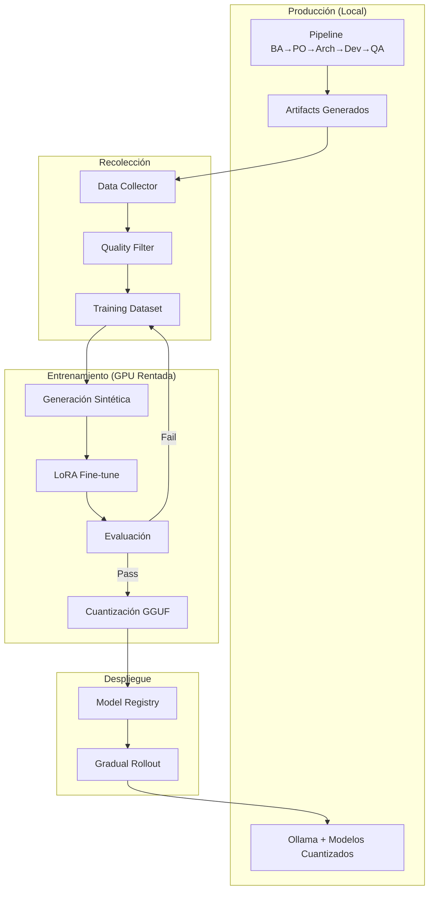

# Plan: Pipeline de Agentes con Modelos Abiertos y Fine-Tuning Continuo

**Objetivo**: Evolucionar el pipeline BA→PO→Architect→Dev→QA usando exclusivamente modelos abiertos, con fine-tuning progresivo para especializar cada rol, minimizando costos de GPU rentada.

**Restricciones**:
- Sin modelos comerciales (no OpenAI, Claude, Gemini)
- GPU solo rentada (sin hardware local)
- Maximizar eficiencia de costos
- Publicable para adopción comunitaria

---

## 1. Stack de Modelos Abiertos Recomendados

### 1.1 Modelos Base por Tamaño (Trade-off calidad/costo)

| Tier | Modelo Base | Parámetros | VRAM Requerida | Caso de Uso |
|------|-------------|------------|----------------|-------------|
| **Pequeño** | Qwen2.5-3B-Instruct | 3B | 4-6 GB | Tareas simples, validación, routing |
| **Mediano** | Qwen2.5-7B-Instruct | 7B | 8-12 GB | BA, PO, QA (tareas analíticas) |
| **Grande** | Qwen2.5-14B-Instruct | 14B | 16-24 GB | Architect, Dev (código complejo) |
| **Maestro** | Qwen2.5-72B-Instruct | 72B | 80-140 GB | Generación de datos sintéticos |

### 1.2 Alternativas Específicas para Código

| Modelo | Parámetros | Fortaleza |
|--------|------------|-----------|
| **DeepSeek-Coder-V2** | 16B/236B | Generación de código, razonamiento |
| **CodeQwen1.5-7B** | 7B | Código, eficiente en recursos |
| **StarCoder2** | 3B/7B/15B | Código abierto, múltiples lenguajes |
| **Codestral-22B** (Mistral) | 22B | Código de alta calidad |

### 1.3 Modelos de Embedding (Locales)

| Modelo | Dimensiones | Caso de Uso |
|--------|-------------|-------------|
| **nomic-embed-text-v1.5** | 768 | Balance calidad/velocidad |
| **bge-m3** | 1024 | Multilingüe, alta precisión |
| **all-MiniLM-L6-v2** | 384 | Ultra ligero, CPU viable |

---

## 2. Estrategia de Fine-Tuning por Rol

### 2.1 Arquitectura Teacher-Student (Destilación)

```
┌─────────────────────────────────────────────────────────────────┐
│                    MODELO MAESTRO (72B)                        │
│              Genera datos de alta calidad                       │
│         Solo se usa offline para crear datasets                │
└─────────────────────┬───────────────────────────────────────────┘
                      │ Destilación
                      ▼
┌─────────────────────────────────────────────────────────────────┐
│              MODELOS ESTUDIANTE POR ROL                        │
├─────────────────────────────────────────────────────────────────┤
│  BA-Student (7B)  │  Especializado en requirements            │
│  PO-Student (7B)  │  Especializado en validación/priorización │
│  Arch-Student (14B)│ Especializado en diseño/ADRs            │
│  Dev-Student (14B) │ Especializado en código/TDD             │
│  QA-Student (7B)  │  Especializado en testing/criterios       │
└─────────────────────────────────────────────────────────────────┘
```

### 2.2 Pipeline de Datos de Entrenamiento

```
Fase 1: Recolección Natural
─────────────────────────────
User Request → Pipeline → Artifacts generados
                              │
                              ▼
                    ┌─────────────────┐
                    │ Data Collector  │
                    │ (artifacts/)    │
                    └────────┬────────┘
                             │
Fase 2: Curación             ▼
─────────────────────────────────
┌──────────────────────────────────────────────────────┐
│                  CURACIÓN DE DATOS                   │
├──────────────────────────────────────────────────────┤
│ 1. Filtrar por calidad (QA gates pasados)           │
│ 2. Extraer pares (input, output) por rol            │
│ 3. Validar con modelo maestro (scoring)             │
│ 4. Generar variaciones sintéticas                   │
└──────────────────────────────────────────────────────┘

Fase 3: Formato de Entrenamiento
─────────────────────────────────
{
  "role": "ba",
  "instruction": "Analiza los siguientes requisitos de negocio...",
  "input": "<concepto del usuario>",
  "output": "<requirements.yaml generado>",
  "quality_score": 0.92,
  "metadata": {"iteration": "X", "qa_passed": true}
}
```

### 2.3 Técnicas de Fine-Tuning

| Técnica | VRAM Necesaria | Tiempo | Calidad | Recomendación |
|---------|----------------|--------|---------|---------------|
| **LoRA** | 8-16 GB | 1-4h | Buena | ✅ Default para producción |
| **QLoRA** | 4-8 GB | 2-6h | Buena | ✅ Cuando el budget es limitado |
| **Full Fine-tune** | 40-80 GB | 8-24h | Mejor | ⚠️ Solo para modelos finales |
| **ORPO/DPO** | 12-24 GB | 4-8h | Excelente | ✅ Para alignment post-LoRA |

---

## 3. Infraestructura GPU Rentada

### 3.1 Proveedores Recomendados (Costo-Eficiencia)

| Proveedor | GPU | Precio/Hora | Caso de Uso |
|-----------|-----|-------------|-------------|
| **RunPod** | A100 40GB | ~$1.20-1.50 | Fine-tuning LoRA/QLoRA |
| **Vast.ai** | A100 40GB | ~$0.80-1.20 | Menor costo, variable |
| **Lambda Labs** | A100 80GB | ~$1.50-2.00 | Full fine-tune, modelos grandes |
| **Google Colab Pro+** | A100 40GB | ~$50/mes | Experimentación, datasets pequeños |
| **Paperspace** | A100 | ~$1.50-2.00 | Persistencia de datos fácil |

### 3.2 Estimación de Costos por Ciclo

| Operación | GPU Necesaria | Tiempo Est. | Costo Est. |
|-----------|---------------|-------------|------------|
| Generación datos sintéticos (72B) | A100 80GB | 2-4h | $3-8 |
| Fine-tune LoRA (7B) | A100 40GB | 1-2h | $1.20-2.40 |
| Fine-tune LoRA (14B) | A100 40GB | 2-4h | $2.40-4.80 |
| Evaluación completa | A100 40GB | 1h | $1.20 |
| **Total por rol** | - | ~5-10h | **$8-17** |
| **Total 5 roles (ciclo)** | - | ~25-50h | **$40-85** |

### 3.3 Optimización de Costos

```
ESTRATEGIA: "Batch Everything"
─────────────────────────────────

1. ACUMULAR antes de rentar GPU
   └─ Esperar N iteraciones exitosas del pipeline
   └─ Mínimo: 100-500 ejemplos por rol

2. PREPROCESAR localmente (CPU)
   └─ Tokenización
   └─ Filtrado y deduplicación
   └─ Formato de datasets

3. SCRIPTS LISTOS antes de iniciar
   └─ Todo automatizado
   └─ Checkpoints cada 30 min
   └─ Auto-shutdown al terminar

4. SPOT/PREEMPTIBLE cuando posible
   └─ Vast.ai: 30-50% descuento
   └─ RunPod: Spot instances disponibles
```

---

## 4. Pipeline de Mejora Continua

### 4.1 Ciclo de Vida del Modelo



### 4.2 Métricas de Evaluación por Rol

| Rol | Métricas Clave | Threshold Mínimo |
|-----|----------------|------------------|
| **BA** | Completitud de requisitos, Claridad | ≥85% |
| **PO** | Consistencia, Priorización correcta | ≥80% |
| **Architect** | Viabilidad técnica, Coherencia con ADRs | ≥85% |
| **Dev** | Tests pasan, Coverage, Complejidad ciclomática | ≥90% |
| **QA** | Bugs encontrados/total, False positives | ≥85% |

### 4.3 Triggers de Re-entrenamiento

```yaml
re_training_triggers:
  automatic:
    - new_examples_count >= 500
    - avg_quality_score_drop >= 10%
    - user_corrections_rate >= 5%

  scheduled:
    - frequency: "monthly"
    - condition: "if new_examples >= 200"

  manual:
    - reason: "new_domain"
    - reason: "architecture_change"
```

---

## 5. Implementación por Fases

### Fase 0: Infraestructura Base (2 semanas)
- [ ] Configurar data collector para artifacts
- [ ] Crear formato estándar de dataset por rol
- [ ] Setup scripts de fine-tuning (Axolotl/Unsloth)
- [ ] Crear modelo de evaluación automática
- [ ] Documentar proceso para comunidad

### Fase 1: Baseline con Modelos Abiertos (1 semana)
- [ ] Reemplazar proveedores comerciales por Ollama
- [ ] Configurar Qwen2.5-7B como baseline para todos los roles
- [ ] Establecer métricas baseline (sin fine-tuning)
- [ ] Ejecutar 10-20 iteraciones para recolectar datos

### Fase 2: Primer Ciclo de Fine-Tuning (2 semanas)
- [ ] Acumular ~500 ejemplos por rol
- [ ] Generar datos sintéticos con modelo maestro
- [ ] Fine-tune LoRA para BA (rol más simple)
- [ ] Evaluar mejora vs baseline
- [ ] Documentar resultados y costos

### Fase 3: Fine-Tuning Completo (4 semanas)
- [ ] Fine-tune especializado para cada rol
- [ ] Implementar DPO/ORPO para alignment
- [ ] Cuantizar modelos (GGUF Q4/Q5)
- [ ] Desplegar y evaluar en producción

### Fase 4: Destilación Avanzada (ongoing)
- [ ] Usar modelos grandes para scoring
- [ ] Crear dataset de preferencias
- [ ] Implementar RLHF simplificado
- [ ] Ciclo continuo de mejora

---

## 6. Stack Técnico Propuesto

### 6.1 Herramientas de Fine-Tuning

```yaml
primary_tools:
  fine_tuning:
    - name: "Unsloth"
      reason: "2x faster, 50% less VRAM"
      url: "https://github.com/unslothai/unsloth"

    - name: "Axolotl"
      reason: "Configuración flexible, múltiples técnicas"
      url: "https://github.com/OpenAccess-AI-Collective/axolotl"

  quantization:
    - name: "llama.cpp"
      reason: "GGUF estándar, ampliamente soportado"

    - name: "AutoGPTQ"
      reason: "Cuantización GPTQ para GPU"

  evaluation:
    - name: "lm-evaluation-harness"
      reason: "Benchmarks estándar"

    - name: "RAGAS"
      reason: "Evaluación específica de RAG"

  data:
    - name: "Hugging Face Datasets"
      reason: "Formato estándar, fácil compartir"
```

### 6.2 Estructura de Directorios Propuesta

```
agnostic-ai-pipeline/
├── training/
│   ├── datasets/           # Datasets por rol
│   │   ├── ba/
│   │   ├── po/
│   │   ├── architect/
│   │   ├── dev/
│   │   └── qa/
│   ├── configs/            # Configs de Axolotl/Unsloth
│   │   ├── lora_7b.yaml
│   │   ├── lora_14b.yaml
│   │   └── qlora_7b.yaml
│   ├── scripts/            # Scripts de entrenamiento
│   │   ├── prepare_data.py
│   │   ├── train_lora.py
│   │   ├── evaluate.py
│   │   └── quantize.py
│   └── models/             # Modelos fine-tuneados
│       ├── ba-v1/
│       ├── po-v1/
│       └── ...
├── data_collection/
│   ├── collector.py        # Recolector de artifacts
│   ├── curator.py          # Curación de datos
│   └── synthetic.py        # Generación sintética
└── evaluation/
    ├── benchmarks/         # Tests por rol
    └── reports/            # Reportes de evaluación
```

---

## 7. Publicación para la Comunidad

### 7.1 Artefactos a Publicar

| Artefacto | Plataforma | Descripción |
|-----------|------------|-------------|
| **Modelos Fine-tuneados** | Hugging Face | Modelos especializados por rol |
| **Datasets** | Hugging Face | Datasets de entrenamiento curados |
| **Scripts** | GitHub | Pipeline completo de fine-tuning |
| **Documentación** | GitHub Wiki | Guías de reproducción |
| **Benchmarks** | Papers with Code | Comparativas de rendimiento |

### 7.2 Licenciamiento Propuesto

```yaml
code: "Apache 2.0"
models: "Apache 2.0" # (si base model lo permite)
datasets: "CC-BY-4.0"
documentation: "CC-BY-4.0"
```

### 7.3 Roadmap de Publicación

1. **Mes 1**: Publicar pipeline base + documentación
2. **Mes 2**: Publicar primer modelo fine-tuneado (BA)
3. **Mes 3**: Publicar suite completa de modelos
4. **Mes 4**: Publicar benchmarks y comparativas
5. **Ongoing**: Actualizaciones mensuales de modelos

---

## 8. Riesgos y Mitigaciones

| Riesgo | Impacto | Mitigación |
|--------|---------|------------|
| Modelo base no suficiente | Alto | Evaluar múltiples modelos antes de fine-tune |
| Costos GPU mayores a estimados | Medio | Usar QLoRA, batching agresivo, spot instances |
| Datos de baja calidad | Alto | Gates de calidad estrictos, validación humana sample |
| Overfitting a dominio | Medio | Mantener dataset diverso, evaluación cruzada |
| Licencias incompatibles | Alto | Verificar licencia de cada modelo base |

---

## 9. Decisiones Pendientes

1. **Modelo base definitivo**: ¿Qwen2.5 vs DeepSeek vs Mistral?
2. **Proveedor GPU principal**: ¿RunPod vs Vast.ai vs Lambda?
3. **Frecuencia de re-entrenamiento**: ¿Mensual vs basado en triggers?
4. **Nivel de automatización**: ¿Full auto vs semi-supervisado?

---

## 10. Próximos Pasos Inmediatos

### Esta semana:
1. [ ] Crear branch `feature/open-models-finetuning`
2. [ ] Implementar data collector básico
3. [ ] Probar Qwen2.5-7B con Ollama como baseline
4. [ ] Estimar cantidad de datos existentes en artifacts/

### Siguiente semana:
1. [ ] Configurar primer script de fine-tuning con Unsloth
2. [ ] Hacer prueba de concepto en Colab/RunPod
3. [ ] Documentar costos reales vs estimados

---

---

## 11. Arquitectura de Destilación Detallada

### 11.1 Proceso de Destilación Step-by-Step

```
FASE 1: GENERACIÓN DE DATOS CON MODELO MAESTRO
══════════════════════════════════════════════════════════════════

Input: Prompts reales del pipeline (histórico de artifacts/)
       + Variaciones sintéticas generadas

┌─────────────────────────────────────────────────────────────────┐
│                    MODELO MAESTRO (72B)                        │
│                    Qwen2.5-72B-Instruct                        │
│                                                                 │
│  Para cada prompt:                                              │
│  1. Generar respuesta de alta calidad                          │
│  2. Generar "chain of thought" explicando el razonamiento      │
│  3. Generar variaciones del mismo problema                     │
│  4. Auto-evaluar calidad (scoring 0-10)                        │
└─────────────────────────────────────────────────────────────────┘
                              │
                              ▼
┌─────────────────────────────────────────────────────────────────┐
│                    DATASET DE DESTILACIÓN                      │
│                                                                 │
│  {                                                              │
│    "instruction": "Como BA, analiza este concepto...",         │
│    "input": "<concepto de negocio>",                           │
│    "output": "<requirements.yaml de alta calidad>",            │
│    "reasoning": "<chain of thought del maestro>",              │
│    "quality_score": 9.2,                                       │
│    "alternatives": ["<variación 1>", "<variación 2>"]          │
│  }                                                              │
└─────────────────────────────────────────────────────────────────┘

FASE 2: ENTRENAMIENTO DE ESTUDIANTES
══════════════════════════════════════════════════════════════════

Técnica: "Distillation with Reasoning Transfer"

┌─────────────────────────────────────────────────────────────────┐
│              ENTRENAMIENTO DEL ESTUDIANTE                      │
│                                                                 │
│  Paso 1: Supervised Fine-Tuning (SFT)                          │
│          - Entrenar en pares (instruction+input) → output      │
│          - Loss: CrossEntropy en tokens de salida              │
│                                                                 │
│  Paso 2: Reasoning Transfer                                    │
│          - Opcionalmente incluir chain-of-thought              │
│          - Mejora razonamiento, aumenta tamaño de respuesta    │
│                                                                 │
│  Paso 3: Knowledge Distillation Loss                           │
│          - KL Divergence entre logits maestro/estudiante       │
│          - Transfiere "soft labels" del maestro                │
└─────────────────────────────────────────────────────────────────┘
```

### 11.2 Configuración de Destilación por Rol

```yaml
# training/configs/distillation_config.yaml

distillation:
  teacher_model: "Qwen/Qwen2.5-72B-Instruct"
  temperature: 2.0  # Suaviza distribución de probabilidades
  alpha: 0.5        # Balance entre hard labels y soft labels

roles:
  ba:
    student_model: "Qwen/Qwen2.5-7B-Instruct"
    focus_areas:
      - "requirement_extraction"
      - "stakeholder_identification"
      - "constraint_detection"
    reasoning_transfer: true
    min_examples: 500

  po:
    student_model: "Qwen/Qwen2.5-7B-Instruct"
    focus_areas:
      - "prioritization"
      - "value_assessment"
      - "risk_identification"
    reasoning_transfer: true
    min_examples: 400

  architect:
    student_model: "Qwen/Qwen2.5-14B-Instruct"
    focus_areas:
      - "system_design"
      - "pattern_selection"
      - "tradeoff_analysis"
      - "adr_generation"
    reasoning_transfer: true
    min_examples: 600

  dev:
    student_model: "deepseek-ai/deepseek-coder-7b-instruct-v1.5"
    focus_areas:
      - "code_generation"
      - "test_writing"
      - "refactoring"
      - "debugging"
    reasoning_transfer: false  # Código no necesita CoT extenso
    min_examples: 1000

  qa:
    student_model: "Qwen/Qwen2.5-7B-Instruct"
    focus_areas:
      - "test_case_design"
      - "edge_case_identification"
      - "bug_detection"
    reasoning_transfer: true
    min_examples: 500
```

### 11.3 Pipeline de Generación de Datos Sintéticos

```python
# Pseudocódigo del proceso de generación sintética

class SyntheticDataGenerator:
    """
    Genera datos de entrenamiento usando modelo maestro.
    Solo se ejecuta en GPU rentada (batch mode).
    """

    def generate_for_role(self, role: str, base_examples: list) -> list:
        """
        Entrada: Ejemplos reales del pipeline
        Salida: Dataset aumentado con variaciones sintéticas
        """

        augmented_data = []

        for example in base_examples:
            # 1. Generar respuesta de alta calidad
            teacher_response = self.teacher.generate(
                instruction=example['instruction'],
                input=example['input'],
                temperature=0.7
            )

            # 2. Generar chain-of-thought
            reasoning = self.teacher.generate(
                prompt=f"Explica paso a paso cómo llegaste a esta respuesta: {teacher_response}"
            )

            # 3. Auto-evaluar calidad
            quality_score = self.teacher.evaluate(
                response=teacher_response,
                criteria=self.get_criteria(role)
            )

            # 4. Generar variaciones del input
            variations = self.generate_variations(example['input'], n=3)

            # 5. Compilar registro
            augmented_data.append({
                'instruction': example['instruction'],
                'input': example['input'],
                'output': teacher_response,
                'reasoning': reasoning,
                'quality_score': quality_score,
                'source': 'synthetic',
                'teacher_model': self.teacher.name
            })

            # 6. Procesar variaciones
            for var in variations:
                var_response = self.teacher.generate(
                    instruction=example['instruction'],
                    input=var
                )
                augmented_data.append({
                    'instruction': example['instruction'],
                    'input': var,
                    'output': var_response,
                    'quality_score': self.teacher.evaluate(var_response),
                    'source': 'synthetic_variation'
                })

        return augmented_data
```

---

## 12. Integración con el Pipeline Existente

### 12.1 Modificaciones a `config.yaml`

```yaml
# Agregar sección de modelos especializados

specialized_models:
  enabled: true
  fallback_to_base: true  # Si modelo especializado falla

  registry:
    local_path: "./training/models"
    remote: "huggingface"  # Para publicación

  models:
    ba:
      base: "qwen2.5:7b-instruct"
      specialized: "agnostic-pipeline/ba-specialist-v1"
      version: "1.0.0"

    po:
      base: "qwen2.5:7b-instruct"
      specialized: "agnostic-pipeline/po-specialist-v1"
      version: "1.0.0"

    architect:
      base: "qwen2.5:14b-instruct"
      specialized: "agnostic-pipeline/architect-specialist-v1"
      version: "1.0.0"

    dev:
      base: "deepseek-coder:7b"
      specialized: "agnostic-pipeline/dev-specialist-v1"
      version: "1.0.0"

    qa:
      base: "qwen2.5:7b-instruct"
      specialized: "agnostic-pipeline/qa-specialist-v1"
      version: "1.0.0"

training:
  data_collection:
    enabled: true
    output_dir: "./training/datasets"
    min_quality_score: 0.7

  triggers:
    auto_retrain: true
    min_new_examples: 500
    quality_drop_threshold: 0.1
```

### 12.2 Modificaciones a `scripts/llm.py`

```python
# Agregar soporte para modelos especializados

class Client:
    def __init__(self, role: str):
        self.role = role
        self.config = load_config()

        # Nuevo: Intentar cargar modelo especializado primero
        if self.config.get('specialized_models', {}).get('enabled'):
            self.model = self._load_specialized_model()
        else:
            self.model = self._load_base_model()

    def _load_specialized_model(self):
        """Carga modelo fine-tuneado si existe."""
        spec_config = self.config['specialized_models']['models'].get(self.role)

        if spec_config and self._model_exists(spec_config['specialized']):
            return self._init_model(spec_config['specialized'])

        # Fallback a modelo base
        if self.config['specialized_models'].get('fallback_to_base'):
            return self._init_model(spec_config['base'])

        raise ModelNotFoundError(f"No model available for role: {self.role}")
```

### 12.3 Data Collector (Nuevo Componente)

```python
# data_collection/collector.py

import json
from pathlib import Path
from datetime import datetime

class ArtifactCollector:
    """
    Recolecta artifacts del pipeline para crear datasets de entrenamiento.
    Se ejecuta automáticamente después de cada iteración exitosa.
    """

    def __init__(self, output_dir: str = "./training/datasets"):
        self.output_dir = Path(output_dir)
        self.output_dir.mkdir(parents=True, exist_ok=True)

    def collect_iteration(self, iteration_path: str, qa_passed: bool):
        """
        Recolecta datos de una iteración completa.
        Solo guarda si QA pasó (indicador de calidad).
        """
        if not qa_passed:
            return  # No recolectar datos de baja calidad

        iteration = Path(iteration_path)

        # Recolectar por rol
        self._collect_ba(iteration)
        self._collect_po(iteration)
        self._collect_architect(iteration)
        self._collect_dev(iteration)
        self._collect_qa(iteration)

    def _collect_ba(self, iteration: Path):
        """Extrae pares de entrenamiento para BA."""
        concept_file = iteration / "concept.txt"
        requirements_file = iteration / "planning" / "requirements.yaml"

        if concept_file.exists() and requirements_file.exists():
            self._save_example(
                role="ba",
                instruction=self._get_ba_instruction(),
                input=concept_file.read_text(),
                output=requirements_file.read_text(),
                metadata={
                    "source": str(iteration),
                    "timestamp": datetime.now().isoformat()
                }
            )

    def _save_example(self, role: str, instruction: str,
                      input: str, output: str, metadata: dict):
        """Guarda ejemplo en formato de entrenamiento."""
        role_dir = self.output_dir / role
        role_dir.mkdir(exist_ok=True)

        example = {
            "instruction": instruction,
            "input": input,
            "output": output,
            "metadata": metadata
        }

        # Nombre único basado en hash del contenido
        filename = f"{hash(input + output) % 10**8}.json"
        (role_dir / filename).write_text(json.dumps(example, indent=2))
```

---

## 13. Estrategia de Cuantización para Despliegue Local

### 13.1 Pipeline de Cuantización

```
MODELO FINE-TUNEADO (FP16/BF16)
         │
         ▼
┌─────────────────────────────────────────────────────────────────┐
│                    CUANTIZACIÓN                                 │
├─────────────────────────────────────────────────────────────────┤
│                                                                 │
│  Opción 1: GGUF (llama.cpp) - RECOMENDADO                      │
│  ─────────────────────────────────────────                      │
│  Q4_K_M: 4-bit, buen balance calidad/tamaño                    │
│  Q5_K_M: 5-bit, mejor calidad, +25% tamaño                     │
│  Q8_0:   8-bit, máxima calidad, +100% tamaño                   │
│                                                                 │
│  Opción 2: GPTQ (GPU inference)                                │
│  ─────────────────────────────────────────                      │
│  4-bit: Requiere GPU, inferencia rápida                        │
│                                                                 │
│  Opción 3: AWQ (Activation-aware)                              │
│  ─────────────────────────────────────────                      │
│  4-bit: Mejor preservación de calidad                          │
│                                                                 │
└─────────────────────────────────────────────────────────────────┘
         │
         ▼
MODELO CUANTIZADO → Ollama / llama.cpp
```

### 13.2 Script de Cuantización

```bash
# training/scripts/quantize.sh

#!/bin/bash
# Cuantiza modelo fine-tuneado a GGUF para Ollama

MODEL_PATH=$1
OUTPUT_DIR=$2
QUANT_TYPE=${3:-"Q4_K_M"}

# Convertir a GGUF
python llama.cpp/convert.py \
    $MODEL_PATH \
    --outfile $OUTPUT_DIR/model-f16.gguf \
    --outtype f16

# Cuantizar
./llama.cpp/quantize \
    $OUTPUT_DIR/model-f16.gguf \
    $OUTPUT_DIR/model-$QUANT_TYPE.gguf \
    $QUANT_TYPE

# Crear Modelfile para Ollama
cat > $OUTPUT_DIR/Modelfile << EOF
FROM $OUTPUT_DIR/model-$QUANT_TYPE.gguf

PARAMETER temperature 0.7
PARAMETER top_p 0.9
PARAMETER stop "<|im_end|>"

SYSTEM "You are a specialized AI assistant for software development."
EOF

# Registrar en Ollama
ollama create $(basename $MODEL_PATH)-$QUANT_TYPE -f $OUTPUT_DIR/Modelfile

echo "Model registered in Ollama as: $(basename $MODEL_PATH)-$QUANT_TYPE"
```

### 13.3 Comparativa de Tamaños y Rendimiento

| Modelo Base | FP16 | Q8_0 | Q5_K_M | Q4_K_M | Pérdida Calidad |
|-------------|------|------|--------|--------|-----------------|
| 7B | 14 GB | 7.5 GB | 5.5 GB | 4.5 GB | <2% (Q4_K_M) |
| 14B | 28 GB | 15 GB | 11 GB | 9 GB | <3% (Q4_K_M) |
| 72B | 144 GB | 76 GB | 55 GB | 45 GB | <5% (Q4_K_M) |

---

## 14. Evaluación Automática de Modelos

### 14.1 Framework de Evaluación

```python
# evaluation/evaluator.py

from dataclasses import dataclass
from typing import Dict, List
import json

@dataclass
class EvaluationResult:
    role: str
    model_version: str
    metrics: Dict[str, float]
    passed: bool
    details: Dict

class RoleEvaluator:
    """
    Evalúa modelos especializados contra benchmarks por rol.
    """

    THRESHOLDS = {
        'ba': {
            'requirement_completeness': 0.85,
            'clarity_score': 0.80,
            'format_compliance': 0.95
        },
        'po': {
            'prioritization_accuracy': 0.80,
            'value_assessment': 0.75,
            'consistency': 0.85
        },
        'architect': {
            'design_coherence': 0.85,
            'pattern_appropriateness': 0.80,
            'adr_quality': 0.85
        },
        'dev': {
            'code_correctness': 0.90,
            'test_coverage': 0.80,
            'style_compliance': 0.90
        },
        'qa': {
            'bug_detection_rate': 0.85,
            'false_positive_rate': 0.10,  # Máximo aceptable
            'test_quality': 0.80
        }
    }

    def evaluate_model(self, role: str, model_path: str,
                       test_set: List[dict]) -> EvaluationResult:
        """
        Ejecuta evaluación completa de un modelo.
        """
        model = self._load_model(model_path)
        metrics = {}
        details = {'examples': []}

        for example in test_set:
            # Generar respuesta
            response = model.generate(
                instruction=example['instruction'],
                input=example['input']
            )

            # Evaluar respuesta
            example_metrics = self._evaluate_response(
                role=role,
                response=response,
                expected=example.get('expected_output'),
                criteria=example.get('criteria', {})
            )

            details['examples'].append({
                'input': example['input'][:100],
                'metrics': example_metrics
            })

            # Agregar a métricas globales
            for k, v in example_metrics.items():
                if k not in metrics:
                    metrics[k] = []
                metrics[k].append(v)

        # Calcular promedios
        avg_metrics = {k: sum(v)/len(v) for k, v in metrics.items()}

        # Verificar thresholds
        passed = self._check_thresholds(role, avg_metrics)

        return EvaluationResult(
            role=role,
            model_version=model_path,
            metrics=avg_metrics,
            passed=passed,
            details=details
        )

    def _check_thresholds(self, role: str, metrics: Dict) -> bool:
        """Verifica si todas las métricas pasan los thresholds."""
        thresholds = self.THRESHOLDS.get(role, {})

        for metric, threshold in thresholds.items():
            if metric in metrics:
                # Para false_positive_rate, menor es mejor
                if 'false' in metric.lower() or 'error' in metric.lower():
                    if metrics[metric] > threshold:
                        return False
                else:
                    if metrics[metric] < threshold:
                        return False
        return True
```

### 14.2 Test Sets por Rol

```yaml
# evaluation/test_sets/ba_test_set.yaml

test_cases:
  - id: "ba_001"
    instruction: "Como Business Analyst, analiza el siguiente concepto..."
    input: |
      Sistema de gestión de inventario para pequeña tienda de ropa.
      Debe manejar stock, ventas, y alertas de reposición.
    expected_output_contains:
      - "requisitos funcionales"
      - "gestión de stock"
      - "alertas"
      - "reportes"
    criteria:
      min_requirements: 5
      must_include_nfr: true
      format: "yaml"

  - id: "ba_002"
    instruction: "Como Business Analyst, analiza el siguiente concepto..."
    input: |
      API de pagos que integre con Stripe y MercadoPago.
      Debe soportar subscripciones y pagos únicos.
    expected_output_contains:
      - "integración"
      - "seguridad"
      - "PCI"
      - "webhooks"
    criteria:
      min_requirements: 8
      must_include_security: true
```

---

## 15. Automatización del Ciclo Completo

### 15.1 Makefile Extendido

```makefile
# Agregar a Makefile existente

# ══════════════════════════════════════════════════════════════════
# TRAINING & FINE-TUNING
# ══════════════════════════════════════════════════════════════════

.PHONY: collect-data prepare-dataset train-role evaluate-model quantize-model

# Recolectar datos de artifacts/
collect-data:
	@echo "📊 Collecting training data from artifacts..."
	.venv/bin/python data_collection/collector.py \
		--source artifacts/iterations \
		--output training/datasets \
		--min-quality 0.7

# Preparar dataset para entrenamiento
prepare-dataset:
	@echo "🔧 Preparing dataset for role: $(ROLE)"
	.venv/bin/python training/scripts/prepare_data.py \
		--role $(ROLE) \
		--input training/datasets/$(ROLE) \
		--output training/datasets/$(ROLE)_prepared \
		--format alpaca

# Entrenar modelo (requiere GPU)
train-role:
	@echo "🚀 Training model for role: $(ROLE)"
	@echo "⚠️  This requires GPU. Run on: RunPod/Vast.ai/Lambda"
	.venv/bin/python training/scripts/train_lora.py \
		--role $(ROLE) \
		--config training/configs/lora_$(SIZE).yaml \
		--dataset training/datasets/$(ROLE)_prepared \
		--output training/models/$(ROLE)-v$(VERSION)

# Evaluar modelo
evaluate-model:
	@echo "📈 Evaluating model for role: $(ROLE)"
	.venv/bin/python evaluation/evaluator.py \
		--role $(ROLE) \
		--model training/models/$(ROLE)-v$(VERSION) \
		--test-set evaluation/test_sets/$(ROLE)_test_set.yaml \
		--output evaluation/reports/$(ROLE)-v$(VERSION).json

# Cuantizar y registrar en Ollama
quantize-model:
	@echo "📦 Quantizing model to GGUF..."
	./training/scripts/quantize.sh \
		training/models/$(ROLE)-v$(VERSION) \
		training/models/$(ROLE)-v$(VERSION)-gguf \
		$(QUANT_TYPE)

# Pipeline completo de training
train-pipeline: collect-data
	@for role in ba po architect dev qa; do \
		$(MAKE) prepare-dataset ROLE=$$role; \
		echo "Ready to train $$role - requires GPU"; \
	done
	@echo "📋 Datasets prepared. Upload to GPU instance and run training."

# ══════════════════════════════════════════════════════════════════
# SYNTHETIC DATA GENERATION (requires GPU)
# ══════════════════════════════════════════════════════════════════

generate-synthetic:
	@echo "🤖 Generating synthetic data with teacher model..."
	@echo "⚠️  This requires GPU with 80GB+ VRAM"
	.venv/bin/python data_collection/synthetic.py \
		--teacher "Qwen/Qwen2.5-72B-Instruct" \
		--role $(ROLE) \
		--input training/datasets/$(ROLE) \
		--output training/datasets/$(ROLE)_synthetic \
		--multiplier 3
```

### 15.2 Script de Orquestación para GPU Rentada

```bash
#!/bin/bash
# training/scripts/gpu_training_session.sh
#
# Script para ejecutar en instancia GPU rentada
# Automatiza todo el proceso de fine-tuning

set -e

ROLE=$1
VERSION=$2
GPU_TYPE=${3:-"A100"}

echo "═══════════════════════════════════════════════════════════"
echo "🚀 Starting Fine-tuning Session"
echo "   Role: $ROLE"
echo "   Version: $VERSION"
echo "   GPU: $GPU_TYPE"
echo "═══════════════════════════════════════════════════════════"

# 1. Setup environment
echo "📦 Setting up environment..."
pip install -q unsloth transformers datasets accelerate

# 2. Download base model
echo "📥 Downloading base model..."
python -c "from transformers import AutoModelForCausalLM; AutoModelForCausalLM.from_pretrained('Qwen/Qwen2.5-7B-Instruct')"

# 3. Train with LoRA
echo "🎯 Starting LoRA training..."
python training/scripts/train_lora.py \
    --role $ROLE \
    --config training/configs/lora_7b.yaml \
    --dataset training/datasets/${ROLE}_prepared \
    --output training/models/${ROLE}-v${VERSION} \
    --wandb-project "agnostic-pipeline"

# 4. Evaluate
echo "📊 Evaluating model..."
python evaluation/evaluator.py \
    --role $ROLE \
    --model training/models/${ROLE}-v${VERSION} \
    --output evaluation/reports/${ROLE}-v${VERSION}.json

# 5. Check if passed
PASSED=$(python -c "import json; r=json.load(open('evaluation/reports/${ROLE}-v${VERSION}.json')); print(r['passed'])")

if [ "$PASSED" = "True" ]; then
    echo "✅ Evaluation PASSED"

    # 6. Quantize
    echo "📦 Quantizing to GGUF..."
    ./training/scripts/quantize.sh \
        training/models/${ROLE}-v${VERSION} \
        training/models/${ROLE}-v${VERSION}-gguf \
        Q4_K_M

    # 7. Upload to HuggingFace
    echo "☁️ Uploading to HuggingFace..."
    huggingface-cli upload \
        agnostic-pipeline/${ROLE}-specialist-v${VERSION} \
        training/models/${ROLE}-v${VERSION}-gguf

    echo "═══════════════════════════════════════════════════════════"
    echo "✅ SUCCESS! Model published to HuggingFace"
    echo "═══════════════════════════════════════════════════════════"
else
    echo "❌ Evaluation FAILED - Model not published"
    echo "   Check: evaluation/reports/${ROLE}-v${VERSION}.json"
    exit 1
fi
```

---

## 16. Resumen Ejecutivo y Decisiones Clave

### Decisiones Tomadas

| Área | Decisión | Justificación |
|------|----------|---------------|
| **Modelo Base** | Qwen2.5 family | Mejor rendimiento open-source actual, licencia permisiva |
| **Técnica Fine-tune** | LoRA/QLoRA | Balance costo/calidad, compatible con GPU rentada |
| **Destilación** | Teacher-Student con 72B | Amortiza costo en múltiples ciclos |
| **Cuantización** | GGUF Q4_K_M | Balance óptimo tamaño/calidad para Ollama |
| **GPU Provider** | RunPod/Vast.ai | Mejor precio/rendimiento para sesiones batch |

### Costos Estimados Mensuales

| Escenario | Iteraciones/mes | Costo GPU | Costo Total |
|-----------|-----------------|-----------|-------------|
| **Mínimo** | 1 ciclo completo | ~$50-80 | $50-80/mes |
| **Normal** | 2 ciclos | ~$100-160 | $100-160/mes |
| **Intensivo** | 4 ciclos | ~$200-320 | $200-320/mes |

### Métricas de Éxito

1. **Calidad**: Modelos especializados superan baseline en >15% por rol
2. **Costo**: Fine-tuning completo <$100 por ciclo
3. **Adopción**: >50 stars en GitHub en 3 meses
4. **Reproducibilidad**: Cualquiera puede replicar con documentación

---

**Estado**: Draft - Pendiente revisión y aprobación
**Autor**: Architecture
**Fecha**: 2026-02-03
