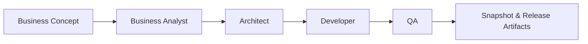

# Loop Release Workflow – AGNOSTIC AI PIPELINE 🏗️

**Deliver finished products through repeatable BA → Product Owner → Architect → Dev → QA release loops.**

## Project Overview

- **Purpose** – Automate the journey from business concept to QA-validated release, producing requirements, architecture, code, tests, and reports.
- **Roles** – Business Analyst, Architect, Developer, QA, and Orchestrator collaborate sequentially.
- **Artifacts** – Planning YAML files (`requirements.yaml`, `stories.yaml`, etc.), generated code/tests under `project/`, QA reports in `artifacts/qa/`.
- **Workflows** – Use `make iteration`/`make loop` for the end-to-end loop, or execute role-specific commands (`make ba`, `make plan`, etc.) for focused debugging.



#
---

## Why Loop Releases Matter

- Wraps the entire multi-agent pipeline into a single iteration artifact.
- Guarantees every release includes stories, code, tests, QA evidence, and reproducible state.
- Enables strict or exploratory runs (QA strict vs relaxed) while preserving audit trails.
- Simple to operate (`make iteration ...`), powerful enough for enterprise backlogs, and extensible to any professional or hobby setup.

---

## Example Release Scenarios

| Scenario | Goal | Command |
| -------- | ---- | ------- |
| **CoffeeClub Inventory & Ordering** | Strict inventory/ordering flow with real-time dashboards | `make iteration CONCEPT="CoffeeClub Inventory & Ordering" LOOPS=2 ALLOW_NO_TESTS=0` |
| **E-commerce MVP** | Quick prototype with relaxed QA to explore UI variants | `make iteration CONCEPT="Retail MVP" LOOPS=1 ALLOW_NO_TESTS=1 ITERATION_NAME="explore-retail"` |
| **Mobile Companion App** | Leverage a React Native skeleton added to `project-defaults/` | `make iteration CONCEPT="Courier Mobile Companion" LOOPS=2 SKIP_BA=0` |
| **API Hardening Sprint** | Re-run architect/dev/qa using existing requirements | `make iteration CONCEPT="API Hardening" LOOPS=3 SKIP_BA=1` |
| **Localized Content Update** | Switch Dev role to Codex CLI for domain-specific models | `make set-role role=dev provider=codex_cli model="codex-local"`<br>`make iteration CONCEPT="Localized Content Refresh" LOOPS=2` |

These examples illustrate how loop releases stay **simple (single make command)**, **powerful (full BA→QA automation)**, and **extensible (drop in new skeletons or providers)** across professional or amateur environments.

---

## Classic Loop Release Flow

```bash
make iteration CONCEPT="Login MVP" LOOPS=2 ITERATION_NAME="release-2025Q1"
```

- **CONCEPT** – Plain-text business goal consumed by the Business Analyst.
- **LOOPS** – Number of Dev→QA passes in the iteration (defaults to 1).
- **ITERATION_NAME** – Human-readable label for snapshots under `artifacts/iterations/`.
- **ALLOW_NO_TESTS** – Set to `0` for strict QA, `1` for exploratory prototyping.
- **SKIP_BA / SKIP_PLAN** – Reuse existing requirements/stories without re-running those roles.

Each call orchestrates BA → Architect → Dev → QA, snapshots the full state, and writes a `summary.json` with story status counts and configuration flags.

---

### Loop Lifecycle

1. **Concept intake** – BA converts the concept into requirements (`planning/requirements.yaml`).
2. **Architecture & stories** – Architect creates PRD, architecture, epics, stories, and tasks.
3. **Development** – Dev agent iterates through stories, updating `project/` code and tests.
4. **Quality gate** – QA executes pytest/Jest suites and enforces TDD:
   - Missing tests → `blocked_no_tests`
   - Test failures → `in_review` + auto Architect adjustment (`ARCHITECT_INTERVENTION=1`)
   - Severity-based force approval allowed after ≥3 retries on P1/P0 stories
5. **Snapshot** – `artifacts/iterations/<iteration>/` stores planning, project, and `summary.json`.
6. **Follow-up** – Use `make loop MAX_LOOPS=1` to retry blocked stories with the refined criteria.

---

## Anatomy of a Snapshot

```
artifacts/iterations/<iteration-name>/
├── planning/
│   ├── requirements.yaml
│   ├── prd.yaml
│   ├── architecture.yaml
│   ├── epics.yaml
│   ├── stories.yaml
│   └── tasks.csv
├── project/
│   ├── backend-fastapi/
│   └── web-express/
└── summary.json
```

`summary.json` includes:
- Concept used, timestamps, loop count, QA strictness.
- Counts of stories by status (`done`, `blocked`, `pending`).
- Lists of story IDs per status for quick inspection.

---

## Supporting Infrastructure

### Core Pipeline Strengths (Quick View)

| Feature | Summary |
| ------- | ------- |
| **Integral TDD** | Tests are mandatory per story; QA blocks missing suites when `ALLOW_NO_TESTS=0`. |
| **Intelligent QA** | Severity-aware classification, automated architect interventions, and selective force approval. |
| **Auto-Retry + Dependencies** | Stories in `waiting` state unlock when prerequisites finish; Dev→QA loops run via `make loop`. |
| **Cross-Stack Support** | Backend (FastAPI), web (Express.js), and new modules (React Native, services) supported through skeletons. |

### Project Defaults Skeleton

`project-defaults/` provides a minimal scaffold copied into `project/` whenever missing:
- `backend-fastapi/app/__init__.py` ensures imports like `from app.foo import ...` always work.
- Placeholder test packages and `.gitkeep` files for web assets.
- Stub modules for FastAPI/Pydantic (optional) so QA runs even if dependencies are offline.

`common.ensure_dirs()` clones these defaults without overwriting existing files, meaning release loops always start from a consistent baseline after cleanup.

### Multi-Stack Extensibility & Providers

- Roles are configured in `config.yaml`; each loop release can target Ollama, OpenAI, or Codex CLI per agent.
- Extending to new stacks (e.g., mobile apps, additional services) is as simple as adding a skeleton under `project-defaults/`—release loops will copy the structure automatically.
- `scripts/llm.py` handles provider selection per role, logging raw interactions under `artifacts/<role>/last_raw.txt`.
- Mix and match local (Ollama) or paid APIs (OpenAI, Claude Code, Codex CLI, etc.) within the same release; each role can target a different provider without code changes.

### Architect Complexity Tiers

- The Architect agent inspects `planning/requirements.yaml` and chooses between three prompt tiers:
  - **Simple** – 3‑6 broad stories, high developer autonomy; triggered by lightweight/MVP requirements.
  - **Medium** – Default backlog size (approx. 5‑12 stories) with balanced detail.
  - **Corporate** – 10‑18 highly specified stories covering integrations, compliance, and non-functional requirements.
- Selection is primarily driven by an LLM classifier fed with the requirements text; a lightweight word-count fallback keeps the system resilient when the classifier is unavailable.
- Override manually when needed with `FORCE_ARCHITECT_TIER=<simple|medium|corporate> make plan`.
- The chosen tier is exposed in console logs (`Complexity tier selected: ...`) and passed to the LLM so outputs scale in detail automatically.

---

## Getting Started (Strict Release)

1. **Install dependencies**
   ```bash
   make setup
   ```
2. **Set providers/models**
   ```bash
   make set-role role=architect provider=codex_cli model="gpt-5-codex"
   make set-role role=dev provider=ollama model="mistral:7b-instruct"
   ```
3. **Run a strict loop release**
   ```bash
   make iteration CONCEPT="CoffeeClub Inventory & Ordering" LOOPS=2 ALLOW_NO_TESTS=0
   ```
4. **Inspect results**
   ```bash
   cat artifacts/iterations/<iteration>/summary.json
   tree artifacts/iterations/<iteration>/
   ```
5. **Retry blocked stories**
   ```bash
   make loop MAX_LOOPS=1
   ```

---

## Advanced Controls

| Flag | Purpose |
| ---- | ------- |
| `ALLOW_NO_TESTS` | TDD strictness (0 = strict, 1 = relaxed) |
| `ARCHITECT_INTERVENTION` | Enables auto story refinements when QA fails |
| `STRICT_TDD` | Forces Architect to embed additional TDD requirements |
| `LOOP_MODE=dev_only` | Skip QA for exploratory coding loops |
| `SKIP_BA` / `SKIP_PLAN` | Reuse existing requirements/stories for incremental releases |

Use these flags in `make iteration` or directly in `make loop` for lower-level control.

---

## Reference Commands

```bash
# One-off actions
make ba                          # BA → requirements
make plan                        # Architect → PRD, epics, stories, tasks
make dev STORY=S1                # Dev implements a specific story
make qa QA_RUN_TESTS=1           # Run QA with tests
make clean                       # Purge artifacts/ (FLUSH=1 also wipes planning/ and project/)

# Orchestration
make loop MAX_LOOPS=10           # Dev↔QA loop (includes Architect adjustments)
make iteration CONCEPT="..."     # Full loop release with snapshot

# Utilities
./.venv/bin/python scripts/fix_stories.py    # Normalize planning/stories.yaml
./.venv/bin/python scripts/reopen_stories.py # Reset stories to todo
make show-config                             # Inspect resolved provider/model per role
```

---

## Proven Outcome

Loop releases have already generated:
- A full e-commerce platform (auth, catalog, cart, checkout) across 15 stories.
- >200 automated tests validated by QA in strict mode.
- Zero manual coding once the concept is defined.

---

## Conclusion

Treat each loop release as a self-contained product increment: enter a concept, run `make iteration`, and receive code, tests, and documentation. The workflow is **simple to drive**, **powerful in coverage**, and **extensible to any stack or environment**—from hobby experiments to enterprise delivery. The AGNOSTIC AI PIPELINE turns this release cadence into a repeatable process that scales while maintaining audit-ready artifacts. 🚀
