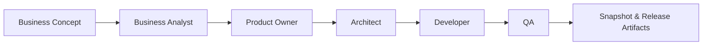
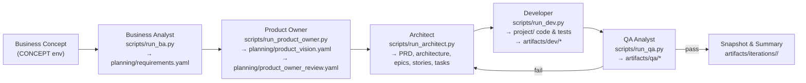

# Loop Release Workflow – AGNOSTIC AI PIPELINE 🏗️

**Deliver finished products through repeatable BA → Product Owner → Architect → Dev → QA release loops.**

## Project Overview

- **Purpose** – Automate the journey from business concept to QA-validated release, producing requirements, architecture, code, tests, and reports.
- **Roles** – Business Analyst, Product Owner, Architect, Developer, QA, and Orchestrator working in sequence.
- **Artifacts** – Planning YAML files (`requirements.yaml`, `stories.yaml`, etc.), generated code/tests under `project/`, QA reports in `artifacts/qa/`.
- **Workflows** – Use `make iteration`/`make loop` for the end-to-end flow, or invoke each role via CLI (`make ba`, `make po`, etc.) to inspect individual steps.



### Product Owner Role

- **Goal** – Maintain the product vision and ensure new requirements stay aligned with business objectives.
- **Outputs** – `planning/product_vision.yaml` with the current vision snapshot and `planning/product_owner_review.yaml` summarising alignment status, gaps, and recommended actions.
- **Entry point** – `make po` (or `python scripts/run_product_owner.py evaluate`) generates updated vision/review files after the Business Analyst stage.

The Product Owner sits between the Business Analyst and the Architect, acting as a quality gate for requirements before the technical planning begins.

## Flexible Model Strategy: Real Impact

An automated, model-agnostic pipeline kills integration battles and lets business priorities drive every decision. Roles stay perfectly choreographed even when you hot-swap providers, so a single loop can kick off with open models humming on your laptop and land with enterprise-grade QA in the cloud.

- **Frictionless speed** – Dial the horsepower per role instantly: blitz ideation with lightweight open models, then hand off polishing or high-stakes QA to premium closed models.
- **Cost & compliance control** – Keep sensitive work on-prem with local models when regulations bite, and burst to cloud providers only when the payoff is clear.
- **Operational resilience** – If a third-party endpoint stalls, the loop keeps running by switching to an alternate model; automation keeps roles aligned without manual triage or retraining.
- **Continuous innovation** – Trial fresh LLMs without retooling scripts or prompts; point `make set-role` at the experimental model and compare results in the next loop.
- **Smarter scaling** – Blend local inference for cost-effective prototypes with cloud surges when your backlog spikes; the automated structure preserves story, code, and QA integrity.

---

## Why Loop Releases Matter

- Wraps the entire multi-agent pipeline into a single iteration artifact.
- Guarantees every release includes stories, code, tests, QA evidence, and reproducible state.
- Enables strict or exploratory runs (QA strict vs relaxed) while preserving audit trails.
- Simple to operate (`make iteration ...`), powerful enough for enterprise backlogs, and extensible to any professional or hobby setup.

---

## Example Release Scenarios

| Scenario | Goal | Command |
| -------- | ---- | ------- |
| **CoffeeClub Inventory & Ordering** | Strict inventory/ordering flow with real-time dashboards | `make iteration CONCEPT="CoffeeClub Inventory & Ordering" LOOPS=2 ALLOW_NO_TESTS=0` |
| **E-commerce MVP** | Quick prototype with relaxed QA to explore UI variants | `make iteration CONCEPT="Retail MVP" LOOPS=1 ALLOW_NO_TESTS=1 ITERATION_NAME="explore-retail"` |
| **Mobile Companion App** | Leverage a React Native skeleton added to `project-defaults/` | `make iteration CONCEPT="Courier Mobile Companion" LOOPS=2 SKIP_BA=0` |
| **API Hardening Sprint** | Re-run architect/dev/qa using existing requirements | `make iteration CONCEPT="API Hardening" LOOPS=3 SKIP_BA=1` |
| **Localized Content Update** | Switch Dev role to Codex CLI for domain-specific models | `make set-role role=dev provider=codex_cli model="codex-local"`<br>`make iteration CONCEPT="Localized Content Refresh" LOOPS=2` |

These examples illustrate how loop releases stay **simple (single make command)**, **powerful (full BA→QA automation)**, and **extensible (drop in new skeletons or providers)** across professional or amateur environments.

---

## Classic Loop Release Flow

The pipeline coordinates five specialised roles. Each emits artifacts that become the inputs for the next role, ensuring traceability from concept to QA evidence.



### Role Responsibilities
- **CONCEPT** – Plain-text business goal consumed by the Business Analyst.
- **LOOPS** – Number of Dev→QA passes in the iteration (defaults to 1).
- **ITERATION_NAME** – Human-readable label for snapshots under `artifacts/iterations/`.
- **ALLOW_NO_TESTS** – Set to `0` for strict QA, `1` for exploratory prototyping.
- **SKIP_BA / SKIP_PLAN** – Reuse existing requirements/stories without re-running those roles.

| Role | Primary Script | Key Inputs | Key Outputs | Decision Points |
| ---- | -------------- | ---------- | ----------- | --------------- |
| Business Analyst | `scripts/run_ba.py` | `CONCEPT` (env) | `planning/requirements.yaml` + metadata (`meta.original_request`) | Defines initial scope and measurable requirements |
| Product Owner | `scripts/run_product_owner.py` | Concept, requirements, previous vision | `planning/product_vision.yaml`, `planning/product_owner_review.yaml` | Validates alignment; flags gaps or conflicts before planning |
| Architect | `scripts/run_architect.py` | Concept (from requirements) | `planning/prd.yaml`, `architecture.yaml`, `epics.yaml`, `stories.yaml`, `tasks.csv` | Adjusts stories based on QA feedback, honours PO vision |
| Developer | `scripts/run_dev.py` | `planning/stories.yaml` | Application code & automated tests under `project/`, per-story diffs in `artifacts/dev/` | Retries up to `DEV_RETRIES`; blocked stories documented |
| QA Analyst | `scripts/run_qa.py` | Codebase + tests | `artifacts/qa/last_report.json`, per-story logs in `artifacts/qa/story_logs/` | Auto-fixes import paths, enforces TDD, classifies severity |

### Execution Timeline per Iteration

1. **Concept definition** – Provide a clear business description by exporting `CONCEPT="..."`.
2. **BA stage** – Run `make ba` (or let `make iteration` call it) to produce the structured requirements.
3. **PO validation** – Execute `make po` to update the product vision and confirm alignment.
4. **Architect planning** – `make plan` creates the delivery backlog from the approved requirements.
5. **Development loop** – `make loop MAX_LOOPS=<N>` cycles through Dev/QA with architect interventions:
   - QA failures labelled `force_applicable` require `>= pipeline.force_approval_attempts` Dev retries (default 3) on P1/P0 stories before safe force approval.
   - Non-critical test-only failures hold the story in `blocked_test_only` for manual Dev fixes.
6. **Snapshot & review** – `make iteration CONCEPT="..." LOOPS=<N>` encapsulates steps 2–5 and stores outputs under `artifacts/iterations/`.

### Recommended Command Sequence

```bash
# 1. Capture requirements and vision
CONCEPT="Mid-market social tagging assistant" make ba
CONCEPT="Mid-market social tagging assistant" make po

# 2. Generate technical plan
CONCEPT="Mid-market social tagging assistant" make plan

# 3. Execute development/QA loop
make loop MAX_LOOPS=5

# Optional: clean artifacts or reset workspace
make clean                 # removes artifacts/*
FLUSH=1 make clean         # also empties planning/ and project/
```
### Loop Lifecycle

Use `artifact/qa/story_logs/<story>.log` to investigate repeated QA failures, and `planning/product_owner_review.yaml` to reconcile BA requirements with the product vision across iterations.

---

## Anatomy of a Snapshot

```
artifacts/iterations/<iteration-name>/
├── planning/
│   ├── requirements.yaml
│   ├── prd.yaml
│   ├── architecture.yaml
│   ├── epics.yaml
│   ├── stories.yaml
│   └── tasks.csv
├── project/
│   ├── backend-fastapi/
│   └── web-express/
└── summary.json
```

`summary.json` includes:
- Concept used, timestamps, loop count, QA strictness.
- Counts of stories by status (`done`, `blocked`, `pending`).
- Lists of story IDs per status for quick inspection.

---

## Supporting Infrastructure

### Core Pipeline Strengths (Quick View)

| Feature | Summary |
| ------- | ------- |
| **Integral TDD** | Tests are mandatory per story; QA blocks missing suites when `ALLOW_NO_TESTS=0`. |
| **Intelligent QA** | Severity-aware classification, automated architect interventions, and selective force approval. |
| **Auto-Retry + Dependencies** | Stories in `waiting` state unlock when prerequisites finish; Dev→QA loops run via `make loop`. |
| **Cross-Stack Support** | Backend (FastAPI), web (Express.js), and new modules (React Native, services) supported through skeletons. |

### Project Defaults Skeleton

`project-defaults/` provides a minimal scaffold copied into `project/` whenever missing:
- `backend-fastapi/app/__init__.py` ensures imports like `from app.foo import ...` always work.
- Placeholder test packages and `.gitkeep` files for web assets.
- Stub modules for FastAPI/Pydantic (optional) so QA runs even if dependencies are offline.

`common.ensure_dirs()` clones these defaults without overwriting existing files, meaning release loops always start from a consistent baseline after cleanup.

### Multi-Stack Extensibility & Providers

- Roles are configured in `config.yaml`; each loop release can target Ollama, OpenAI, or Codex CLI per agent.
- Extending to new stacks (e.g., mobile apps, additional services) is as simple as adding a skeleton under `project-defaults/`—release loops will copy the structure automatically.
- `scripts/llm.py` handles provider selection per role, logging raw interactions under `artifacts/<role>/last_raw.txt`.
- Mix and match local (Ollama) or paid APIs (OpenAI, Claude Code, Codex CLI, etc.) within the same release; each role can target a different provider without code changes.

## Model Recommender (RoRF)

- **Enable/Disable**: Set `enabled: true` or `enabled: false` in `config/model_recommender.yaml`. When disabled, the system falls back to the `weak` model defined for each route.
- **How it works**: When enabled, `recommend_model()` embeds the prompt with Jina, feeds it to a pretrained RoRF router, and returns either the **weak**/cost-efficient or **strong**/high-quality model ID defined in `config/model_recommender.yaml`.
- **Upstream reference**: RoRF ships via the open-source controller described on the project page (search for “Routing on Random Forests” by notdiamond) where you can review router calibration notes and the list of pretrained Jina checkpoints bundled with the PyPI package.
- **Config**: `config/model_recommender.yaml` defines the `enabled` flag, role routes, `strong`/`weak` models, and router IDs.
- **Tuning**: Increase `threshold` to shift more prompts toward the `strong` model; drop it to save cost.
- **Smoke test**: `make reco-demo` runs `scripts/reco_demo.py` and prints model picks per role, respecting the `enabled` flag.

## Vertex AI (Gemini) Providers

- Google Vertex AI support ships via the `vertex_cli` (REST through `gcloud auth print-access-token`) and optional `vertex_sdk` providers.
- See `vertex_ai_gemini_provider_via_gcloud_implementation_guide_for_codex.md` for setup, smoke tests, CI wiring, and advanced usage notes.

### Architect Complexity Tiers

- The Architect agent inspects `planning/requirements.yaml` and chooses between three prompt tiers:
  - **Simple** – 3‑6 broad stories, high developer autonomy; triggered by lightweight/MVP requirements.
  - **Medium** – Default backlog size (approx. 5‑12 stories) with balanced detail.
  - **Corporate** – 10‑18 highly specified stories covering integrations, compliance, and non-functional requirements.
- Selection is primarily driven by an LLM classifier fed with the requirements text; a lightweight word-count fallback keeps the system resilient when the classifier is unavailable.
- Override manually when needed with `FORCE_ARCHITECT_TIER=<simple|medium|corporate> make plan`.
- The chosen tier is exposed in console logs (`Complexity tier selected: ...`) and passed to the LLM so outputs scale in detail automatically.

---

## Getting Started (Strict Release)

1. **Install dependencies**
   ```bash
   make setup
   ```
2. **Set providers/models**
   ```bash
   make set-role role=architect provider=codex_cli model="gpt-5-codex"
   make set-role role=dev provider=ollama model="mistral:7b-instruct"
   ```
3. **Run a strict loop release**
   ```bash
   make iteration CONCEPT="CoffeeClub Inventory & Ordering" LOOPS=2 ALLOW_NO_TESTS=0
   ```
4. **Inspect results**
   ```bash
   cat artifacts/iterations/<iteration>/summary.json
   tree artifacts/iterations/<iteration>/
   ```
5. **Retry blocked stories**
   ```bash
   make loop MAX_LOOPS=1
   ```

---

## Advanced Controls

| Flag | Purpose |
| ---- | ------- |
| `ALLOW_NO_TESTS` | TDD strictness (0 = strict, 1 = relaxed) |
| `ARCHITECT_INTERVENTION` | Enables auto story refinements when QA fails |
| `STRICT_TDD` | Forces Architect to embed additional TDD requirements |
| `LOOP_MODE=dev_only` | Skip QA for exploratory coding loops |
| `SKIP_BA` / `SKIP_PO` / `SKIP_PLAN` | Reuse existing outputs for incremental releases |

Use these flags in `make iteration` or directly in `make loop` for lower-level control.

---

## Reference Commands

```bash
# One-off actions
make ba                          # BA → requirements
make po                          # Product Owner → vision + alignment review
make plan                        # Architect → PRD, epics, stories, tasks
make dev STORY=S1                # Dev implements a specific story
make qa QA_RUN_TESTS=1           # Run QA with tests
make clean                       # Purge artifacts/ (FLUSH=1 also wipes planning/ and project/)

# Orchestration
make loop MAX_LOOPS=10           # Dev↔QA loop (includes Architect adjustments)
make iteration CONCEPT="..."     # Full loop release with snapshot

# Utilities
./.venv/bin/python scripts/fix_stories.py    # Normalize planning/stories.yaml
./.venv/bin/python scripts/reopen_stories.py # Reset stories to todo
make show-config                             # Inspect resolved provider/model per role
```

---

## Proven Outcome

Loop releases have already generated:
- A full e-commerce platform (auth, catalog, cart, checkout) across 15 stories.
- >200 automated tests validated by QA in strict mode.
- Zero manual coding once the concept is defined.

---

## Conclusion

Treat each loop release as a self-contained product increment: enter a concept, run `make iteration`, and receive code, tests, and documentation. The workflow is **simple to drive**, **powerful in coverage**, and **extensible to any stack or environment**—from hobby experiments to enterprise delivery. The AGNOSTIC AI PIPELINE turns this release cadence into a repeatable process that scales while maintaining audit-ready artifacts. 🚀
