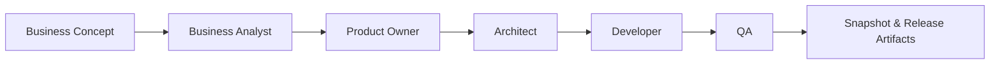

# Loop Release Workflow – AGNOSTIC AI PIPELINE 🏗️

**Deliver finished products through repeatable development cycles: BA → Product Owner → Architect → Dev → QA.**

## Product Concept

The purpose of this project is to automate the entire software development lifecycle, from the conception of an idea to its validation by QA. The pipeline generates code, tests, and planning artifacts ready for delivery.

- **Involved Roles** – A Business Analyst, Product Owner, Architect, Developer, QA, and an Orchestrator collaborate to transform a concept into a functional product.
- **Generated Artifacts** – The system produces planning files (`requirements.yaml`, `stories.yaml`), source code and tests (in `project/`), and QA reports (`artifacts/qa/`).
- **Workflow** – You can run a full cycle with `make iteration` or `make loop`, or run each role independently for debugging and granular control.



## The Advantage of an Agnostic Pipeline

The main strength of this pipeline is its **AI model agnosticism**. This eliminates dependencies on a single provider and allows business priorities to drive technical decisions. The roles remain perfectly choreographed even when swapping model providers on the fly.

- **Frictionless Speed** – Adapt the AI power for each role. Use lightweight open-source models for ideation and delegate critical QA tasks to more powerful premium models.
- **Cost and Compliance Control** – Keep sensitive data on-premise using local models and only turn to cloud providers when strictly necessary.
- **Operational Resilience** – If an external provider fails, the pipeline can switch to an alternative model without stopping the development cycle.
- **Continuous Innovation** – Test new LLMs without rewriting scripts or prompts. Simply point to a new model and compare the results.

## Supported Providers

The pipeline is compatible with multiple AI model providers. You can configure which model each role uses with a simple command.

Here are some examples:

### Vertex AI (Gemini)
To use Google's models via Vertex AI.
```bash
make set-role role=architect provider=vertex_cli model="gemini-1.0-pro"
```
*See `vertex_ai_gemini_provider_via_gcloud_implementation_guide_for_codex.md` for more configuration details.*

### OpenAI (GPT)
To use models like GPT-4 through a Codex-compatible CLI.
```bash
make set-role role=dev provider=codex_cli model="gpt-4-turbo"
```

### Claude Code CLI (Anthropic)
To call Anthropic's Claude Code via its local CLI (no direct API integration required).
```bash
make set-role role=dev provider=claude_cli model="claude-3-5-sonnet-latest"
```
*Prerequisites*: run `claude login` (or equivalent token setup) beforehand and ensure the binary is on your `PATH`.
*Optional verbose mode*: set `debug: true` on the `claude_cli` provider in `config.yaml` to add `--verbose --debug` flags and persist CLI stderr under `artifacts/<role>/last_raw.txt`.

### Ollama (Local Models)
To run open-source models like Llama or Mistral on your own machine.
```bash
make set-role role=dev provider=ollama model="mistral:7b-instruct"
```

### Local-Only Example with Ollama
For an entirely local stack, point the core roles to Ollama models:
```bash
make set-role role=architect provider=ollama model="qwen2.5-coder:7b"
make set-role role=dev provider=ollama model="qwen2.5-coder:14b"
make set-role role=qa provider=ollama model="qwen2.5-coder:7b"
```
This keeps every agent on locally hosted models while the pipeline remains ready to switch back to hosted providers when needed.

---

## Quick Start Guide

1. **Install dependencies**
   ```bash
   make setup
   ```
2. **Configure providers and models**
   ```bash
   # Example: Architect with OpenAI and Development with a local model
   make set-role role=architect provider=codex_cli model="gpt-4-turbo"
   make set-role role=dev provider=ollama model="mistral:7b-instruct"
   ```
3. **Run a full development cycle**
   ```bash
   make iteration CONCEPT="An inventory system for a coffee shop"
   ```
4. **Inspect the results**
   ```bash
   cat artifacts/iterations/<iteration>/summary.json
   tree artifacts/iterations/<iteration>/
   ```

---

## Additional Features

### Deployable Pipeline as Services (A2A)

This repository adopts the **Agent-to-Agent (A2A)** protocol, allowing each role in the pipeline to run as an independent HTTP service. This enables distributed orchestration, where agents can be deployed, scaled, and replaced independently.

- **Classic Mode**: Run `make iteration`. The entire process occurs sequentially on a single machine. Ideal for quick iterations.
- **A2A Mode (Service Mesh)**: Start each role with `python scripts/run_<role>.py serve`. Agents expose HTTP endpoints and can be orchestrated remotely. Ideal for distributed systems and team collaboration.

### Model Recommender (RoRF)

The system can dynamically select the most suitable model (cost-efficient vs. high-quality) for a given task.
- **Activation**: Controlled from `config/model_recommender.yaml`.
- **How it works**: It uses a pre-trained router to analyze the prompt and choose between a `weak` model (fast and cheap) or a `strong` model (powerful and expensive).

### Architect Complexity Tiers

The Architect agent analyzes the requirements and adjusts the level of detail in the user stories.
- **Tiers**: `Simple`, `Medium`, `Corporate`.
- **Selection**: An LLM classifier determines the complexity level based on the requirements text, although it can be forced manually.

---

## Advanced Controls

| Flag | Purpose |
| ---- | ------- |
| `ALLOW_NO_TESTS` | TDD strictness level (0 = strict, 1 = relaxed) |
| `ARCHITECT_INTERVENTION` | Allows the architect to refine stories if QA fails |
| `STRICT_TDD` | Forces the architect to include additional TDD requirements |
| `LOOP_MODE=dev_only` | Skips the QA step for exploratory coding cycles |
| `SKIP_BA` / `SKIP_PO` / `SKIP_PLAN` | Reuses existing artifacts for incremental releases |

---

## Reference Commands

```bash
# Individual actions
make ba                          # Generate requirements
make po                          # Review product vision
make plan                        # Generate epics, stories, and tasks
make dev STORY=S1                # Implement a specific story
make qa QA_RUN_TESTS=1           # Run QA with tests

# Orchestration
make loop MAX_LOOPS=10           # Start a Dev↔QA loop
make iteration CONCEPT="..."     # Run a full release cycle

# Start services in A2A mode
python scripts/run_ba.py serve
python scripts/run_architect.py serve
python scripts/run_dev.py serve
# ... and so on for each role

# Utilities
make clean                       # Clean up artifacts
make show-config                 # Display the model configuration per role
```

---

## Proven Results

This pipeline has already generated:
- A complete e-commerce platform (authentication, catalog, cart, checkout).
- Over 200 automated tests validated by QA in strict mode.
- Zero manual coding once the initial concept is defined.

---

## Conclusion

Treat each `make iteration` cycle as a self-contained product increment. The workflow is **simple to operate**, **powerful in its coverage**, and **extensible to any tech stack**. The AGNOSTIC AI PIPELINE turns the release cycle into a repeatable process that scales while maintaining auditable artifacts. 🚀
