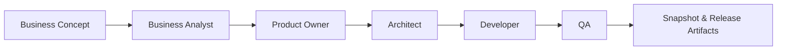
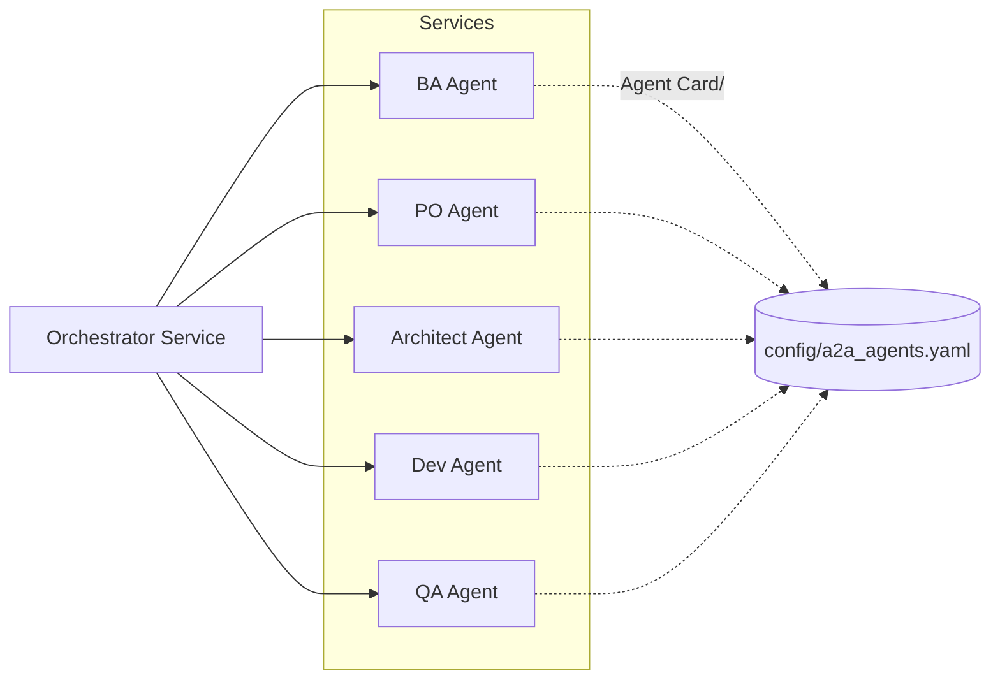

# Loop Release Workflow – AGNOSTIC AI PIPELINE 🏗️

**Deliver finished products through repeatable BA → Product Owner → Architect → Dev → QA release loops.**

## Project Overview

- **Purpose** – Automate the product-development loop from concept intake to QA validation, producing code, tests, and planning artifacts ready for release.
- **Roles** – Business Analyst, Product Owner, Architect, Developer, QA, and Orchestrator collaborate sequentially (classic mode) or via services (A2A mode).
- **Artifacts** – Planning YAMLs (`requirements.yaml`, `stories.yaml`, etc.), generated code/tests under `project/`, QA reports in `artifacts/qa/`.
- **Workflows** – Use `make iteration`/`make loop` for one-shot runs, or start individual CLIs to execute or debug each role independently.



### A2A-Enabled Pipeline at a Glance

This repository adopts the Agent-to-Agent (A2A) protocol so every pipeline role can run as an independent HTTP service. Each role publishes an Agent Card (capabilities, skills, auth) and collaborates through JSON-RPC calls orchestrated by the pipeline. You can:

- Trigger the traditional loop with `make iteration` (BA→PO→Architect→Dev→QA in one command).
- Launch the A2A mesh (`python scripts/run_<role>.py serve`) and coordinate roles dynamically via the Orchestrator service or the `A2AClient` helpers.

Agent endpoints, ports, and skills live in `config/a2a_agents.yaml`, enabling you to deploy agents separately, swap implementations, or integrate external services without touching the orchestration core.



#### Classic vs. A2A Modes

- **Classic (“monolithic”) mode** – Run `make iteration`, `make loop`, or the individual role scripts without `serve`. Everything executes sequentially inside one process. Use this mode for quick iterations on a single machine when you don’t need distributed orchestration.
- **A2A (“service mesh”) mode** – Start each role with `python scripts/run_<role>.py serve`. Agents expose HTTP endpoints and can be orchestrated remotely (`A2AClient`, Orchestrator skill, or external tools). Choose this mode when you want independent scaling, easier substitution of agents, or when multiple teams/services must collaborate over a stable protocol.

Both modes share the same business logic; switching between them only changes how the roles are invoked and coordinated.

### Theoretical Context

The [A2A specification](https://a2a-protocol.org/latest/) defines three pillars that we apply in this repo:

1. **Agent discovery via Agent Cards** – Every service exposes `/.well-known/agent-card.json` describing its identity, authentication requirements, skills (input/output modes, examples), and endpoint. In our project these cards are generated by the FastAPI layer (`a2a/server.py`) and parameterised via `config/a2a_agents.yaml`.
2. **Standardised messaging over JSON-RPC 2.0** – Agents invoke each other through the `message/send` method, embedding the task payload (and optional streaming/artifact metadata). The reusable `create_agent_app()` dispatcher handles this contract, while `A2AClient` wraps the HTTP calls to keep orchestrator code concise.
3. **Task lifecycle & artifact sharing** – A2A models work items as tasks with clear states and optional artifacts. Each role handler (BA, PO, Architect, Dev, QA, Orchestrator) returns structured JSON containing both status and pointers to generated files (e.g., `planning/requirements.yaml`). The Orchestrator skill composes these results to deliver a full release increment.

Together, these concepts allow the pipeline to remain modular: each agent can evolve independently, yet the overall system stays interoperable and discoverable under one standard.

---

## Flexible Model Strategy: Real Impact

An automated, model-agnostic pipeline kills integration battles and lets business priorities drive every decision. Roles stay perfectly choreographed even when you hot-swap providers, so a single loop can kick off with open models humming on your laptop and land with enterprise-grade QA in the cloud.

- **Frictionless speed** – Dial the horsepower per role instantly: blitz ideation with lightweight open models, then hand off polishing or high-stakes QA to premium closed models.
- **Cost & compliance control** – Keep sensitive work on-prem with local models when regulations bite, and burst to cloud providers only when the payoff is clear.
- **Operational resilience** – If a third-party endpoint stalls, the loop keeps running by switching to an alternate model; automation keeps roles aligned without manual triage or retraining.
- **Continuous innovation** – Trial fresh LLMs without retooling scripts or prompts; point `make set-role` at the experimental model and compare results in the next loop.
- **Smarter scaling** – Blend local inference for cost-effective prototypes with cloud surges when your backlog spikes; the automated structure preserves story, code, and QA integrity.

## Model Recommender (RoRF)

- **Enable/Disable**: Set `enabled: true` or `enabled: false` in `config/model_recommender.yaml`. When disabled, the system falls back to the `weak` model defined for each route.
- **How it works**: When enabled, `recommend_model()` embeds the prompt with Jina, feeds it to a pretrained RoRF router, and returns either the **weak**/cost-efficient or **strong**/high-quality model ID defined in `config/model_recommender.yaml`.
- **Upstream reference**: RoRF ships via the open-source controller described on the project page (search for “Routing on Random Forests” by notdiamond) where you can review router calibration notes and the list of pretrained Jina checkpoints bundled with the PyPI package.
- **Config**: `config/model_recommender.yaml` defines the `enabled` flag, role routes, `strong`/`weak` models, and router IDs.
- **Tuning**: Increase `threshold` to shift more prompts toward the `strong` model; drop it to save cost.
- **Smoke test**: `make reco-demo` runs `scripts/reco_demo.py` and prints model picks per role, respecting the `enabled` flag.

## Vertex AI (Gemini) Providers

- Google Vertex AI support ships via the `vertex_cli` (REST through `gcloud auth print-access-token`) and optional `vertex_sdk` providers.
- See `vertex_ai_gemini_provider_via_gcloud_implementation_guide_for_codex.md` for setup, smoke tests, CI wiring, and advanced usage notes.

### Architect Complexity Tiers

- The Architect agent inspects `planning/requirements.yaml` and chooses between three prompt tiers:
  - **Simple** – 3‑6 broad stories, high developer autonomy; triggered by lightweight/MVP requirements.
  - **Medium** – Default backlog size (approx. 5‑12 stories) with balanced detail.
  - **Corporate** – 10‑18 highly specified stories covering integrations, compliance, and non-functional requirements.
- Selection is primarily driven by an LLM classifier fed with the requirements text; a lightweight word-count fallback keeps the system resilient when the classifier is unavailable.
- Override manually when needed with `FORCE_ARCHITECT_TIER=<simple|medium|corporate> make plan`.
- The chosen tier is exposed in console logs (`Complexity tier selected: ...`) and passed to the LLM so outputs scale in detail automatically.

### Token Tracking Policy

- Log the token cost (or mark as `N/A` when unavailable) for every significant command or AI interaction.
- Append entries to `TOKEN_USAGE.md`, including UTC timestamp, action description, and estimated tokens.

### A2A Agent Configuration

- Agent endpoints and capabilities are declared in `config/a2a_agents.yaml`.
- Role launchers (`scripts/run_*_agent.py`) expose A2A-compliant FastAPI services using the helpers under `a2a/`.
- Business Analyst, Product Owner, Architect, Developer, and QA handlers delegate to the existing role workflows; the Orchestrator skill calls them sequentially via `A2AClient`.

---

## Getting Started (Strict Release)

1. **Install dependencies**
   ```bash
   make setup
   ```
2. **Set providers/models**
   ```bash
   make set-role role=architect provider=codex_cli model="gpt-5-codex"
   make set-role role=dev provider=ollama model="mistral:7b-instruct"
   ```
3. **Run a strict loop release**
   ```bash
   make iteration CONCEPT="CoffeeClub Inventory & Ordering" LOOPS=2 ALLOW_NO_TESTS=0
   ```
4. **Inspect results**
   ```bash
   cat artifacts/iterations/<iteration>/summary.json
   tree artifacts/iterations/<iteration>/
   ```
5. **Retry blocked stories**
   ```bash
   make loop MAX_LOOPS=1
   ```

---

## Advanced Controls

| Flag | Purpose |
| ---- | ------- |
| `ALLOW_NO_TESTS` | TDD strictness (0 = strict, 1 = relaxed) |
| `ARCHITECT_INTERVENTION` | Enables auto story refinements when QA fails |
| `STRICT_TDD` | Forces Architect to embed additional TDD requirements |
| `LOOP_MODE=dev_only` | Skip QA for exploratory coding loops |
| `SKIP_BA` / `SKIP_PO` / `SKIP_PLAN` | Reuse existing outputs for incremental releases |

Use these flags in `make iteration` or directly in `make loop` for lower-level control.

---

## Reference Commands

```bash
# One-off actions
make ba                          # BA → requirements
make po                          # Product Owner → vision + alignment review
make plan                        # Architect → PRD, epics, stories, tasks
make dev STORY=S1                # Dev implements a specific story
make qa QA_RUN_TESTS=1           # Run QA with tests
make clean                       # Purge artifacts/ (FLUSH=1 also wipes planning/ and project/)
python scripts/run_ba.py serve             # Start Business Analyst agent service
python scripts/run_product_owner.py serve  # Start Product Owner agent service
python scripts/run_architect.py serve      # Start Architect agent service
python scripts/run_dev.py serve            # Start Developer agent service
python scripts/run_qa.py serve             # Start QA agent service
python scripts/run_orchestrator.py serve   # Start Orchestrator agent service

# Orchestration
make loop MAX_LOOPS=10           # Dev↔QA loop (includes Architect adjustments)
make iteration CONCEPT="..."     # Full loop release with snapshot

# Utilities
./.venv/bin/python scripts/fix_stories.py    # Normalize planning/stories.yaml
./.venv/bin/python scripts/reopen_stories.py # Reset stories to todo
make show-config                             # Inspect resolved provider/model per role
```

---

## Proven Outcome

Loop releases have already generated:
- A full e-commerce platform (auth, catalog, cart, checkout) across 15 stories.
- >200 automated tests validated by QA in strict mode.
- Zero manual coding once the concept is defined.

---

## Conclusion

Treat each loop release as a self-contained product increment: enter a concept, run `make iteration`, and receive code, tests, and documentation. The workflow is **simple to drive**, **powerful in coverage**, and **extensible to any stack or environment**—from hobby experiments to enterprise delivery. The AGNOSTIC AI PIPELINE turns this release cadence into a repeatable process that scales while maintaining audit-ready artifacts. 🚀
