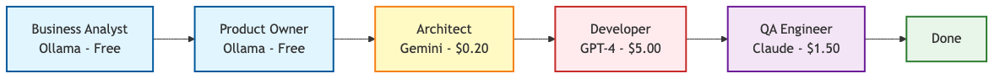
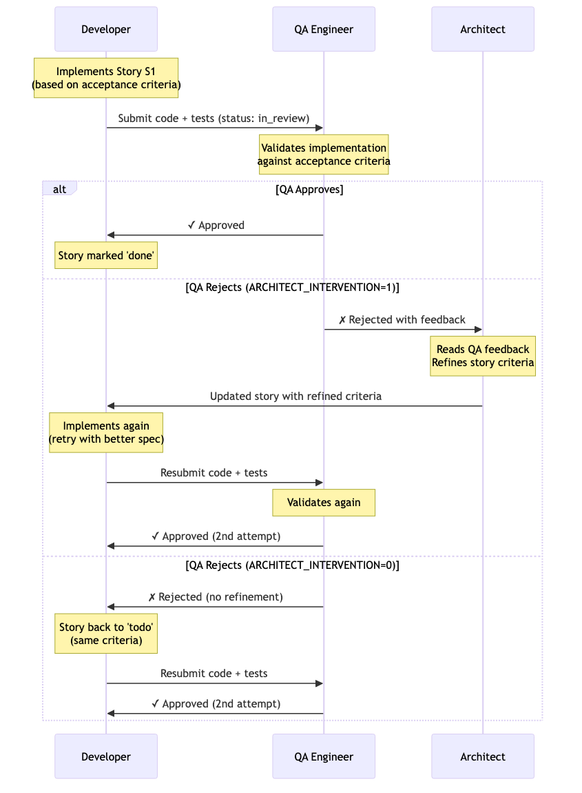

# Inside the AI Development Team: BA → Architect → Developer → QA

**How a multi-role AI pipeline actually works: from business concept to production code (and what gets generated along the way).**

*Part 2 of 7 • [← Part 1: The Vision](link-to-part-1)*

---

## The Reality Check

In [Part 1](link-to-part-1), I showed you the vision: a pipeline that treats AI models like infrastructure. Now let's talk about how it actually works.

Here's the truth: it's not magic. It's just a bunch of specialized roles, each doing one thing well, passing artifacts to the next role in line.

Think of it like a real development team. You wouldn't ask your QA engineer to write the architecture docs. You wouldn't ask your business analyst to implement the backend. Same principle here.

---

## The Five Roles (and What They Actually Do)



Let me walk you through what happens when you run `make iteration CONCEPT="User login with email"`.

---

### 1. Business Analyst (BA)

**Input:** Your concept string
**Output:** `planning/requirements.yaml`
**Model:** Ollama (local, free)
**Cost:** $0

The BA's job is simple: understand what you want to build.

You give it a vague concept like "User login with email and password". It asks itself questions a real BA would ask:

- What are the functional requirements?
- What are the non-functional requirements (security, performance)?
- What constraints exist?
- What's in scope? What's out of scope?

Then it writes a `requirements.yaml` file that looks like this:

```yaml
project_name: "User Authentication System"
functional_requirements:
  - User can register with email and password
  - Password must be hashed (bcrypt)
  - User can login with credentials
  - Invalid credentials return 401
non_functional_requirements:
  - Response time < 200ms
  - Passwords stored securely (hashed)
  - Email validation required
constraints:
  - Backend: FastAPI
  - Database: PostgreSQL
  - No third-party auth providers
```

Notice: it's using a local Ollama model. This is a draft. It doesn't need to be perfect. It just needs to be good enough for the next step.

---

### 2. Product Owner (PO)

**Input:** `requirements.yaml`
**Output:** `product_vision.yaml`, `product_owner_review.yaml`
**Model:** Ollama (local, free)
**Cost:** $0

The PO validates the requirements. Does this make sense from a product perspective?

- Are the requirements clear?
- Is there any ambiguity?
- Are there edge cases we're missing?
- Does this align with product goals?

The PO might flag issues like: "No password reset flow specified" or "What happens if email is already registered?"

Then it writes a `product_vision.yaml` that clarifies these points.

Still using a local model. Still free. Still a draft.

---

### 3. Architect

**Input:** `product_vision.yaml`
**Output:** `stories.yaml`, `epics.yaml`, `architecture.yaml`
**Model:** Gemini 2.5-pro (cloud, $0.20/feature)
**Cost:** ~$0.20

This is where it gets real. The Architect breaks down the vision into actionable user stories.

Each story has:
- ID (S1, S2, S3...)
- Description (what to build)
- Acceptance criteria (how to verify it works)
- Priority (P1, P2, P3)

Example story:

```yaml
- id: S1
  description: "Create POST /api/auth/register endpoint"
  acceptance:
    - Endpoint accepts email and password
    - Password is hashed with bcrypt
    - Returns 201 on success
    - Returns 400 if email already exists
    - Includes automated tests for all scenarios
  priority: P1
  status: todo
```

The Architect also decides the complexity tier (Simple, Medium, Corporate) and adjusts the level of detail accordingly.

This is the first step that costs money (Gemini at ~$0.30/1M tokens). But it's still cheap compared to using GPT-4 for the entire pipeline.

---

### 4. Developer

**Input:** `stories.yaml` (status: todo)
**Output:** Generated code in `project/`
**Model:** GPT-4 / Codex (cloud, ~$5/feature)
**Cost:** ~$5

The Developer takes the next `todo` story and implements it.

What it actually does:
1. Reads the story acceptance criteria
2. Writes the tests first (TDD enforcement)
3. Implements the code to make tests pass
4. Runs the tests locally
5. Marks the story as `doing` → `in_review`

For the registration endpoint, it generates:

```python
# project/backend-fastapi/routes/auth.py
from fastapi import APIRouter, HTTPException
from passlib.hash import bcrypt
from models.user import User
from database import db

router = APIRouter()

@router.post("/api/auth/register")
async def register(email: str, password: str):
    # Check if user exists
    existing = await db.users.find_one({"email": email})
    if existing:
        raise HTTPException(status_code=400, detail="Email already registered")

    # Hash password
    hashed = bcrypt.hash(password)

    # Create user
    user = await db.users.insert_one({
        "email": email,
        "password": hashed
    })

    return {"id": str(user.inserted_id)}, 201
```

Plus tests:

```python
# project/backend-fastapi/tests/test_auth.py
def test_register_success():
    response = client.post("/api/auth/register", json={
        "email": "test@example.com",
        "password": "secure123"
    })
    assert response.status_code == 201

def test_register_duplicate_email():
    # Register once
    client.post("/api/auth/register", json={
        "email": "test@example.com",
        "password": "secure123"
    })
    # Try again
    response = client.post("/api/auth/register", json={
        "email": "test@example.com",
        "password": "secure123"
    })
    assert response.status_code == 400
```

This is where most of the cost goes (~$5 per feature using GPT-4). But it's also where the value is.

---

### 5. QA Engineer

**Input:** Generated code + tests
**Output:** `artifacts/qa/report.md`, approval/rejection
**Model:** Claude 3.5 Sonnet (cloud, ~$1.50/feature)
**Cost:** ~$1.50

QA validates everything:

- Do the tests actually test what the acceptance criteria say?
- Is the code quality acceptable?
- Are there edge cases missing?
- Does it follow best practices?

If `QA_RUN_TESTS=1`, it also runs the tests and checks coverage.

QA can either:
- **Approve** → Story marked as `done`
- **Reject** → Story goes back to `todo`, Architect refines it

---

## The Feedback Loop (When QA Fails)

Here's where it gets interesting.

If QA rejects a story, the Architect gets involved again. It reads the QA feedback and refines the story based on what went wrong.



This is controlled by `ARCHITECT_INTERVENTION=1` (default).

If you set `ARCHITECT_INTERVENTION=0`, the story just goes back to `todo` without refinement.

---

## What Actually Gets Generated (Artifacts)

Every time you run `make iteration`, you get a complete snapshot:

```
artifacts/iterations/login-feature-20251102/
├── summary.json          # Cost, duration, model usage
├── requirements.yaml     # BA output
├── product_vision.yaml   # PO output
├── stories.yaml          # Architect output
├── architecture.yaml     # System design
├── epics.yaml           # High-level features
└── code.zip             # All generated code

planning/
├── requirements.yaml
├── product_vision.yaml
├── stories.yaml
├── architecture.yaml
├── epics.yaml
└── tasks.csv

project/backend-fastapi/
├── main.py
├── routes/
│   └── auth.py
├── models/
│   └── user.py
└── tests/
    └── test_auth.py

artifacts/qa/
├── report.md            # QA findings
└── coverage.json        # Test coverage
```

Everything is tracked. You can diff between iterations. You can rollback. You can see exactly which model was used for which step.

> **The key insight:** Artifacts = complete traceability. From concept to code, every decision is documented.

---

## Real Example: Login Feature End-to-End

Let's walk through a real run:

```bash
make iteration CONCEPT="User login with email and password"
```

**Step 1: BA (2 seconds, $0)**
Generates `requirements.yaml` with 8 functional requirements, 4 non-functional, 3 constraints.

**Step 2: PO (3 seconds, $0)**
Validates requirements, flags missing password reset flow, writes `product_vision.yaml`.

**Step 3: Architect (15 seconds, $0.18)**
Breaks into 4 stories: S1 (register), S2 (login), S3 (logout), S4 (password reset). Classifies as "Simple" complexity.

**Step 4: Developer - Story S1 (45 seconds, $4.20)**
Implements `POST /api/auth/register` with tests. Marks as `in_review`.

**Step 5: QA (12 seconds, $1.35)**
Validates code, runs tests, approves. Story marked `done`.

**Loop continues for S2, S3, S4...**

**Total: 4 stories, ~$23, 8 minutes**

Output:
- 4 endpoints implemented
- 16 tests written and passing
- Complete documentation in artifacts/
- Full audit trail in summary.json

---

## Why This Works

Three reasons:

**1. Separation of Concerns**
Each role does one thing. BA doesn't write code. Dev doesn't write requirements. QA doesn't design architecture.

**2. Cost Optimization by Role**
Use free local models for drafts (BA, PO). Use expensive cloud models only for critical steps (Dev, QA).

**3. Complete Traceability**
Every artifact is saved. Every decision is documented. You can see exactly what happened and why.

---

## What Can Go Wrong

Let's be honest:

- **Models fail.** About 12-18% of the time, a model will timeout, return malformed JSON, or hallucinate. That's why we have fallback (Part 4).
- **Tests aren't perfect.** Sometimes the Developer writes tests that don't actually test the acceptance criteria. QA catches most of these, but not all.
- **Architect can over-engineer.** If classified as "Corporate" complexity, you get way more detail than you need. You can force `FORCE_ARCHITECT_TIER=simple`.

But here's the thing: when something fails, you have complete logs. You can see exactly which role failed, which model was used, what the input was, what the output was.

Debugging is way easier when everything is documented.

---

## Try It Yourself

```bash
# Clone and setup
git clone https://github.com/krukmat/agnostic-ai-pipeline.git
cd agnostic-ai-pipeline
make setup

# Run a full iteration
make iteration CONCEPT="Todo app with user auth"

# Or just run individual steps
make ba CONCEPT="Todo app"
make po
make plan
make dev STORY=S1
make qa

# Check the artifacts
cat planning/requirements.yaml
cat planning/stories.yaml
tree artifacts/iterations/
```

You'll get:
- `requirements.yaml` - What the BA understood
- `stories.yaml` - User stories with acceptance criteria
- `project/` - Actual generated code + tests
- `artifacts/qa/` - QA test results and coverage report

---

## What's Next

In **Part 3**, I'll show you the numbers: how using local models for drafts and cloud models for production cuts costs by 89%. Plus, how the Model Recommendation system (RoRF) automatically routes to the right model based on prompt complexity.

In **Part 4**, we'll dive into the fallback system: what happens when Gemini fails, how it automatically tries Codex, then Ollama, and how all of that is tracked in metadata.

---

**Part 2 of 7:** Multi-Role Pipeline + Artifacts
[← Part 1: The Vision](link-to-part-1) | Part 3: Cost Engineering (coming soon)

Repository: https://github.com/krukmat/agnostic-ai-pipeline

*Questions? Feedback? Open an issue or reach out. This is a proof-of-concept—rough edges expected.*
