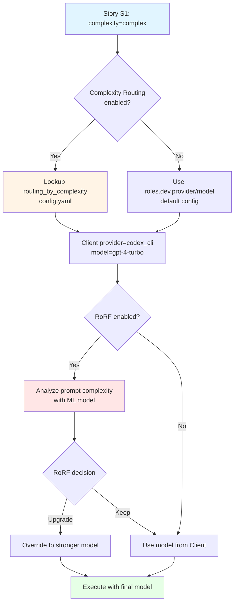

# Análisis de Duplicidad - Complexity Routing

**Fecha**: 2025-01-29
**Revisor**: Claude Code
**Estado**: ✅ NO HAY DUPLICIDAD - Implementación es complementaria

---

## Resumen Ejecutivo

✅ **NO existe duplicidad**. La funcionalidad propuesta es **complementaria** a las capacidades existentes:

1. **Complexity Classifier** (existente) → Clasifica **requirements** (input de BA)
2. **RoRF/Model Recommender** (existente) → Analiza **prompts** en runtime
3. **Complexity Routing** (propuesto) → Rutas basado en **story complexity** (metadata de Architect)

Son tres sistemas **diferentes** que operan en **diferentes etapas** del pipeline.

---

## 1. Sistemas Existentes Detectados

### 1.1 Complexity Classifier (`scripts/architect/complexity_classifier.py`)

**Propósito**: Clasificar **requirements** (BA output) como `simple | medium | corporate`

**Uso actual**:
```python
# En run_architect.py
tier = await classify_complexity_with_llm(requirements_content)
# Devuelve: "simple" | "medium" | "corporate"
```

**Input**: Texto de requirements (BA output)
**Output**: Tier de complejidad para seleccionar prompt de Architect
**Aplicación**: Seleccionar prompt de Architect basado en complejidad del proyecto

**Valores**: `simple`, `medium`, `corporate` (diferente a story complexity)

**Diferencias clave**:
| Aspecto | Complexity Classifier | Complexity Routing (propuesto) |
|---------|----------------------|--------------------------------|
| **Input** | Requirements (BA) | Stories (Architect) |
| **Scope** | Todo el proyecto | Story individual |
| **Purpose** | Prompt selection para Architect | Model selection para Dev/QA |
| **Values** | simple/medium/corporate | simple/medium/complex |
| **When** | Antes de llamar Architect | Antes de llamar Dev/QA |

✅ **No hay conflicto**: Operan en etapas diferentes del pipeline.

---

### 1.2 RoRF Model Recommender (`src/recommend/model_recommender.py`)

**Propósito**: Routing **dinámico** basado en análisis de prompts en runtime

**Uso actual**:
```python
# En scripts/llm.py:238-247
async def chat(self, system: str, user: str) -> str:
    if recommend_model and _reco_enabled():
        prompt = f"{system.strip()}\n\n{user.strip()}"
        chosen_model = recommend_model(prompt, role=self.role)
        logger.info(f"[LLM] Model recommender chose: {chosen_model}")
        if chosen_model:
            self.model = chosen_model  # Override model
```

**Input**: Prompt completo (system + user)
**Output**: Model ID (strong vs weak)
**Aplicación**: Optimización de costos en runtime analizando complejidad del prompt

**Config** (`config/model_recommender.yaml`):
```yaml
enabled: true
routes:
  dev:
    router_id: "some-router"
    strong: "gpt-4-turbo"
    weak: "qwen2.5-coder:7b"
    threshold: 0.30
```

**Diferencias clave**:
| Aspecto | RoRF Model Recommender | Complexity Routing (propuesto) |
|---------|------------------------|--------------------------------|
| **Trigger** | Runtime (cada prompt) | Config time (por story) |
| **Analysis** | Prompt content | Story metadata |
| **Logic** | ML model analysis | Config lookup |
| **Override** | Dinámico (puede cambiar) | Estático (basado en config) |
| **Config** | `model_recommender.yaml` | `config.yaml` |

✅ **No hay conflicto**: RoRF puede seguir funcionando **después** de complexity routing.

---

## 2. Interacción Entre Sistemas

### Orden de Ejecución Propuesto:



### Ejemplo Concreto:

**Escenario**: Story S1 con `complexity: complex`

**Paso 1 - Complexity Routing** (propuesto):
```python
# En Client.__init__()
complexity = "complex"  # From story
provider, model = resolve_role_model_for_complexity(config, "dev", complexity)
# Returns: ("codex_cli", "gpt-4-turbo")
```

**Paso 2 - RoRF** (existente):
```python
# En Client.chat()
if recommend_model and _reco_enabled():
    chosen_model = recommend_model(prompt, role="dev")
    # Analiza el prompt real y puede override:
    # - Si prompt es simple: downgrade a "qwen2.5-coder:7b"
    # - Si prompt es complejo: mantiene "gpt-4-turbo"
```

**Resultado**: Dos capas de optimización que se complementan.

---

## 3. ¿Hay Duplicidad? NO

### 3.1 Stories NO tienen campo `complexity` actualmente

```yaml
# planning/stories.yaml (actual)
- id: S1
  description: "Create simple calculator API"
  status: todo
  depends_on: []
  acceptance_criteria: [...]
  # ❌ NO HAY CAMPO complexity
```

**Búsqueda en codebase**:
```bash
grep -r "story.*complexity\|\.get(\"complexity\"" scripts/
# Resultado: 0 matches
```

✅ **Confirmado**: Ningún código actual usa `story.get("complexity")`.

---

### 3.2 Config `routing_by_complexity` NO existe

```yaml
# config.yaml (actual)
roles:
  dev:
    provider: vertex_sdk
    model: gemini-2.5-pro
  # ❌ NO HAY routing_by_complexity
```

**Búsqueda en codebase**:
```bash
grep -r "routing_by_complexity" --exclude-dir=docs .
# Resultado: 0 matches (solo en docs/COMPLEXITY_ROUTING_PLAN.md que acabo de crear)
```

✅ **Confirmado**: Config propuesto no existe.

---

### 3.3 Client NO acepta parámetro `complexity`

```python
# scripts/llm.py:95 (actual)
class Client:
    def __init__(self, role: Optional[str] = None, *legacy_args, **overrides):
        # ❌ NO HAY parámetro complexity
```

✅ **Confirmado**: Modificación necesaria, no hay duplicación.

---

## 4. Compatibilidad con Sistemas Existentes

### 4.1 Complexity Classifier

**Impacto**: ✅ NINGUNO

- Opera en fase BA→Architect (requirements)
- Propuesta opera en fase Architect→Dev/QA (stories)
- Valores diferentes: `corporate` vs `complex`

**No requiere cambios**.

---

### 4.2 RoRF Model Recommender

**Impacto**: ✅ COMPATIBLE

**Escenarios**:

#### A. Solo Complexity Routing (RoRF disabled)
```python
# Story: complexity=simple
# Routing: ollama/qwen2.5-coder:7b
# RoRF: disabled
# Final: ollama/qwen2.5-coder:7b ✅
```

#### B. Solo RoRF (Complexity Routing disabled)
```python
# Story: no complexity
# Routing: disabled → roles.dev.provider/model
# RoRF: enabled → analyzes prompt → may override
# Final: RoRF decision ✅
```

#### C. Ambos Enabled (recomendado)
```python
# Story: complexity=complex
# Routing: codex_cli/gpt-4-turbo ← Base from complexity
# RoRF: enabled → analyzes prompt → may downgrade if prompt is simple
# Final: RoRF decision (can downgrade to save costs) ✅
```

**Orden de prioridad** (propuesto):
1. Complexity routing selecciona base model
2. RoRF puede override en runtime si detecta mismatch
3. Final model decision es de RoRF (si enabled)

**No hay conflicto**: RoRF es la última palabra (como debe ser).

---

## 5. Ajustes Necesarios al Plan Original

### 5.1 Documentar Interacción con RoRF

Añadir sección en `COMPLEXITY_ROUTING_PLAN.md`:

```markdown
### Interaction with RoRF

Complexity routing provides a **config-based baseline**, while RoRF provides
**runtime optimization**. They work together:

1. Complexity routing sets initial model from story metadata
2. RoRF analyzes actual prompt and may override
3. Final decision: RoRF (if enabled) > Complexity Routing > Role defaults

Example:
- Story S1: complexity=complex → routes to gpt-4-turbo
- RoRF analyzes prompt: detects it's actually simple
- RoRF downgrades to qwen2.5-coder:7b to save costs
- Final model: qwen2.5-coder:7b ✅ (cost-optimized)
```

### 5.2 Logging debe mostrar ambas decisiones

```python
logger.info(f"[ROUTING] Story {story_id} complexity={complexity} → {provider}/{model}")
# ...later in Client.chat()...
logger.info(f"[RoRF] Analyzed prompt → override to {chosen_model}")
```

### 5.3 Feature flags independientes

```yaml
features:
  routing_by_complexity_enabled: false  # Static routing por story
  # RoRF tiene su propio config en model_recommender.yaml
```

---

## 6. Recomendaciones Finales

### ✅ PROCEDER con implementación

La funcionalidad propuesta:

1. **NO duplica** nada existente
2. **Complementa** RoRF y Complexity Classifier
3. **Es ortogonal** a los sistemas existentes
4. **Añade valor**: Config estático basado en metadata vs ML runtime

### Modificaciones al plan:

1. ✅ Añadir sección de interacción con RoRF
2. ✅ Documentar orden de precedencia
3. ✅ Actualizar logs para mostrar ambas decisiones
4. ✅ Añadir tests de integración con RoRF

### Casos de uso diferenciados:

| Sistema | Mejor para | Ejemplo |
|---------|-----------|---------|
| **Complexity Routing** | Predictable, policy-based | "Todas las stories de autenticación usan GPT-4" |
| **RoRF** | Cost optimization, dynamic | "Downgrade si el prompt es simple despite complexity tag" |
| **Ambos** | Best of both worlds | Static baseline + dynamic optimization |

---

## 7. Conclusión

✅ **NO HAY DUPLICIDAD**

La implementación propuesta es **complementaria y valiosa**:
- Complexity Classifier → classifica **projects** (requirements)
- Complexity Routing → rutas **stories** (metadata)
- RoRF → optimiza **prompts** (runtime analysis)

**Tres sistemas diferentes, tres etapas diferentes, tres propósitos diferentes.**

**Recomendación**: ✅ IMPLEMENTAR según plan original con ajustes menores para documentar interacción con RoRF.
