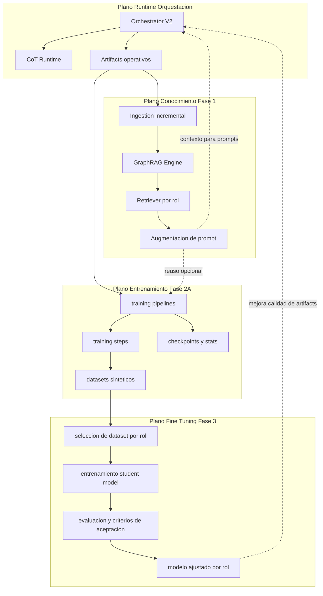
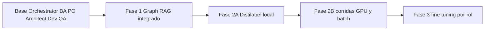
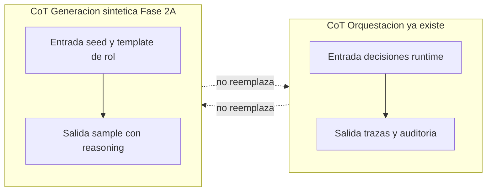
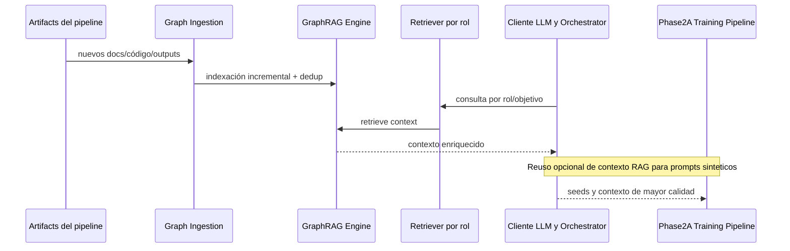
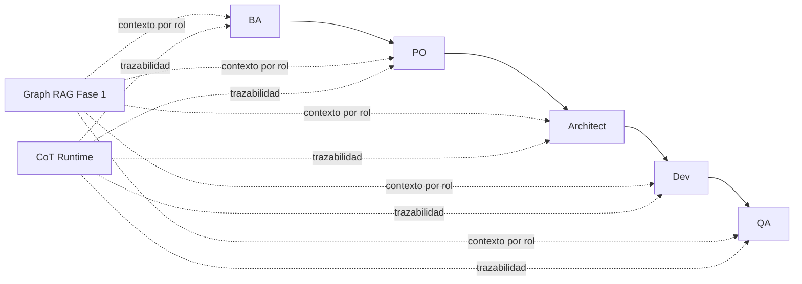
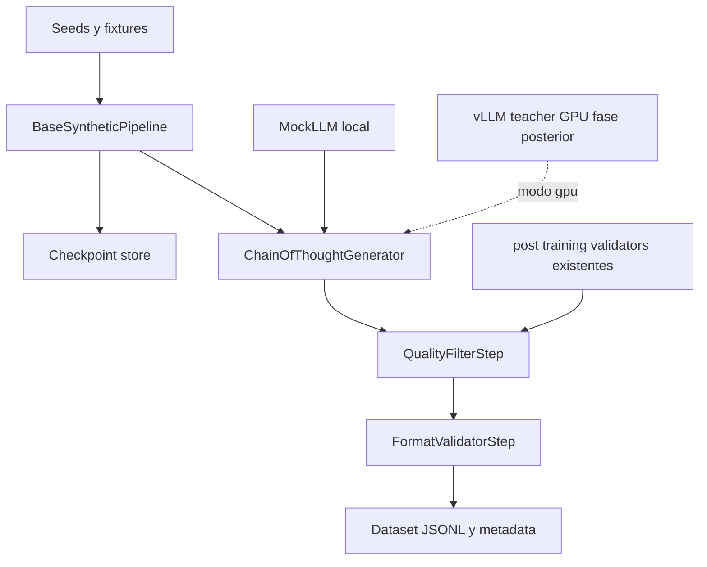
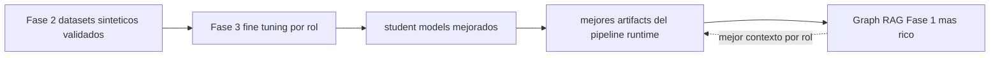
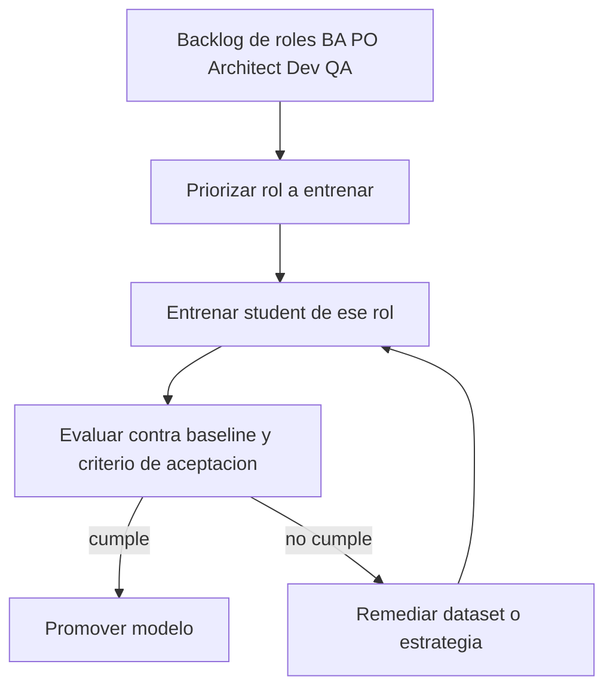
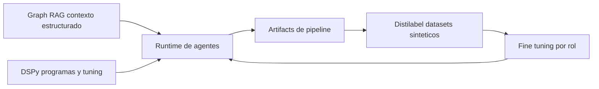

# Mapa conceptual general (Fase 1 + Fase 2A + Fase 3)

> **Objetivo**: visualizar cómo encaja lo ya existente (Graph RAG + Orchestrator + CoT runtime) con el diseño de **Phase 2A Distilabel** y la **Fase 3 de fine-tuning**.
> Este documento queda como mapa conceptual de referencia.

---

## 1) Vista ejecutiva (qué existe y cómo se conecta)

Este repo hoy combina **cuatro planos**:

1. **Plano de ejecución/orquestación** (pipeline agentic + CoT de runtime).
2. **Plano de conocimiento** (Graph RAG de Fase 1, integrado al cliente LLM y al orchestrator).
3. **Plano de entrenamiento** (Fase 2A: diseño de generación sintética local/dev-first con Distilabel).
4. **Plano de adaptación de modelos** (Fase 3: fine-tuning por rol, priorizado y medido).

La idea central: Fase 2A y Fase 3 **no reemplazan** Fase 1; extienden el sistema con un ciclo de mejora donde mejores datasets generan mejores modelos, que a su vez generan mejores artefactos para Graph RAG.

---

## 2) Mapa conceptual global

---

## 3) Línea temporal por fase (visión de producto técnico)

---

## 4) Contrato de CoT: evitar colisión conceptual

Regla de arquitectura:

- **CoT Runtime** = observabilidad del sistema en ejecución.
- **CoT Sintético** = contenido entrenable dentro de ejemplos.

---

## 5) Fase 1 Graph RAG dentro de la película completa

---

## 6) Roles implementados hoy (runtime) y su encaje

Roles implementados en la cadena principal:

- **BA** (Business Analyst)
- **PO** (Product Owner)
- **Architect**
- **Dev**
- **QA**

---

## 7) Fase 2A (dev-first) encajada con componentes existentes

---

## 8) Fase 3 (fine-tuning) y cómo encaja con Fase 1 + Fase 2A

Referencia conceptual tomada de: `PLAN_implementation_distilabel_finetuning_rag.md`.

Puntos clave de encaje:

- Fase 3 consume datasets filtrados/producidos en Fase 2.
- Se propone entrenamiento **por rol** (no todo en paralelo) para controlar costo/riesgo.
- Define criterios de aceptación por calidad del student.
- Cierra un ciclo con Fase 1: mejores modelos generan mejores artefactos, que enriquecen el KG.

---

## 9) Qué ya está “productivo” vs qué es diseño/plan

| Bloque | Estado actual |
|---|---|
| Graph RAG Fase 1 (`graph_rag/*`, integración en llm/orchestrate) | **Implementado** |
| CoT de orquestación (`scripts/orchestrator/cot_*`) | **Implementado** |
| Cadena de roles BA PO Architect Dev QA (runtime) | **Implementado** |
| Diseño Distilabel Fase 2A (`docs/PHASE2A_*`) | **Implementado y cerrado en local** |
| `training/steps/cot_generator.py` | **Implementado** |
| Fase 3 fine-tuning por rol (`PLAN_implementation_distilabel_finetuning_rag.md`) | **Planificado** |

---

## 10) DSPy: concepto y encaje con RAG + Distilabel

DSPy en este proyecto cumple el rol de **optimización programática de prompts/programas de ejecución** (BA/PO/Architect y QA), mientras que Distilabel Fase 2A se enfoca en **infra de generación sintética** para entrenamiento.

No compiten; se complementan:

- **DSPy**: mejora cómo razonan/estructuran respuestas los agentes en runtime y evaluación.
- **Graph RAG**: mejora el contexto (knowledge grounding) que reciben esos agentes.
- **Distilabel (2A/2B)**: genera datasets para entrenar modelos por rol (Fase 3).

Regla práctica:

- DSPy = capa de **calidad de inferencia/orquestación**.
- Distilabel = capa de **producción de datos**.
- Fine-tuning = capa de **adaptación de modelo**.

---

## 11) Lectura recomendada para aterrizar rápido

1. `docs/ONBOARDING_BRANCH_PHASE1_GRAPH_RAG.md`
2. `docs/PHASE2A_TECHNICAL_PLAN.md`
3. `docs/PHASE2A_CODE_DESIGN.md`
4. `docs/PHASE2A_IMPLEMENTATION_CONTRACT.md` (contrato normativo Fase 2A)
5. `PLAN_implementation_distilabel_finetuning_rag.md`

---

## 12) Conclusión conceptual

- Fase 1, Fase 2A y Fase 3 forman una cadena: **contexto (RAG) → datos sintéticos → modelos ajustados → mejores artifacts → mejor contexto**.
- La posible “duplicación CoT” es **de término**, no de responsabilidad, si se mantiene el contrato de separación por dominio.
- Este marco permite evolucionar por iteraciones sin romper lo existente, priorizando roles de mayor impacto.
