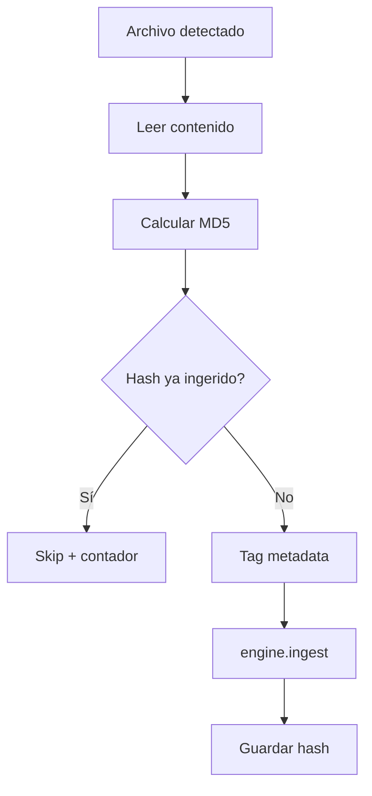
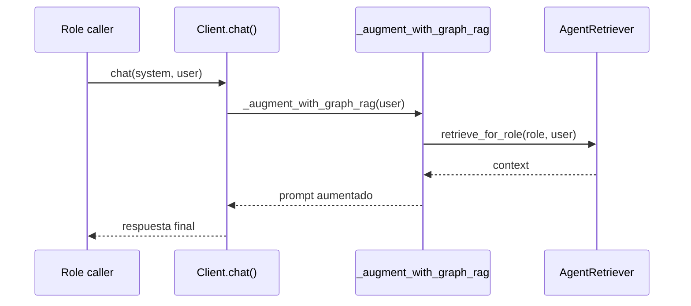
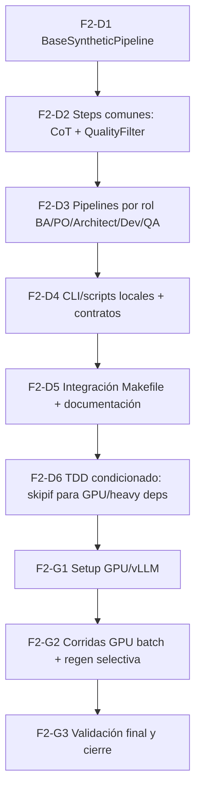

# Onboarding Técnico del Branch: `feature/phase1-graph-rag-distilabel-finetuning`

> Documento de onboarding para un/a nuevo/a agente coder.
> Objetivo: entender **qué se implementó**, **cómo está integrado**, **cómo validarlo** y **dónde continuar**.

---

## 1) Resumen ejecutivo

En este branch se completó la **Fase 1 de Graph RAG** sobre el pipeline agentic existente:

- Se agregó un módulo `graph_rag/` con engine, ingestion, retrieval, config y capacidades adicionales (cache, streaming, multi-language).
- Se integró Graph RAG en el cliente LLM (`scripts/llm.py`) como augmentación opcional de contexto.
- Se agregó auto-ingest por hooks en el orquestador (`scripts/orchestrate.py`) para ingerir artifacts post-step sin bloquear pipeline.
- Se añadieron comandos operativos (`make rag-*`) y perfiles de testing (`make test-*`) incluyendo integración real con Ollama/LightRAG.
- Se endureció la estrategia de tests con markers y manejo de dependencias opcionales.

Estado actual del branch: **funcional, con foco local-first y compatibilidad hacia atrás**.

---

## 2) Timeline de commits relevantes

```text
0535959  feat: plan Graph RAG + Distilabel + Fine-tuning
e46b923  feat: F1-T1 setup LightRAG + bge-m3 + módulo graph_rag
c72856c  feat: F1-T2/T3/T4 tests unitarios (TDD)
3797ca0  feat: F1-T5/T6/T7 integración LLM + Makefile + E2E
853ad32  refactor: scripts/llm.py (reducción complejidad ciclomática)
6cd7b75  feat: perfiles de ejecución de tests + hardening + integración real
```

Lectura recomendada: `AUDIT_PHASE1_GRAPH_RAG.md` + este onboarding.

---

## 3) Arquitectura implementada (visión global)

```mermaid
flowchart LR
    A[Artifacts pipeline\nplanning/project/artifacts/docs] --> B[PipelineIngestion\ngraph_rag/ingestion.py]
    B --> C[GraphRAGEngine\ngraph_rag/engine.py]
    C --> D[LightRAG\n(KG + Vector)]
    D --> E[AgentRetriever\ngraph_rag/retrieval.py]
    E --> F[LLM Client\nscripts/llm.py]
    F --> G[Roles\nBA/PO/Architect/Dev/QA]
```

### Principios aplicados

1. **Local-first**: Ollama + LightRAG local.
2. **Feature opcional**: si Graph RAG falla/no está disponible, el pipeline sigue.
3. **Separación de responsabilidades**:
   - Engine = ciclo de vida y consultas
   - Ingestion = deduplicación + indexación incremental
   - Retrieval = políticas por rol
   - LLM client = inyección de contexto (hook)

---

## 4) Componentes clave del código

## 4.1 `graph_rag/engine.py` (núcleo)

Responsabilidades:

- Singleton `GraphRAGEngine`.
- Inicialización lazy de LightRAG.
- APIs:
  - `initialize`, `ingest`
  - `query`, `get_context_only`
  - `stream_query`, `stream_context_only`
  - `query_multilingual`, `get_context_multilingual`
- Cache de queries y persistencia de metadatos de índice.

Modos soportados:

- `naive`, `local`, `global`, `hybrid`, `mix`.

Nota técnica importante:

- Existe fallback cuando `lightrag` no está instalado (útil para tests/mocks), evitando romper flujos no-runtime.

---

## 4.2 `graph_rag/ingestion.py` (indexación incremental)

Responsabilidades:

- Ingesta de fuentes (`planning/`, `project/`, `artifacts/`, `docs/`).
- Deduplicación por hash MD5 usando estado persistido (`.graph_rag_ingestion_state.json`).
- Etiquetado de contenido con metadata (`[Source: ...] [Type: ...]`).
- Hook `auto_ingest_hook` para post-step ingestion desde el orquestador.

Flujo de deduplicación:



---

## 4.3 `graph_rag/retrieval.py` (políticas por rol)

Clase: `AgentRetriever`.

Define `ROLE_POLICIES` para enrutar recuperación según contexto del rol:

- `ba`: mix, top_k 30
- `product_owner`: mix, top_k 40
- `architect`: hybrid, top_k 60
- `dev`: local, top_k 40
- `qa`: mix, top_k 50

Comportamiento:

- Por defecto usa `context_only=True` para inyectar contexto al prompt del rol.
- Permite override dinámico de policy (útil para test/experimentos).

---

## 4.4 `scripts/llm.py` (punto de integración)

Se agregó `_augment_with_graph_rag(user)` dentro de `Client`.

Flujo:



Detalles relevantes:

- Guardrail de presupuesto: `context_budget_chars`.
- Truncación configurable (`hierarchical` o `truncate`).
- Si falla Graph RAG: warning + fallback a prompt original.

---

## 4.5 `scripts/orchestrate.py` (hooking auto-ingest)

Se introdujo `HookRegistry` y se conecta `auto_ingest_hook` cuando `graph_rag.auto_ingest=true`.

Objetivo:

- Ingerir artifacts después de pasos (principalmente dev), sin bloquear el loop si hay error en ingestión.

Esto mantiene el Knowledge Graph “vivo” a medida que evoluciona el proyecto.

---

## 5) Superficie operativa (comandos)

Targets nuevos en `Makefile`:

- `make rag-index` → indexa/actualiza Knowledge Graph.
- `make rag-status` → muestra estado de `artifacts/graph_rag/`.
- `make rag-query QUERY="..." [MODE=...] [ROLE=...]`.
- `make rag-visualize` → arranca WebUI de LightRAG.

Testing por perfiles:

- `make test-fast`
- `make test-no-integration`
- `make test-integration`
- `make test-integration-real`
- `make test-with-integration`
- `make test-all`
- `make test-rag-real`

---

## 6) Estrategia de testing implementada

Se consolidó estrategia de perfiles (doc: `docs/PLAN_TEST_EXECUTION_PROFILES.md`):

1. **Sin integración** (rápido, CI general).
2. **Con integración**.
3. **Integración real** (`integration_real`) dependiente de entorno (Ollama + modelos).

Runbook real: `docs/GRAPH_RAG_REAL_INTEGRATION_RUNBOOK.md`.

Patrón clave: dependencias opcionales se gestionan con `skip` explícito + motivo claro para evitar romper collection en entornos mínimos.

---

## 7) Configuración relevante

El bloque `graph_rag` en `config.yaml` gobierna:

- `enabled`
- `working_dir`
- `llm_model`, `embedding_model`, `embedding_dim`
- `top_k`, `default_mode`
- `auto_ingest`
- `context_budget_chars`
- `context_truncation_strategy`

Validación de schema centralizada en `graph_rag/config.py` (`GraphRAGConfig.validate_schema`).

---

## 8) Qué cambió respecto a `main`

Áreas más relevantes del diff del branch:

- **Nuevos módulos**: `graph_rag/*`.
- **Nuevos scripts**: `scripts/setup_graph_rag.py`, `scripts/rag_query_cli.py`.
- **Integración**: `scripts/llm.py`, `scripts/orchestrate.py`.
- **Operación**: `Makefile`, `README.md`.
- **Testing**: amplia batería en `tests/test_graph_rag_*` + perfiles de ejecución.
- **Documentación**: auditoría, runbooks y planes asociados.

---

## 9) Checklist para que el nuevo agente se ponga productivo rápido

1. Leer:
   - `AUDIT_PHASE1_GRAPH_RAG.md`
   - `docs/GRAPH_RAG_REAL_INTEGRATION_RUNBOOK.md`
   - este archivo
2. Verificar entorno:
   - `ollama serve`
   - modelos `qwen2.5:7b-instruct` y `bge-m3`
3. Ejecutar smoke operativo:
   - `make rag-index`
   - `make rag-query QUERY="resumen de arquitectura" ROLE=architect MODE=hybrid`
4. Ejecutar tests:
   - `make test-fast`
   - `make test-rag-real` (si entorno preparado)
5. Revisar puntos de extensión:
   - `ROLE_POLICIES` en `graph_rag/retrieval.py`
   - presupuesto/context guard en `scripts/llm.py`
   - hooks en `scripts/orchestrate.py`

## 10) Fase 2 detallada: planificación operativa (Distilabel / datos sintéticos)

Objetivo de Fase 2: construir un pipeline reproducible para generar datasets sintéticos de alta calidad por rol (BA/PO/Architect/Dev/QA), con control de costo, validación automática y capacidad de reanudación.

### 10.0 Convención de lenguaje (no ambiguo, orientado a agente sintético)

Las descripciones de esta sección siguen un contrato semántico estricto para minimizar ambigüedad operacional:

1. **Verbo imperativo + objeto técnico** por tarea (ej.: “Implementar checkpointing incremental”).
2. **DoD verificable** (resultado observable, no subjetivo).
3. **Dependencia explícita y bloqueante** (`Requiere F2-Dx`).
4. **Sin términos vagos**: evitar “mejorar”, “optimizar”, “robusto” sin métrica.
5. **Nomenclatura estable**:
   - `F2-D*` = desarrollo sin GPU
   - `F2-G*` = ejecución dependiente de GPU
6. **Criterio de ejecución determinista**:
   - si una precondición no se cumple, la tarea no inicia;
   - los tests GPU se marcan `integration_gpu` + `skipif`.

> Regla de interpretación para el agente: cada subtarea debe mapear a una unidad implementable, testeable y auditable.

### 10.1 Alcance y entregables

Entregables principales:

1. Módulo `training/` con pipelines por rol.
2. Filtro de calidad reutilizando validadores existentes.
3. Scripts de ejecución en sesión GPU (batch + checkpoints).
4. Targets Makefile para operación.
5. Suite de tests E2E/contract para validar calidad y robustez.

### 10.2 Estructura de trabajo (WBS)



### 10.3 Plan de tareas, subtareas y dependencias

## F2-D1 — BaseSyntheticPipeline (dev-first, sin GPU)

**Objetivo**: construir el esqueleto de desarrollo desacoplado de infraestructura pesada.

Subtareas:

- F2-D1.1 Crear `training/pipelines/base_pipeline.py` con contrato de entrada/salida.
- F2-D1.2 Implementar flujo `load_seed -> generate -> quality_filter -> save` en modo local/mock.
- F2-D1.3 Implementar `checkpointing` desde el inicio.
- F2-D1.4 Definir metadatos por muestra (`role`, `teacher_model`, `score`, `trace_id`).

Dependencias:

- Sin dependencias previas.

DoD:

- Pipeline base corre en local con fixtures pequeñas y sin GPU.

---

## F2-D2 — Steps comunes (CoT + QualityFilter)

**Objetivo**: consolidar lógica reusable antes de especializar por rol.

Subtareas:

- F2-D2.1 Crear `training/steps/cot_generator.py` (inicialmente en modo determinista/mock).
- F2-D2.2 Crear `training/steps/quality_filter.py`.
- F2-D2.3 Integrar validadores existentes (`post_training/src/validators.py`).
- F2-D2.4 Definir thresholds por rol y política rechazo/regeneración.

Dependencias:

- Requiere F2-D1.

DoD:

- Steps funcionando en local sin teacher model real ni GPU.

---

## F2-D3 — Pipelines por rol (BA/PO/Architect/Dev/QA)

**Objetivo**: completar la capa de negocio por rol usando base común.

Subtareas:

- F2-D3.1 `ba_pipeline.py` (requisitos trazables).
- F2-D3.2 `po_pipeline.py` (visión + priorización + aceptación).
- F2-D3.3 `architect_pipeline.py` (CoT, trade-offs, ADRs).
- F2-D3.4 `dev_pipeline.py` (implementación + patrones de test).
- F2-D3.5 `qa_pipeline.py` (test cases + edge cases).

Dependencias:

- Requiere F2-D2.

DoD:

- Los 5 pipelines se ejecutan localmente con dataset pequeño de prueba.

---

## F2-D4 — Scripts locales y contrato operativo

**Objetivo**: exponer ejecución de pipelines sin GPU como camino principal de desarrollo.

Subtareas:

- F2-D4.1 Crear/ajustar `training/scripts/run_synthetic_pipeline.py` con modo local/mock.
- F2-D4.2 Definir flags estables (`--role`, `--dry-run`, `--resume-from-checkpoint`).
- F2-D4.3 Estandarizar outputs en `training/datasets/` y `artifacts/training/`.

Dependencias:

- Requiere F2-D3.

DoD:

- Se puede desarrollar y depurar Fase 2 sin necesidad de GPU.

---

## F2-D5 — Integración Makefile + documentación dev-first

**Objetivo**: formalizar operación diaria sin dependencias pesadas.

Subtareas:

- F2-D5.1 Agregar targets `synthetic-data`, `synthetic-validate`, `synthetic-stats`, `synthetic-stats-all`.
- F2-D5.2 Documentar modos `local/mock` vs `gpu`.
- F2-D5.3 Añadir troubleshooting para ejecución sin entorno GPU.

Dependencias:

- Requiere F2-D4.

DoD:

- Operación de desarrollo de Fase 2 estandarizada y reproducible.

---

## F2-D6 — Testing con TDD condicionado (skipif/markers)

**Objetivo**: asegurar calidad desde el principio, sin romper CI local.

Subtareas:

- F2-D6.1 Escribir primero tests unitarios/contrato para pipeline base y steps.
- F2-D6.2 Marcar tests pesados con `@pytest.mark.integration_gpu`.
- F2-D6.3 Aplicar `@pytest.mark.skipif(...)` por GPU/dependencias opcionales no disponibles.
- F2-D6.4 Reusar helper centralizado de opcionales para mantener criterio homogéneo.
- F2-D6.5 Definir perfiles: `test-fast` (default) y `test-gpu` (solo cierre de fase).

Ejemplo de política explícita (referencia):

```python
import pytest

HAS_GPU_STACK = False  # reemplazar por chequeo real de entorno

@pytest.mark.integration_gpu
@pytest.mark.skipif(not HAS_GPU_STACK, reason="GPU stack no disponible: test condicionado")
def test_distilabel_gpu_batch_generation():
    ...
```

Dependencias:

- Requiere F2-D5.

DoD:

- Suite rápida estable por defecto + suite GPU condicionada y auditable.

---

## F2-G1 — Setup GPU/vLLM (al final)

**Objetivo**: habilitar entorno pesado solo cuando el desarrollo ya está estable.

Subtareas:

- F2-G1.1 Crear/validar `requirements-training.txt` final para GPU.
- F2-G1.2 Verificar runtime vLLM + compatibilidad CUDA.
- F2-G1.3 Ejecutar smoke test real en GPU (5 ejemplos).

Dependencias:

- Requiere F2-D6.

DoD:

- Entorno GPU validado sin bloquear el trabajo de desarrollo.

---

## F2-G2 — Corridas GPU batch + regeneración selectiva

**Objetivo**: ejecutar generación masiva con costo controlado.

Subtareas:

- F2-G2.1 Ejecutar por rol con `--teacher-tier` (14B/32B/72B).
- F2-G2.2 Activar `--regen-failed-only` para muestras rechazadas.
- F2-G2.3 Medir costo/tiempo/calidad por corrida.

Dependencias:

- Requiere F2-G1.

DoD:

- Datasets generados con métricas y estrategia tiered confirmadas.

---

## F2-G3 — Validación final GPU + cierre

**Objetivo**: certificar criterios finales con ejecución real.

Subtareas:

- F2-G3.1 Ejecutar `test-gpu` condicionado (solo casos reales).
- F2-G3.2 Verificar thresholds de calidad por rol.
- F2-G3.3 Emitir reporte de aceptación final de Fase 2.

Dependencias:

- Requiere F2-G2.

DoD:

- Reporte final confirma cumplimiento funcional y de calidad.

### 10.4 Matriz de dependencias (resumen)

| Tarea | Depende de | Tipo de dependencia |
|---|---|---|
| F2-D1 | - | Inicio dev |
| F2-D2 | F2-D1 | Bloqueante técnica |
| F2-D3 | F2-D2 | Bloqueante funcional |
| F2-D4 | F2-D3 | Operación local |
| F2-D5 | F2-D4 | Estandarización |
| F2-D6 | F2-D5 | TDD condicionado |
| F2-G1 | F2-D6 | Inicio GPU |
| F2-G2 | F2-G1 | Ejecución pesada |
| F2-G3 | F2-G2 | Cierre |

### 10.5 Ruta crítica

Ruta crítica (GPU al final):

`F2-D1 -> F2-D2 -> F2-D3 -> F2-D4 -> F2-D5 -> F2-D6 -> F2-G1 -> F2-G2 -> F2-G3`

Paralelización recomendada (para reducir tiempo):

- Durante F2-D3, preparar fixtures y contratos de test para F2-D6.
- Durante F2-D5, preparar scripts/entorno de F2-G1 sin ejecutar GPU todavía.

### 10.6 Riesgos y mitigaciones de planificación

1. **Riesgo**: costo GPU se dispara por regeneración masiva.
   - Mitigación: estrategia tiered + `--regen-failed-only`.
2. **Riesgo**: calidad inconsistente entre roles.
   - Mitigación: thresholds por rol + validación unificada.
3. **Riesgo**: corridas largas sin checkpoint.
   - Mitigación: checkpointing obligatorio desde F2-D1.
4. **Riesgo**: deriva de formato en salidas sintéticas.
   - Mitigación: contrato schema + tests condicionados desde F2-D6.
5. **Riesgo**: fricción en CI por tests dependientes de GPU.
   - Mitigación: `skipif` + marker `integration_gpu` + perfiles separados.

### 10.7 Hitos semanales sugeridos

- **Semana 1**: F2-D1 + F2-D2.
- **Semana 2**: F2-D3 + F2-D4.
- **Semana 3**: F2-D5 + F2-D6.
- **Semana 4 (GPU/cierre)**: F2-G1 + F2-G2 + F2-G3.

---

### 10.8 Siguientes pasos post-Fase 2

- Expandir validación/benchmarks en integración real con métricas comparables por perfil.
- Encadenar salida de Fase 2 con Fase 3 (fine-tuning) usando datasets ya filtrados.

---

## 11) Mapa rápido de archivos (para navegación)

```text
graph_rag/
  engine.py          # núcleo LightRAG + query/cache/stream/multi-lang
  ingestion.py       # ingestión incremental + dedup + hooks
  retrieval.py       # políticas por rol
  config.py          # schema/defaults
  cache.py           # cache/persistencia
  language.py        # detección de idioma

scripts/
  llm.py             # integración de contexto RAG al prompt
  orchestrate.py     # HookRegistry + auto-ingest wiring
  setup_graph_rag.py # smoke/setup
  rag_query_cli.py   # consulta CLI

docs/
  GRAPH_RAG_REAL_INTEGRATION_RUNBOOK.md
  PLAN_TEST_EXECUTION_PROFILES.md
  ONBOARDING_BRANCH_PHASE1_GRAPH_RAG.md  <-- este documento
```

---

## 12) TL;DR para el nuevo agente

Este branch ya dejó lista una capa Graph RAG funcional y opcional, integrada al cliente LLM y al orquestador con auto-ingest, más una estrategia de testing por perfiles (rápida + integración real). Si empezás hoy, podés operar y extender desde `graph_rag/` + `scripts/llm.py` sin tocar el core del pipeline legado.

Para avanzar Fase 2, seguí la ruta crítica de este documento: primero base pipeline + CoT de Architect, luego escalado por rol, quality gate, scripts GPU y cierre con E2E.
