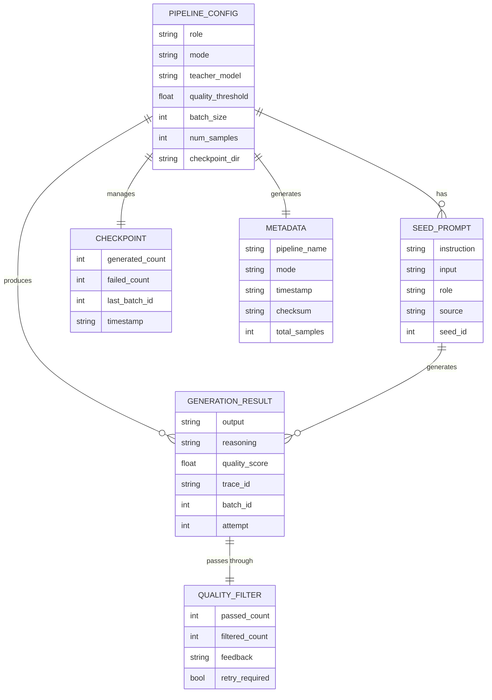
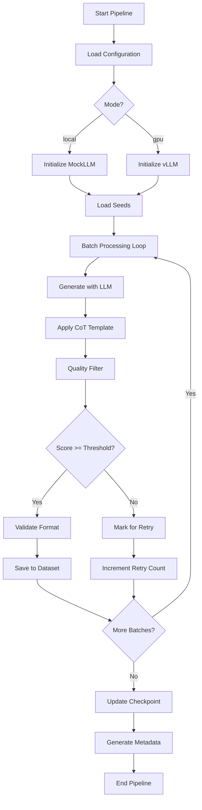
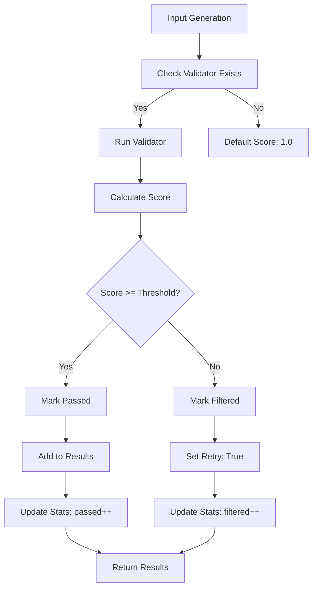
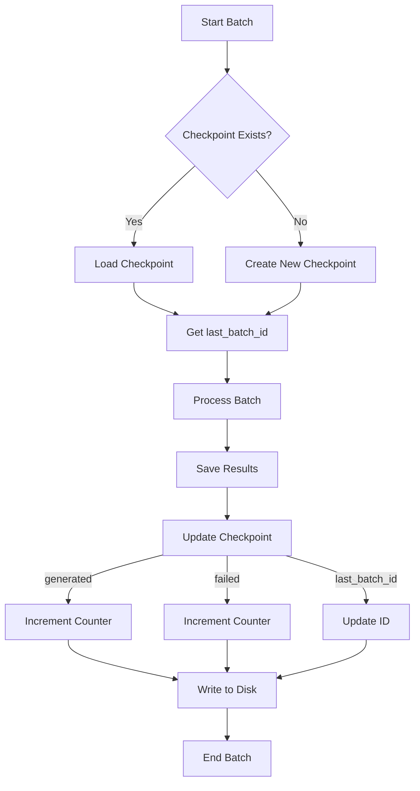
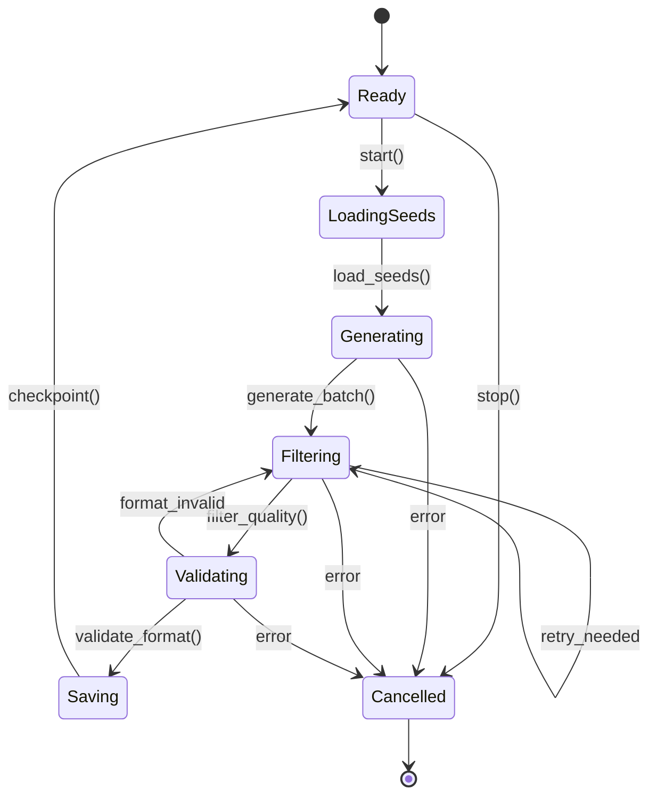

# Phase 2A: Technical Plan - Distilabel Infrastructure (Local/Dev-First)

**Branch**: `feature/phase2-distilabel-finetuning-2a`
**Status**: Implemented (Phase 2A closed in local/dev-first mode)
**Date**: 2026-02-08
**Author**: Claude Code

---

## Alignment Note (Normative)

Este documento queda alineado por contrato con:

- `docs/PHASE2A_IMPLEMENTATION_CONTRACT.md` (**source of truth**)

Reglas normativas de implementación para Fase 2A:

1. **Validación**: no asumir APIs inexistentes en `post_training/src/posttrain/validators.py`; usar `ValidatorAdapter` sobre `ValidationResult`.
2. **Ejecución**: API pública del pipeline en modo **síncrono** (`run(...)`), con async interno opcional y encapsulado.
3. **Tests**: precondiciones de GPU basadas en imports reales de módulos Python (no en binarios CLI ambiguos).
4. **Salida JSONL**: cumplir esquema mínimo de campos (`instruction`, `input`, `output`, `role`, `metadata`).

En caso de conflicto entre este plan y snippets de ejemplo, prevalece el contrato normativo.

---

## Implementation Status (2026-02-08)

Estado real en este branch (sin GPU):

- ✅ `training/` implementado (pipelines, steps, configs, mock llm, checkpointing)
- ✅ CLI local implementada: `training/scripts/run_synthetic_pipeline.py`
- ✅ Validación dataset: `training/scripts/validate_datasets.py`
- ✅ Targets `synthetic-*` y `test-distilabel-*` en `Makefile`
- ✅ Suite de tests base distilabel pasando en local
- ✅ Artefactos de cierre 2A agregados:
  - `requirements-training.txt`
  - `training/configs/output_schema.json`
  - `training/scripts/gpu_session.sh` (preparado para 2B)
  - `docs/DISTILABEL_USAGE.md`
  - `docs/DISTILABEL_TROUBLESHOOTING.md`

Fuera de alcance en 2A (pospuesto):

- Integración GPU real Distilabel/vLLM (fase 2B)
- Generación masiva final para entrenamiento productivo

---

## Executive Summary

This document describes **Phase 2A** - the local development infrastructure for Distilabel-based synthetic data generation. This phase focuses on building the complete pipeline structure **without GPU dependency**, enabling TDD development, testing, and debugging in local environments.

### Key Principle

> **Dev-first, GPU-last**: Build complete infrastructure locally with mocks/fixtures → Validate with real GPU only when available for final generation.

### CoT Taxonomy (to avoid conceptual duplication)

This project contains **two different CoT domains**. They are complementary, not interchangeable:

| Domain | Purpose | Current location | Output artifact |
|---|---|---|---|
| **Orchestration CoT** | Runtime decision traceability (planner/policy/LLM fallback/coherence) | `scripts/orchestrator/cot_logger.py`, `advanced_cot.py`, `cot_tracker.py` | `artifacts/cot*`, `artifacts/cot_layer6/*` |
| **Synthetic Generation CoT** | Reasoning content inside generated training samples | `training/steps/cot_generator.py` (Phase 2A target) | `reasoning` field in dataset samples |

Non-duplication rule:

- **Do not** reuse orchestration CoT modules to generate synthetic dataset reasoning.
- **Do not** use synthetic CoT step as runtime observability for orchestrator decisions.
- Both may coexist in one execution, but each one has a distinct contract.

### What This Phase Delivers

1. **Complete pipeline structure** (`training/pipelines/`) with 5 role-specific pipelines
2. **Reusable steps** (`training/steps/`) for CoT generation and quality filtering
3. **Local execution mode** with mock LLM for development/debugging
4. **Checkpointing** from day one for resumability
5. **TDD suite** with conditional skips for GPU-dependent tests
6. **Makefile targets** for both local (dev) and GPU (prod) workflows

---

## Architecture Overview

```
training/
├── __init__.py
├── pipelines/
│   ├── __init__.py
│   ├── base_pipeline.py          # Base class with mock/GPU fallback
│   ├── ba_pipeline.py            # Business Analyst pipeline
│   ├── po_pipeline.py            # Product Owner pipeline
│   ├── architect_pipeline.py     # Architect pipeline (with CoT)
│   ├── dev_pipeline.py           # Developer pipeline (code generation)
│   └── qa_pipeline.py            # QA pipeline (test generation)
├── steps/
│   ├── __init__.py
│   ├── cot_generator.py          # Chain-of-Thought generation step
│   ├── quality_filter.py         # Quality scoring & filtering
│   └── format_validator.py       # Output format validation
├── configs/
│   ├── base.yaml                 # Base configuration
│   └── roles/
│       ├── ba.yaml
│       ├── po.yaml
│       ├── architect.yaml
│       ├── dev.yaml
│       └── qa.yaml
└── scripts/
    ├── run_synthetic_pipeline.py # CLI entrypoint
    ├── validate_datasets.py      # Dataset validation
    └── gpu_session.sh            # GPU execution wrapper
```

---

## Architecture Diagrams

### System Interaction Diagram

```mermaid
flowchart TB
    subgraph CLI
        CLI[CLI run_synthetic_pipeline.py]
    end

    subgraph Pipeline
        BP[BaseSyntheticPipeline]
        BAP[BAPipeline]
        POP[POPipeline]
        AP[ArchitectPipeline]
        DP[DevPipeline]
        QP[QAPipeline]
    end

    subgraph Steps
        COG[ChainOfThoughtGenerator]
        QF[QualityFilterStep]
        FV[FormatValidatorStep]
    end

    subgraph LLM
        MOCK[MockLLM for local]
        VLLM[vLLM for GPU]
    end

    subgraph Validators
        VA[ValidatorAdapter]
        V[Existing Validators]
    end

    subgraph Storage
        CK[Checkpoint System]
        DS[Dataset Storage]
    end

    CLI -->|role, mode, num_samples| BP
    BP --> BAP
    BP --> POP
    BP --> AP
    BP --> DP
    BP --> QP

    BAP --> COG
    BAP --> QF
    BAP --> FV

    COG -->|prompt| MOCK
    COG -->|prompt| VLLM

    QF -->|input| VA
    VA -->|validation| V

    CK -->|save/load| BP
    DS -->|output| BP

    style MOCK fill:#90EE90
    style VLLM fill:#FFB6C1
    style VA fill:#87CEEB
```

---

### Data Entity Relationship (DER) Diagram



---

### Pipeline Execution Flow



---

### Quality Filter Logic



---

### Checkpointing Strategy



---

## Technical Design Decisions

### D1: Mock LLM for Local Development

**Decision**: Use a mock LLM that returns deterministic responses for local development.

**Implementation**:
```python
# training/llm_mock.py
class MockLLM:
    """Mock LLM for local development and testing."""

    def __init__(self, model_name: str = "mock"):
        self.model_name = model_name

    async def generate(self, prompt: str, **kwargs) -> str:
        """Return deterministic mock response based on prompt."""
        # Simple pattern-based generation for development
        if "architect" in prompt.lower():
            return self._generate_architect_response(prompt)
        elif "requirement" in prompt.lower():
            return self._generate_ba_response(prompt)
        return self._generate_generic_response(prompt)
```

**Rationale**:
- Enables local TDD without GPU
- Allows testing pipeline logic independent of external API
- Mock responses can be versioned with fixtures

### D2: Two-Mode Architecture

**Decision**: Support both `local` and `gpu` execution modes.

**Implementation**:
```python
# BaseSyntheticPipeline supports both modes
class BaseSyntheticPipeline:
    def __init__(self, role: str, mode: str = "local"):
        self.role = role
        self.mode = mode  # "local" or "gpu"

        if mode == "local":
            self.llm = MockLLM(model_name="mock")
        else:
            from distilabel.llms import vLLM
            self.llm = vLLM(model=self.config["teacher_model"])
```

**Configuration**:
```yaml
# training/configs/base.yaml
execution:
  default_mode: local  # local or gpu
  gpu:
    default_tier: 14b  # 14b, 32b, 72b
    available_models:
      14b: "Qwen/Qwen2.5-14B-Instruct"
      32b: "Qwen/Qwen2.5-32B-Instruct"
      72b: "Qwen/Qwen2.5-72B-Instruct"
```

### D3: Checkpointing from Day 1

**Decision**: Implement checkpointing at pipeline level for resumability, integrated into BaseSyntheticPipeline.

**Implementation**:
```python
# BaseSyntheticPipeline
class BaseSyntheticPipeline:
    def __init__(self, ...):
        self.checkpoint_dir = Path("artifacts/training/checkpoints")
        self.checkpoint_file = self.checkpoint_dir / f"{self.role}.json"

    def _load_checkpoint(self) -> dict:
        """Load last checkpoint if exists."""
        if self.checkpoint_file.exists():
            return json.loads(self.checkpoint_file.read_text())
        return {"generated": 0, "failed": 0, "last_batch_id": 0}

    def _save_checkpoint(self, stats: dict):
        """Save checkpoint after each batch."""
        self.checkpoint_dir.mkdir(parents=True, exist_ok=True)
        self.checkpoint_file.write_text(json.dumps(stats, indent=2))
```

### D4: Reuse Existing Validators

**Decision**: Wrap existing validators from `post_training/src/posttrain/validators.py`.

**Implementation**:
```python
# training/steps/quality_filter.py
from training.steps.validators_adapter import ValidatorAdapter

class QualityFilterStep:
    """Quality filter using existing validators."""

    def __init__(self, role: str, min_score: float = 0.85):
        self.role = role
        self.min_score = min_score
        self.validator_adapter = ValidatorAdapter()

    def _score_output(self, input_data: dict) -> tuple[float, str]:
        result = self.validator_adapter.validate(self.role, input_data)
        feedback = result.reason if hasattr(result, "reason") else "ok"
        return result.score, feedback
```

---

### D5: Quality Thresholds Configuration

```yaml
# training/configs/quality_thresholds.yaml
quality_thresholds:
  ba: 0.85
  product_owner: 0.85
  architect: 0.85
  dev: 0.85
  qa: 0.85

retry_policies:
  max_retries: 3
  backoff_multiplier: 2.0
  min_score_increase: 0.05

regeneration_strategies:
  - "retry_with_different_seed"
  - "retry_with_enhanced_prompt"
  - "promote_to_expensive_teacher"
```

**Rationale**: Role-specific thresholds ensure appropriate quality standards for each role's output type.

## Detailed Task Breakdown

---

## F2-D1: BaseSyntheticPipeline

### F2-D1.1: Create `training/pipelines/base_pipeline.py`

**File**: `training/pipelines/base_pipeline.py`
**Lines**: ~250-300
**Dependencies**: None

**Structure**:
```python
class BaseSyntheticPipeline:
    """Base class for all synthetic data generation pipelines."""

    # Class attributes
    DEFAULT_SEEDS: List[dict]  # Sample prompts for each role
    OUTPUT_SCHEMA: dict        # JSON schema for output validation

    # Instance attributes
    role: str
    mode: str                  # "local" or "gpu"
    config: dict
    llm: LLMInterface          # MockLLM or vLLM
    checkpoint: dict

    # Methods
    def __init__(self, role: str, mode: str = "local", config: dict = None):
        ...

    def build(self) -> Pipeline:
        """Build the Distilabel pipeline."""
        ...

    def _load_seeds(self) -> List[dict]:
        """Load seed prompts for generation."""
        ...

    def _create_generate_step(self) -> Step:
        """Create the text generation step."""
        ...

    def _create_quality_filter_step(self) -> Step:
        """Create the quality filtering step."""
        ...

    def _create_format_validator_step(self) -> Step:
        """Create the format validation step."""
        ...

    def _apply_checkpointing(self, dataset: Dataset) -> Dataset:
        """Apply checkpointing to dataset processing."""
        ...
```

**Deliverable**: Pipeline runs locally with mock LLM and produces valid outputs.

---

### F2-D1.2: Implement Local/Mock Flow

**Subtasks**:
1. Implement `load_seed` → `generate` → `quality_filter` → `save` flow
2. Add checkpointing after each batch (configurable batch size)
3. Support `--dry-run` mode (no output, just simulate)
4. Add progress tracking and logging

**Implementation**:
```python
def run(self, num_samples: int = 10, batch_size: int = 5) -> dict:
    """Run the pipeline locally with mock LLM."""
    seeds = self._load_seeds()[:num_samples]

    all_results = []
    checkpoint = self._load_checkpoint()

    for i in range(0, len(seeds), batch_size):
        batch = seeds[i:i + batch_size]

        # Generate with mock LLM
        generated = self._generate_batch(batch)

        # Filter by quality
        filtered = self._filter_quality(generated)

        # Validate format
        valid = self._validate_format(filtered)

        # Save results
        self._save_batch(valid)

        # Update checkpoint
        checkpoint = {
            "generated": checkpoint.get("generated", 0) + len(valid),
            "failed": checkpoint.get("failed", 0) + len(generated) - len(valid),
            "last_batch_id": i,
        }
        self._save_checkpoint(checkpoint)

        all_results.extend(valid)

    return {
        "total_seeds": len(seeds),
        "generated": len(all_results),
        "filtered_out": len(seeds) - len(all_results),
        "duration_seconds": ...
    }
```

**Deliverable**: Pipeline can run `python -m training.pipelines.base_pipeline --role ba --dry-run`

---

### F2-D1.3: Implement Checkpointing

**File**: `training/pipelines/base_pipeline.py` (integrated into BaseSyntheticPipeline class)

**Methods**:
```python
def _load_checkpoint(self) -> dict:
    """Load last checkpoint if exists."""
    if self.checkpoint_file.exists():
        return json.loads(self.checkpoint_file.read_text())
    return {"generated": 0, "failed": 0, "last_batch_id": 0}

def _save_checkpoint(self, stats: dict):
    """Save checkpoint after each batch."""
    self.checkpoint_dir.mkdir(parents=True, exist_ok=True)
    self.checkpoint_file.write_text(json.dumps(stats, indent=2))
```

**Checkpoint Storage Format**:
```json
{
  "role": "ba",
  "checkpoint_version": "1.0",
  "created_at": "2026-02-08T12:00:00Z",
  "stats": {
    "generated": 25,
    "failed": 3,
    "filtered": 2,
    "retried": 1
  },
  "last_batch_id": 4,
  "progress": {
    "current_sample": 25,
    "total_samples": 100,
    "percentage": 25
  },
  "config": {
    "mode": "local",
    "batch_size": 5,
    "quality_threshold": 0.85
  }
}
```

**Storage Path**: `artifacts/training/checkpoints/{role}.json`

**Rollback Mechanism**: Checkpoints are versioned; old format automatically migrates to new format on load.

---

### F2-D1.4: Define Metadata Schema

**JSON Schema**:
```json
{
  "$schema": "http://json-schema.org/draft-07/schema#",
  "type": "object",
  "required": ["instruction", "input", "output", "role", "metadata"],
  "properties": {
    "instruction": {
      "type": "string",
      "description": "The instruction for the model"
    },
    "input": {
      "type": "string",
      "description": "Input context for the instruction"
    },
    "output": {
      "type": "string",
      "description": "Expected output from the model"
    },
    "role": {
      "type": "string",
      "enum": ["ba", "product_owner", "architect", "dev", "qa"]
    },
    "quality_score": {
      "type": "number",
      "minimum": 0,
      "maximum": 1,
      "description": "Auto-generated quality score"
    },
    "metadata": {
      "type": "object",
      "required": ["teacher_model", "trace_id", "timestamp", "batch_id"],
      "properties": {
        "teacher_model": {"type": "string"},
        "trace_id": {"type": "string", "format": "uuid"},
        "timestamp": {"type": "string", "format": "iso8601"},
        "batch_id": {"type": "integer"},
        "source": {"type": "string"},
        "reasoning": {"type": "string", "optional": true}
      }
    }
  }
}
```

**Deliverable**: Schema file at `training/configs/output_schema.json`

---

### F2-D1.5: Database Schema (Checkpoint Format)

**Checkpoint Storage Format**:
```json
{
  "role": "ba",
  "checkpoint_version": "1.0",
  "created_at": "2026-02-08T12:00:00Z",
  "stats": {
    "generated": 25,
    "failed": 3,
    "filtered": 2,
    "retried": 1
  },
  "last_batch_id": 4,
  "progress": {
    "current_sample": 25,
    "total_samples": 100,
    "percentage": 25
  },
  "config": {
    "mode": "local",
    "batch_size": 5,
    "quality_threshold": 0.85
  }
}
```

**Storage Path**: `artifacts/training/checkpoints/{role}.json`

**Rollback Mechanism**: Checkpoints are versioned; old format automatically migrates to new format on load.

---

**F2-D1 DoD**: Base pipeline runs locally, produces valid outputs, checkpoints progress, and can be resumed.

---

## F2-D2: Steps Comunes (CoT + QualityFilter)

Scope clarification:

- `ChainOfThoughtGenerator` in Phase 2A is **Synthetic Generation CoT** (dataset content generation).
- It is intentionally independent from orchestrator runtime CoT trackers/loggers.

### F2-D2.1: Create `training/steps/cot_generator.py`

**File**: `training/steps/cot_generator.py`
**Lines**: ~150-200

**Structure**:
```python
from distilabel.steps import Step
from distilabel.steps.tasks import TextGeneration

class ChainOfThoughtGenerator(TextGeneration):
    """
    Step that generates CoT alongside the main output.

    Produces: {output: "...", reasoning: "..."}
    """

    def __init__(self, cot_template: str = None, **kwargs):
        super().__init__(**kwargs)
        self.cot_template = cot_template or self._default_cot_template()

    def _default_cot_template(self) -> str:
        """Default template for CoT generation."""
        return """{instruction}

Think step by step and output your reasoning in a "Reasoning:" section,
then provide your final answer in an "Answer:" section.

Example format:
Reasoning: [your reasoning here]
Answer: [your answer here]

User: {input}"""

    def format_output(self, generation: str) -> dict:
        """Parse generation into output and reasoning."""
        output = generation
        reasoning = ""

        # Try to extract reasoning if formatted
        if "Reasoning:" in generation and "Answer:" in generation:
            parts = generation.split("Answer:")
            if len(parts) == 2:
                reasoning = parts[0].replace("Reasoning:", "").strip()
                output = parts[1].strip()

        return {
            "output": output,
            "reasoning": reasoning,
        }
```

**Deliverable**: CoT generator step that can be used in pipelines.

---

### F2-D2.2: Create `training/steps/quality_filter.py`

**File**: `training/steps/quality_filter.py`
**Lines**: ~200-250

**Structure**:
```python
from distilabel.steps import Step
from training.steps.validators_adapter import ValidatorAdapter


class QualityFilterStep(Step):
    """
    Quality filtering step using existing validators.

    Filters out low-quality generations and marks them for regeneration.
    """
    def __init__(self, role: str, min_score: float = 0.85, **kwargs):
        super().__init__(**kwargs)
        self.role = role
        self.min_score = min_score
        self.validator_adapter = ValidatorAdapter()
        self.stats = {"passed": 0, "failed": 0, "filtered": 0}

    def process(self, inputs: List[Dict[str, Any]]) -> List[Dict[str, Any]]:
        """Process inputs and filter by quality."""
        results = []

        for input_data in inputs:
            score, feedback = self._score_output(input_data)

            if score >= self.min_score:
                results.append({
                    **input_data,
                    "quality_score": score,
                    "quality_feedback": feedback,
                    "passed": True,
                })
                self.stats["passed"] += 1
            else:
                results.append({
                    **input_data,
                    "quality_score": score,
                    "quality_feedback": feedback,
                    "passed": False,
                    "retry": True,
                })
                self.stats["filtered"] += 1

        self.stats["failed"] = len(inputs) - self.stats["passed"]
        return results

    def _score_output(self, input_data: dict) -> Tuple[float, str]:
        """Score output and return (score, feedback)."""
        result = self.validator_adapter.validate(self.role, input_data)
        feedback = result.reason if hasattr(result, "reason") else "ok"
        return result.score, feedback

    def get_stats(self) -> dict:
        """Get filtering statistics."""
        return self.stats.copy()
```

**Deliverable**: Quality filter that integrates with existing validators.

---

### F2-D2.3: Integrate Existing Validators

**File**: `post_training/src/posttrain/validators.py` (existing)

**Validators to integrate**:
1. `ValidatorAdapter.validate(role, record) -> ValidationResult`
2. Adaptadores por rol para estructuras BA/PO/Architect/Dev/QA
3. Reglas de scoring alineadas con contrato Fase 2A

**Adapter Pattern**:
```python
# training/steps/validators_adapter.py
from post_training.src.posttrain.validators import ValidationResult


class ValidatorAdapter:
    """Adapter de validación por rol (contrato Phase 2A)."""

    def validate(self, role: str, record: dict) -> ValidationResult:
        # Implementación real: mapear role+record a validaciones existentes
        # y devolver siempre ValidationResult
        ...
```

**Deliverable**: All 5 validators integrated into QualityFilterStep via adapter pattern.

---

### F2-D2.4: Create `training/steps/format_validator.py`

**File**: `training/steps/format_validator.py`
**Lines**: ~150-200

**Structure**:
```python
from distilabel.steps import Step
from pydantic import ValidationError
import jsonschema

class FormatValidatorStep(Step):
    """
    Format validation step for output schema compliance.

    Validates that generated outputs conform to expected structure.
    """

    ROLE_SCHEMAS = {
        "ba": "requirements_yaml",
        "product_owner": "product_yaml",
        "architect": "adr_json",
        "dev": "code_python",
        "qa": "test_python",
    }

    def __init__(self, role: str, schema: str = None, **kwargs):
        super().__init__(**kwargs)
        self.role = role
        self.schema = schema or self.ROLE_SCHEMAS.get(role)
        self.validation_errors = []

    def process(self, inputs: List[Dict[str, Any]]) -> List[Dict[str, Any]]:
        """Process inputs and validate format."""
        results = []

        for input_data in inputs:
            is_valid, errors = self._validate_format(input_data)

            if is_valid:
                results.append({
                    **input_data,
                    "format_valid": True,
                    "format_errors": None,
                })
            else:
                results.append({
                    **input_data,
                    "format_valid": False,
                    "format_errors": errors,
                    "retry": True,
                })
                self.validation_errors.extend(errors)

        return results

    def _validate_format(self, input_data: dict) -> Tuple[bool, List[str]]:
        """Validate output format against schema."""
        if self.schema == "adr_json":
            return self._validate_adr_format(input_data)
        elif self.schema == "requirements_yaml":
            return self._validate_requirements_format(input_data)
        return True, []  # Default pass for unknown schemas

    def get_stats(self) -> dict:
        """Get validation statistics."""
        return {
            "validated": len(self.validation_errors),
            "errors": self.validation_errors,
        }
```

**Deliverable**: Format validator that validates all role-specific output formats.

---

### F2-D2.5: Define Thresholds and Policies

**Configuration**:
```yaml
# training/configs/quality_thresholds.yaml
quality_thresholds:
  ba: 0.85
  product_owner: 0.85
  architect: 0.85
  dev: 0.85
  qa: 0.85

retry_policies:
  max_retries: 3
  backoff_multiplier: 2.0
  min_score_increase: 0.05

regeneration_strategies:
  - "retry_with_different_seed"
  - "retry_with_enhanced_prompt"
  - "promote_to_expensive_teacher"
```

**Deliverable**: Configuration file at `training/configs/quality_thresholds.yaml`

**F2-D2 DoD**: All steps work locally, quality filtering rejects low-quality outputs, validators integrate properly.

---

## F2-D3: Pipelines porRol

### F2-D3.1: BA Pipeline

**File**: `training/pipelines/ba_pipeline.py`
**Lines**: ~150-200

**Structure**:
```python
from distilabel.steps import LoadDataFromDicts, keep_fields
from distilabel.steps.tasks import TextGeneration

from .base_pipeline import BaseSyntheticPipeline
from ..steps.cot_generator import ChainOfThoughtGenerator
from ..steps.quality_filter import QualityFilterStep


class BAPipeline(BaseSyntheticPipeline):
    """Pipeline for Business Analyst role."""

    DEFAULT_SEEDS = [
        {
            "instruction": "As a Business Analyst, analyze this business concept...",
            "input": "{concept}",
            "role": "ba",
        },
        # Add more BA-specific seeds
    ]

    OUTPUT_SCHEMA = {
        "type": "object",
        "properties": {
            "instruction": {"type": "string"},
            "input": {"type": "string"},
            "output": {
                "type": "string",
                "description": "YAML requirements document",
            },
        },
    }

    def build(self):
        """Build BA-specific pipeline."""
        with Pipeline(name="synthetic-ba") as pipeline:
            # Load seeds
            load = LoadDataFromDicts(data=self._load_seeds())

            # Generate with CoT
            generate = ChainOfThoughtGenerator(
                llm=self.llm,
                system_prompt=self._get_system_prompt(),
                num_generations=2,  # Generate 2 candidates
            )

            # Quality filter
            quality = QualityFilterStep(
                role="ba",
                min_score=self.config["quality_thresholds"]["ba"],
            )

            # Keep only required fields
            keep = keep_fields(fields=["instruction", "input", "output"])

            # Connect pipeline
            load >> generate >> quality >> keep

        return pipeline
```

**Deliverable**: BA pipeline executable locally.

---

### F2-D3.2: PO Pipeline

**File**: `training/pipelines/po_pipeline.py`
**Lines**: ~150-200

**Key Features**:
- Focus on product vision and prioritization
- Generate acceptance criteria
- Validate consistency with requirements

---

### F2-D3.3: Architect Pipeline

**File**: `training/pipelines/architect_pipeline.py`
**Lines**: ~150-200

**Key Features**:
- Emphasize Chain-of-Thought generation
- Include trade-off analysis
- Generate ADRs (Architectural Decision Records)

**Structure**:
```python
class ArchitectPipeline(BaseSyntheticPipeline):
    """Pipeline for Architect role with CoT focus."""

    def __init__(self, role="architect", mode="local", config=None):
        super().__init__(role, mode, config)
        # Architect uses more aggressive CoT
        self.cot_strength = "detailed"

    def build(self):
        with Pipeline(name="synthetic-architect") as pipeline:
            load = LoadDataFromDicts(data=self._load_seeds())

            # Enhanced CoT for architecture
            generate = ChainOfThoughtGenerator(
                llm=self.llm,
                cot_template=self._architect_cot_template(),
                num_generations=2,
            )

            quality = QualityFilterStep(
                role="architect",
                min_score=self.config["quality_thresholds"]["architect"],
            )

            # Validate ADR structure
            validate = FormatValidatorStep(
                role="architect",
                expected_format="adr",
            )

            load >> generate >> quality >> validate

        return pipeline

    def _architect_cot_template(self) -> str:
        return """{instruction}

Think step by step about the following aspects:

1. Architecture goals and non-goals
2. Component breakdown and responsibilities
3. Technology stack rationale
4. Trade-off analysis
5. Risk assessment

Output in this format:

Architecture Goals:
[goals]

Component Breakdown:
[components]

Technology Stack:
[stack]

Trade-Off Analysis:
[analysis]

Risks & Mitigations:
[risks]

Final Architecture Decision:
[decision]

User: {input}"""
```

**Deliverable**: Architect pipeline with detailed CoT.

---

### F2-D3.4: Dev Pipeline

**File**: `training/pipelines/dev_pipeline.py`
**Lines**: ~150-200

**Key Features**:
- Code generation with test patterns
- Validate TDD compliance
- Check code quality metrics

---

### F2-D3.5: QA Pipeline

**File**: `training/pipelines/qa_pipeline.py`
**Lines**: ~150-200

**Key Features**:
- Test case generation
- Edge case coverage
- Bug report format

---

**F2-D3 DoD**: All 5 pipelines run locally and produce valid outputs.

---

### Pipeline State Machine



---

## F2-D4: Scripts Locales

### F2-D4.1: Create `training/scripts/run_synthetic_pipeline.py`

**File**: `training/scripts/run_synthetic_pipeline.py`
**Lines**: ~250-300

**Structure**:
```python
#!/usr/bin/env python3
"""CLI entrypoint for running synthetic data generation pipelines."""

import argparse
import json
import sys
from pathlib import Path

from training.pipelines.ba_pipeline import BAPipeline
from training.pipelines.po_pipeline import POPipeline
from training.pipelines.architect_pipeline import ArchitectPipeline
from training.pipelines.dev_pipeline import DevPipeline
from training.pipelines.qa_pipeline import QAPipeline


PIPELINE_CLASSES = {
    "ba": BAPipeline,
    "product_owner": POPipeline,
    "architect": ArchitectPipeline,
    "dev": DevPipeline,
    "qa": QAPipeline,
}


def load_config(config_path: Path) -> dict:
    """Load configuration from YAML file."""
    import yaml

    if config_path.exists():
        return yaml.safe_load(config_path.read_text()) or {}
    return {}


def main():
    parser = argparse.ArgumentParser(
        description="Run synthetic data generation pipeline"
    )

    parser.add_argument(
        "--role",
        required=True,
        choices=["ba", "product_owner", "architect", "dev", "qa"],
        help="Role to generate data for",
    )

    parser.add_argument(
        "--mode",
        choices=["local", "gpu"],
        default="local",
        help="Execution mode (local uses mock LLM, gpu uses real teacher model)",
    )

    parser.add_argument(
        "--num-samples",
        type=int,
        default=10,
        help="Number of samples to generate",
    )

    parser.add_argument(
        "--batch-size",
        type=int,
        default=5,
        help="Batch size for generation",
    )

    parser.add_argument(
        "--dry-run",
        action="store_true",
        help="Simulate without producing output",
    )

    parser.add_argument(
        "--resume-from-checkpoint",
        action="store_true",
        help="Resume from last checkpoint",
    )

    parser.add_argument(
        "--config",
        type=Path,
        default=Path("training/configs/base.yaml"),
        help="Configuration file path",
    )

    parser.add_argument(
        "--output-dir",
        type=Path,
        default=Path("training/datasets"),
        help="Output directory for generated data",
    )

    args = parser.parse_args()

    # Load config
    config = load_config(args.config)
    if args.mode == "gpu":
        # Override with GPU settings
        config["execution"]["default_mode"] = "gpu"

    # Create and run pipeline
    PipelineClass = PIPELINE_CLASSES[args.role]
    pipeline = PipelineClass(
        role=args.role,
        mode=args.mode,
        config=config,
    )

    if args.dry_run:
        print(f"[DRY-RUN] Would run {args.role} pipeline")
        print(f"[DRY-RUN] Mode: {args.mode}")
        print(f"[DRY-RUN] Samples: {args.num_samples}")
        return 0

    result = pipeline.run(
        num_samples=args.num_samples,
        batch_size=args.batch_size,
    )

    # Save results
    output_path = args.output_dir / args.role
    output_path.mkdir(parents=True, exist_ok=True)

    # Write results
    timestamp = "20260208_120000"  # Replace with actual timestamp
    results_file = output_path / f"results_{timestamp}.jsonl"
    with open(results_file, "w") as f:
        for item in result["data"]:
            f.write(json.dumps(item) + "\n")

    # Print summary
    print(f"[OK] Generated {result['generated']} samples")
    print(f"[OK] Output: {results_file}")
    print(f"[OK] Stats: {json.dumps(result['stats'], indent=2)}")

    return 0


if __name__ == "__main__":
    sys.exit(main())
```

**Deliverable**: CLI script that runs all pipelines locally.

---

### F2-D4.2: Define CLI Flags

**Flags**:
```
--role (required): ba, product_owner, architect, dev, qa
--mode: local (default), gpu
--num-samples: Number of samples (default: 10)
--batch-size: Batch size (default: 5)
--dry-run: Simulate without output
--resume-from-checkpoint: Resume from checkpoint
--config: Path to config file
--output-dir: Output directory
--verbose: Enable verbose logging
--seed: Random seed for reproducibility
```

**Deliverable**: All flags implemented in `run_synthetic_pipeline.py`.

---

### F2-D4.3: Standardize Outputs

**Directory Structure**:
```
training/datasets/
├── ba/
│   ├── results_20260208_120000.jsonl
│   ├── metadata.json
│   └── quality_stats.json
├── product_owner/
│   └── ...
├── architect/
│   └── ...
├── dev/
│   └── ...
└── qa/
    └── ...

artifacts/training/
├── checkpoints/
│   ├── ba.json
│   ├── product_owner.json
│   └── ...
├── validation/
│   ├── ba_validation_report.json
│   └── ...
└── logs/
    └── pipeline.log
```

**Metadata Format**:
```json
{
  "pipeline": "ba",
  "mode": "local",
  "timestamp": "2026-02-08T12:00:00Z",
  "num_samples": 10,
  "batch_size": 5,
  "output_files": ["results_20260208_120000.jsonl"],
  "checksum": "sha256:abc123..."
}
```

**Deliverable**: Standardized output structure.

---

**F2-D4 DoD**: CLI works for all roles in both local and gpu modes.

---

## F2-D5: Makefile Integration

### F2-D5.1: Add Makefile Targets

**File**: `Makefile`

**New Targets**:
```makefile
# ═════════════════════════════════════════════════════════════════
# SYNTHETIC DATA GENERATION (Distilabel)
# ═════════════════════════════════════════════════════════════════

.PHONY: synthetic-data synthetic-validate synthetic-stats synthetic-stats-all

# Optional dry-run flag (set DRY_RUN=1 to enable)
DRY_RUN_FLAG := $(if $(DRY_RUN),--dry-run,)

# Generate synthetic data for a role (local mode by default)
synthetic-data:
	@echo "🚀 Generating synthetic data for role: $(ROLE)"
	.venv/bin/python -m training.scripts.run_synthetic_pipeline \
		--role $(ROLE) \
		--mode $(MODE) \
		--num-samples $(NUM_SAMPLES) \
		--batch-size $(BATCH_SIZE) \
		$(DRY_RUN_FLAG)
	@echo "✅ Synthetic data generated for $(ROLE)"

# Validate generated dataset
synthetic-validate:
	@echo "🔍 Validating dataset for role: $(ROLE)"
	.venv/bin/python -m training.scripts.validate_datasets \
		--role $(ROLE) \
		--output-dir $(OUTPUT_DIR)
	@echo "✅ Validation complete"

# Show stats for a specific role
synthetic-stats:
	@echo "📊 Stats for role: $(ROLE)"
	.venv/bin/python -c "\
import json; \
from pathlib import Path; \
p = Path('training/datasets/$(ROLE)'); \
files = list(p.glob('results_*.jsonl')); \
total = sum(1 for f in files for _ in open(f)); \
print(f'Total samples: {total}')"

# Show stats for all roles
synthetic-stats-all:
	@echo "📊 Stats for all roles:"
	@for role in ba product_owner architect dev qa; do \
		echo -n "$$role: "; \
		.venv/bin/python -c "\
import json; \
p = Path('training/datasets/$$role'); \
files = list(p.glob('results_*.jsonl')); \
total = sum(1 for f in files for _ in open(f)); \
print(total)"; \
	done

# Run all pipelines (local mode)
synthetic-all-local:
	@for role in ba product_owner architect dev qa; do \
		$(MAKE) synthetic-data ROLE=$$role MODE=local; \
	done
	@echo "✅ All local pipelines completed"

# Run all pipelines (GPU mode)
synthetic-all-gpu:
	@for role in ba product_owner architect dev qa; do \
		$(MAKE) synthetic-data ROLE=$$role MODE=gpu; \
	done
	@echo "✅ All GPU pipelines completed"

# Clean synthetic data artifacts
synthetic-clean:
	@rm -rf training/datasets/*
	@rm -rf artifacts/training/checkpoints/*
	@echo "✅ Synthetic data artifacts cleaned"
```

**Deliverable**: All targets added to Makefile.

---

### F2-D5.2: Document Local vs GPU Modes

**File**: `CLAUDE.md` (or new doc `docs/DISTILABEL_USAGE.md`)

**Content**:
```markdown
## Synthetic Data Generation

### Local Mode (Development)

Uses mock LLM for fast iteration and testing:

```bash
make synthetic-data ROLE=ba MODE=local NUM_SAMPLES=10
```

### GPU Mode (Production)

Uses real teacher model (requires GPU access):

```bash
make synthetic-data ROLE=ba MODE=gpu NUM_SAMPLES=100
```

### Quality Validation

```bash
make synthetic-validate ROLE=ba
```

### Stats

```bash
make synthetic-stats ROLE=ba
make synthetic-stats-all
```
```

**Deliverable**: Documentation updated.

---

### F2-D5.3: Add Troubleshooting

**File**: `docs/DISTILABEL_TROUBLESHOOTING.md`

**Content**:
```markdown
## Troubleshooting

### No GPU Available

Error: `vLLM not installed`

Solution: Use local mode
```bash
make synthetic-data ROLE=ba MODE=local
```

### Checkpoint Exists

Warning: `Checkpoint found for role X`

Solution: Resume or clear
```bash
# Resume
make synthetic-data ROLE=ba RESUME=true

# Clear
make synthetic-clean
```

### Output Format Invalid

Error: `Validation failed`

Solution: Check seed format and retry
```bash
make synthetic-data ROLE=ba NUM_SAMPLES=10
```
```

**Deliverable**: Troubleshooting guide created.

---

**F2-D5 DoD**: Makefile targets work, documentation complete.

---

## F2-D6: TDD Testing

### F2-D6.1: Unit Tests for Pipeline Base

**File**: `tests/test_distilabel_base_pipeline.py`

**Tests**:
```python
import pytest
from training.pipelines.base_pipeline import BaseSyntheticPipeline


class TestBaseSyntheticPipeline:
    """Tests for BaseSyntheticPipeline."""

    @pytest.fixture
    def pipeline(self):
        return BaseSyntheticPipeline(role="ba", mode="local")

    def test_initialization(self, pipeline):
        """Test pipeline initializes correctly."""
        assert pipeline.role == "ba"
        assert pipeline.mode == "local"
        assert pipeline.checkpoint is not None

    def test_checkpoint_save_load(self, pipeline, tmp_path):
        """Test checkpoint persistence."""
        pipeline.checkpoint_dir = tmp_path

        pipeline._save_checkpoint({"generated": 10, "failed": 2})
        loaded = pipeline._load_checkpoint()

        assert loaded["generated"] == 10
        assert loaded["failed"] == 2

    def test_dry_run_mode(self, pipeline):
        """Test dry run doesn't produce output."""
        result = pipeline.run(num_samples=5, dry_run=True)

        assert result["total_seeds"] == 5
        assert result["generated"] == 0

    def test_checkpoint_resumption(self, pipeline, tmp_path):
        """Test resuming from checkpoint."""
        pipeline.checkpoint_dir = tmp_path
        pipeline._save_checkpoint({"generated": 5, "last_batch_id": 1})

        # Resume and generate more
        result = pipeline.run(num_samples=10, resume=True)

        assert result["generated"] == 10  # 5 from checkpoint + 5 new
```

---

### F2-D6.2: Unit Tests for Quality Filter

**File**: `tests/test_distilabel_quality_filter.py`

**Tests**:
```python
import pytest
from training.steps.quality_filter import QualityFilterStep


class TestQualityFilterStep:
    """Tests for QualityFilterStep."""

    @pytest.fixture
    def filter_step(self):
        return QualityFilterStep(role="ba", min_score=0.85)

    def test_filter_passes_high_quality(self, filter_step):
        """Test high quality output passes."""
        inputs = [
            {"output": "Valid requirements", "quality_score": 0.95}
        ]

        results = filter_step.process(inputs)
        assert results[0]["passed"] is True

    def test_filter_rejects_low_quality(self, filter_step):
        """Test low quality output is rejected."""
        inputs = [
            {"output": "Invalid", "quality_score": 0.5}
        ]

        results = filter_step.process(inputs)
        assert results[0]["passed"] is False
        assert results[0]["retry"] is True

    def test_filter_stats(self, filter_step):
        """Test filtering statistics."""
        inputs = [
            {"output": "Valid", "quality_score": 0.95},
            {"output": "Valid", "quality_score": 0.90},
            {"output": "Invalid", "quality_score": 0.5},
        ]

        filter_step.process(inputs)
        stats = filter_step.get_stats()

        assert stats["passed"] == 2
        assert stats["filtered"] == 1
```

---

### F2-D6.3: Unit Tests for CoT Generator

**File**: `tests/test_distilabel_cot_generator.py`

**Tests**:
```python
import pytest
from training.steps.cot_generator import ChainOfThoughtGenerator


class TestChainOfThoughtGenerator:
    """Tests for ChainOfThoughtGenerator."""

    def test_cot_extraction(self):
        """Test CoT is extracted from formatted output."""
        generator = ChainOfThoughtGenerator()

        output = generator.format_output(
            "Reasoning: First I think...\nAnswer: Final answer"
        )

        assert output["reasoning"] == "First I think..."
        assert output["output"] == "Final answer"

    def test_no_cot_fallback(self):
        """Test fallback when CoT not formatted."""
        generator = ChainOfThoughtGenerator()

        output = generator.format_output("Just an answer")

        assert output["reasoning"] == ""
        assert output["output"] == "Just an answer"
```

---

### F2-D6.4: Marker-Based Skipping

**File**: `tests/conftest.py`

**Content**:
```python
import pytest
import shutil


def has_gpu_stack():
    """Check if GPU stack is available."""
    try:
        import vllm
        return True
    except ImportError:
        return False


def has_distilabel():
    """Check if distilabel python package is installed."""
    import importlib.util
    return importlib.util.find_spec("distilabel") is not None


def pytest_configure(config):
    """Register custom markers."""
    config.addinivalue_line(
        "markers", "integration_gpu: tests that require GPU execution"
    )
    config.addinivalue_line(
        "markers", "integration_real: tests that require real teacher model"
    )


def pytest_runtest_setup(item):
    """Skip GPU tests if GPU stack not available."""
    if "integration_gpu" in item.keywords and not has_gpu_stack():
        pytest.skip("GPU stack not available: requires vLLM and CUDA")

    if "integration_real" in item.keywords and not has_distilabel():
        pytest.skip("Distilabel not installed: requires distilabel package")
```

---

### F2-D6.5: Test Profiles

**File**: `Makefile`

**Content**:
```makefile
# Test profiles
test-distilabel-local:
	.venv/bin/pytest tests/test_distilabel*.py -m "not integration_gpu" -v

test-distilabel-gpu:
	.venv/bin/pytest tests/test_distilabel*.py -m "integration_gpu" -v

test-distilabel-all:
	.venv/bin/pytest tests/test_distilabel*.py -v
```

**Deliverable**: Test suite with proper markers and profiles.

---

**F2-D6 DoD**: All tests pass, markers work correctly, skipif conditions are correct.

---

## Summary: Phase 2A Deliverables

### Files to Create/Modify

| File | Purpose | Lines | Status |
|------|---------|-------|--------|
| `training/__init__.py` | Package marker | 5 | To create |
| `training/pipelines/base_pipeline.py` | Base class | 250 | To create |
| `training/pipelines/ba_pipeline.py` | BA pipeline | 180 | To create |
| `training/pipelines/po_pipeline.py` | PO pipeline | 180 | To create |
| `training/pipelines/architect_pipeline.py` | Architect pipeline | 200 | To create |
| `training/pipelines/dev_pipeline.py` | Dev pipeline | 180 | To create |
| `training/pipelines/qa_pipeline.py` | QA pipeline | 180 | To create |
| `training/steps/__init__.py` | Steps package | 5 | To create |
| `training/steps/cot_generator.py` | CoT generation | 150 | To create |
| `training/steps/quality_filter.py` | Quality filtering | 200 | To create |
| `training/steps/format_validator.py` | Format validation | 150 | To create |
| `training/checkpoint.py` | Shared checkpointing | 100 | To create |
| `training/llm_mock.py` | Mock LLM for local | 80 | To create |
| `training/scripts/run_synthetic_pipeline.py` | CLI entrypoint | 250 | To create |
| `training/scripts/validate_datasets.py` | Validation script | 150 | To create |
| `training/configs/base.yaml` | Base config | 50 | To create |
| `training/configs/quality_thresholds.yaml` | Quality config | 30 | To create |
| `training/configs/roles/*.yaml` | Role configs | 5 × 30 | To create |
| `requirements-training.txt` | Training deps | 10 | To create |
| `tests/test_distilabel_*.py` | Test suite | 3 × 200 | To create |
| `docs/DISTILABEL_USAGE.md` | User guide | 100 | To create |
| `docs/DISTILABEL_TROUBLESHOOTING.md` | Troubleshooting | 50 | To create |
| `docs/PHASE2A_TECHNICAL_PLAN.md` | This document | - | ✓ Created |

**Total**: ~20 new files, ~3000 lines of code

---

## Next Steps

1. **Implement F2-D1**: BaseSyntheticPipeline with mock LLM
2. **Implement F2-D2**: CoT generator and quality filter
3. **Implement F2-D3**: 5 role-specific pipelines
4. **Implement F2-D4**: CLI scripts
5. **Implement F2-D5**: Makefile integration
6. **Implement F2-D6**: TDD test suite
7. **Run F2-D6 tests**: Verify all local tests pass
8. **Document**: Update CLAUDE.md with new commands

---

**Status**: Planning complete, ready for implementation
**Branch**: `feature/phase2-distilabel-finetuning-2a`
**Next Branch**: After F2-D6 completion → `feature/phase2-distilabel-finetuning-gpu` (for GPU integration)
