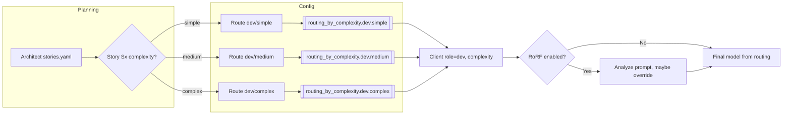
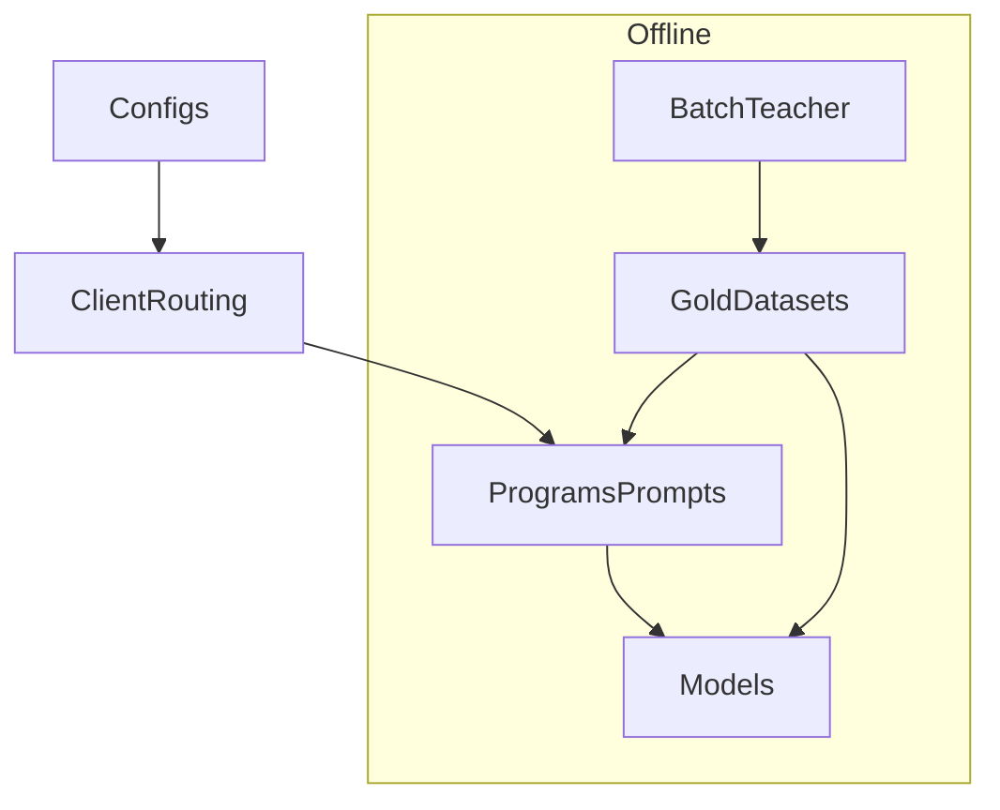

# Teaching My AI Pipeline to Choose Its Own Models (by Story Complexity)

I used to think that picking models for my multi‑agent pipeline was a one‑time decision.  
“BA goes to this provider, Architect to that one, Dev to the powerful model, QA to something cheap.”  

That worked… until it didn’t.

After a few iterations it was obvious that:

- Some stories are trivial and don’t deserve an expensive model.
- Some stories are gnarly and actually suffer when routed to a tiny local model.
- A static “one model per role” config just leaves money and quality on the table.

This post is about the change I just merged: **routing models per story based on complexity**, while keeping the pipeline predictable and compatible with the existing DSPy and RoRF machinery.

---

## The pain: one model per role is not enough

The pipeline has multiple roles (BA → Product Owner → Architect → Dev → QA).  
Originally, each role had a single provider/model pair in `config.yaml`:

```yaml
roles:
  dev:
    provider: vertex_sdk
    model: gemini-2.5-pro
```

That’s simple, but it forces every story handled by `dev` through the same model, regardless of difficulty:

- A one‑liner “healthcheck endpoint” story would burn the same model as a full login flow.
- If I pointed Dev to a cheap local model, the heavy stories suffered.
- If I pointed Dev to a strong cloud model, the simple stories became unnecessarily expensive.

I already had two other “complexity‑related” components:

- A **project‑level complexity classifier** for Architect (simple / medium / corporate).
- A **RoRF model recommender** that looks at prompts in real time and occasionally upgrades/downgrades models.

But none of these worked at the **story** level in a predictable, config‑driven way. That’s what the new routing solves.

---

## How story-level routing actually works (diagram)



You can read it as:

- Architect emits stories (with or without `complexity`).
- The pipeline normalizes them so every story has `complexity` set.
- Dev looks up a `(provider, model)` pair based on `role=dev` and that `complexity`.
- RoRF, if enabled, still has the last word before the request hits the final LLM.

---

## The idea: complexity as story metadata + routing table

Instead of hard‑coding “Dev = model X” forever, I now let each story carry a **`complexity` tag**:

```yaml
- id: S1
  epic: E1
  description: ...
  priority: P1
  status: todo
  complexity: medium    # simple | medium | complex
```

The Architect role is responsible for generating stories, so the prompt was updated to explicitly require this field. On top of that, a small normalizer (`fix_stories.py`) ensures that if the model forgets to emit `complexity`, the pipeline doesn’t die: it injects a default (currently `medium`) and logs a warning.

Once stories carry `complexity`, the routing becomes a **lookup problem** instead of a “hard‑code everything” problem. I added a section to `config.yaml`:

```yaml
features:
  routing_by_complexity_enabled: true

defaults:
  complexity: medium

routing_by_complexity:
  dev:
    simple:
      provider: ollama
      model: qwen2.5-coder:7b
    medium:
      provider: vertex_sdk
      model: gemini-2.5-flash
    complex:
      provider: codex_cli
      model: gpt-4-turbo
  qa:
    simple:
      provider: vertex_cli
      model: gemini-2.5-flash
    medium:
      provider: vertex_sdk
      model: gemini-2.5-flash
    complex:
      provider: vertex_cli
      model: gemini-2.5-pro
```

This is intentionally simple for now (same model across tiers), but the structure makes it trivial to swap in local vs. cloud models per tier later.

---

## The plumbing: one helper and a small `Client` tweak

The routing logic lives in a tiny helper:

```python
def resolve_role_model_for_complexity(config, role, complexity):
    # 1) Check feature flag
    # 2) Normalize role/complexity
    # 3) Lookup config["routing_by_complexity"][role][complexity]
    # 4) Return (provider, model) or (None, None) for “use defaults”
```

The LLM client (`scripts/llm.py`) was extended to accept an optional `complexity` parameter:

```python
class Client:
    def __init__(self, role=None, *legacy_args, complexity=None, **overrides):
        cfg = load_config()
        self.role = ...

        roles = cfg.get("roles", {})
        role_cfg = roles.get(self.role, {})
        providers = cfg.get("providers", {})

        routed_provider, routed_model = resolve_role_model_for_complexity(
            cfg, self.role, complexity
        )
        provider_key = routed_provider or role_cfg.get("provider") or "vertex_sdk"
        provider_cfg = providers.get(provider_key, {"type": "vertex_sdk"})

        if routed_model:
            self.model = routed_model
        else:
            self.model = role_cfg.get("model", "gemini-2.5-flash")

        # ... rest of provider setup ...
```

On the Dev side, the runner now passes `complexity` from the story into the client:

```python
story = pick_story(stories, story_id)
complexity = story.get("complexity")
client = Client(role="dev", complexity=complexity)
```

If a story doesn’t have `complexity` (because the model forgot), `fix_stories.py` fills it with the config default before Dev even starts.

---

## Backwards compatibility and failure modes

I didn’t want this feature to become another “flags everywhere, chaos everywhere” situation, so I forced myself to handle a few failure modes properly:

1. **Feature flag off**  
   - If `routing_by_complexity_enabled` is `false`, the helper always returns `(None, None)` and the `Client` falls back to the old `roles.<role>` config.

2. **Missing or malformed routing config**  
   - If `routing_by_complexity` is missing or incomplete for a role/complexity, the helper returns `(None, None)` and the client behaves exactly as before.

3. **Stories without `complexity`**  
   - The Architect prompt was updated, pero los LLMs no siempre obedecen.  
   - `fix_stories.py` now:
     - Ensures `status` exists (defaults to `todo`).  
     - Ensures `complexity` exists (defaults to `defaults.complexity`, today `medium`).  
     - Prints a warning whenever it has to inject `complexity`:
       ```text
       [fix_stories] Missing complexity for story S3, defaulting to medium
       ```
   - Dev and QA never see a story without `complexity`.

4. **Provider issues at runtime**  
   - Routing can happily point to a model that doesn’t actually work in the current environment (no credentials, region misconfigured, etc.).  
   - The good news is that this is no worse than the old setup: if the model fails, Dev/QA would have failed anyway.  
   - The logs now at least make the decision visible:
     ```text
     [ROUTING] dev/medium -> vertex_sdk/gemini-2.5-flash
     [LLM] Complexity routing applied for role 'dev' (complexity=medium) -> vertex_sdk/gemini-2.5-flash
     ```

---

## Interaction with DSPy and RoRF

One of my constraints was “don’t break the nice things I already have”:

- **DSPy modules** (BA/PO/Architect/QA‑testcases) run on top of an LM spec; routing by complexity lives below that, in the client/config layer.  
- **RoRF recommender** still has the last word at runtime:  
  - Complexity routing chooses the *baseline* model from the story metadata.  
  - RoRF can still look at the actual prompt and decide to upgrade/downgrade, or keep the chosen model.

In other words:

1. Architect & co. produce stories/epics/architecture using whatever LM you configure (local or cloud).  
2. Each story carries `complexity`.  
3. Dev/QA create their LLM clients with that complexity, hitting `routing_by_complexity`.  
4. RoRF looks at the real prompt and may override the model if it sees a mismatch.

This layering lets me rotate providers and models in config, tune prompts/programs with DSPy, and still keep the routing logic simple and explicit.

---

## A concrete run: S1 end‑to‑end

Here’s what a recent end‑to‑end run looks like for story `S1`:

1. **BA & Architect**  
   - BA generates `planning/requirements.yaml` from the concept (“feature toggle app”).  
   - Architect (tier forced to simple) produces `epics.yaml`, `stories.yaml`, `architecture.yaml`.  
   - `fix_stories.py` normalizes `stories.yaml` and injects `complexity: medium` on each story where it’s missing.

2. **Dev**  
   - `make dev STORY=S1` reads `stories.yaml`, picks `S1`, and logs:
     ```text
     [DEV] Implementando: S1 ... (complexity=medium)
     [ROUTING] dev/medium -> vertex_sdk/gemini-2.5-flash
     [LLM] Complexity routing applied for role 'dev' (complexity=medium) -> vertex_sdk/gemini-2.5-flash
     ```
   - The model writes `project/backend-fastapi/app/models.py` using the JSON contract from `prompts/developer.md`.

3. **QA**  
   - `make qa STORY=S1 QA_RUN_TESTS=0` generates DSPy QA testcases and then runs backend tests.  
   - Output: `artifacts/qa/S1/report.json` with a `pass` status and a structured summary in `qa_summary.json`.

Nothing in that flow knows which specific model is used beyond the config—they only care about the role (“dev”) and the story’s `complexity`.

---

## What’s next

This merge was mostly about plumbing and correctness:

- The helper exists.  
- The config shape is stable.  
- The client and Dev/QA entrypoints know how to use it.  
- Architect is expected to emit `complexity`, and the pipeline has a fallback when it doesn’t.

The interesting next step is *what to route to*:

- For **simple** stories, I want to route aggressively to local models (7B, quantized) and keep cloud as teacher or backup.  
- For **medium** stories, a local LoRA‑tuned model should be enough once I have good gold datasets.  
- For **complex** stories, I can still decide whether I pay for a strong cloud model or keep everything on‑prem.

The nice part is that I no longer have to encode that logic in Python. I can make those trade‑offs in `config.yaml` and let the pipeline handle the rest.

If you squint, the system now has three layers:



Configs decide *where* to send a story, programs/prompts decide *how* to talk to the model, y los modelos (cada vez más locales) son los que hacen el trabajo pesado, idealmente afinados con datos gold generados en batch.
