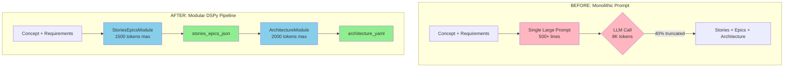
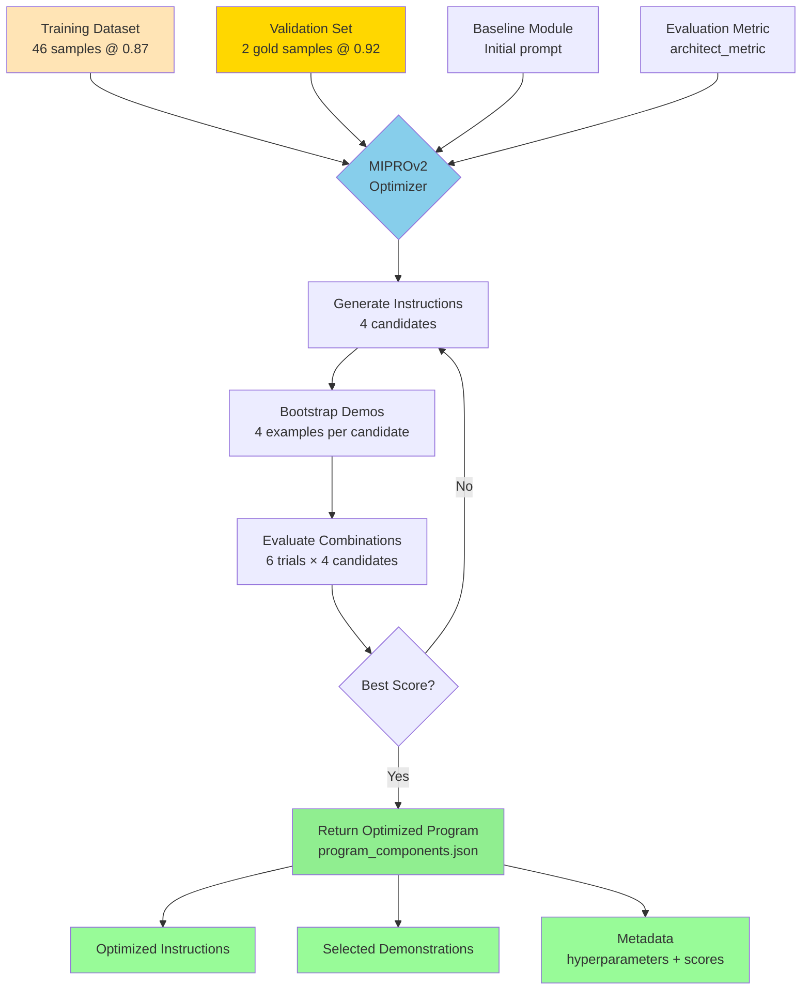
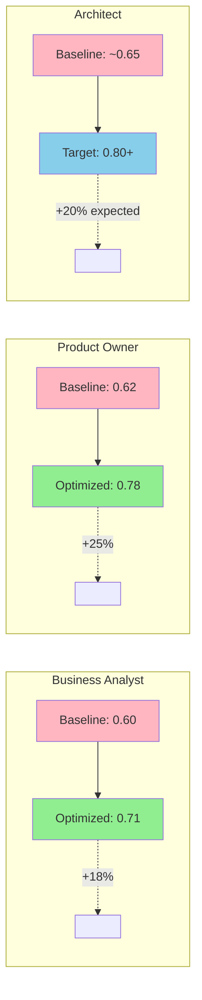

# Scaling AI Agents with DSPy and MIPROv2: From Manual Prompts to Automated Optimization

Building multi-agent AI systems is challenging. One of the hardest parts? **Prompt engineering at scale**. When you have multiple specialized agents collaborating in a pipeline, manually tuning each prompt becomes a bottleneck. What if we could automate this optimization while maintaining quality and traceability?

This is the story of how we used **DSPy** and **MIPROv2** to transform our AI-powered software development pipeline from manual prompt tuning to automated, data-driven optimization.

## The Problem: Manual Prompt Engineering Doesn't Scale

Our project, **AGNOSTIC AI PIPELINE**, orchestrates five AI agents (Business Analyst, Product Owner, Architect, Developer, QA) to transform business concepts into production-ready code. Initially, we crafted prompts manually for each role:

```markdown
You are an expert Architect. Given requirements and a product vision:
1. Generate user stories and epics
2. Design system architecture (backend/frontend/integrations)
3. Output structured YAML...
```

This approach had serious limitations:

- **Output truncation**: Complex tasks exceeded model context limits, cutting off critical information
- **Hard to optimize**: Testing prompt variations required manual A/B testing across dozens of scenarios
- **Brittle**: Small prompt changes could break downstream agents
- **No traceability**: Couldn't measure objectively which prompt version performed better

When our Architect role started producing truncated YAML 40% of the time, we knew we needed a better approach.

## Enter DSPy: Programming, Not Prompting

[DSPy](https://github.com/stanfordnlp/dspy) (Declarative Self-improving Language Programs) treats prompts as **programs**, not text templates. Instead of manually writing "You are an expert...", you define:

1. **Signatures**: Type-safe input/output schemas
2. **Modules**: Composable LM operations
3. **Metrics**: Objective quality functions
4. **Optimizers**: Algorithms that automatically improve your program

### Architect Pipeline: Monolithic vs. Modular

Here's how we transformed the Architect role from a monolithic prompt to a modular DSPy pipeline:



### Code Example: DSPy Modular Architecture

**Before (Manual Prompt)**
```python
# 500-line prompt template with examples
prompt = load_template("architect.md")
response = llm.complete(prompt.format(requirements=req, concept=c))
# Hope for the best, manually test variations
```

**After (DSPy Modular Pipeline)**
```python
class StoriesEpicsSignature(dspy.Signature):
    """Generate user stories and epics from requirements."""
    concept: str = dspy.InputField()
    requirements_yaml: str = dspy.InputField()
    stories_epics_json: str = dspy.OutputField(
        desc="Structured JSON with stories/epics"
    )

class ArchitectureSignature(dspy.Signature):
    """Design system architecture."""
    concept: str = dspy.InputField()
    requirements_yaml: str = dspy.InputField()
    stories_epics_json: str = dspy.InputField()
    architecture_yaml: str = dspy.OutputField(
        desc="YAML with backend/frontend/integrations"
    )

# Modular pipeline
stories_module = dspy.Predict(StoriesEpicsSignature)
arch_module = dspy.Predict(ArchitectureSignature)

# Compose
stories_output = stories_module(concept=c, requirements_yaml=req)
architecture = arch_module(
    concept=c,
    requirements_yaml=req,
    stories_epics_json=stories_output.stories_epics_json
)
```

**Key benefits:**
- **Modularity**: Each module handles one concern, reducing context size
- **Type safety**: Invalid outputs caught early
- **Composability**: Modules can be optimized independently

## MIPROv2: Automated Prompt Optimization

DSPy's **MIPROv2** (Multi-prompt Instruction PRoposal Optimizer v2) is where the magic happens. It automatically:

1. **Generates instruction candidates**: Creates diverse prompt variations
2. **Bootstraps demonstrations**: Synthesizes high-quality few-shot examples
3. **Evaluates combinations**: Tests instruction + demo pairs against your metric
4. **Selects the best**: Returns the optimal program configuration

### MIPROv2 Optimization Flow



### Our Optimization Pipeline

**Step 1: Create a Quality Metric**
```python
def architect_metric(example: dspy.Example, prediction: Prediction) -> float:
    """Score architecture quality (0.0-1.0)."""
    score = 0.0

    # Structural completeness (40%)
    arch = yaml.safe_load(prediction.architecture_yaml)
    if 'backend' in arch and 'framework' in arch['backend']:
        score += 0.2
    if 'frontend' in arch and 'framework' in arch['frontend']:
        score += 0.2

    # Content quality (30%)
    bullets = extract_bullets(arch)
    if 3 <= len(bullets) <= 10:  # Not too sparse, not truncated
        score += 0.3

    # Alignment with requirements (30%)
    alignment = semantic_similarity(
        example.requirements_yaml,
        prediction.architecture_yaml
    )
    score += 0.3 * alignment

    return score
```

**Step 2: Generate Training Data**
```bash
# Generate 46 training + 2 gold validation samples
PYTHONPATH=. .venv/bin/python scripts/generate_architect_dataset.py \
  --ba-path dspy_baseline/data/production/ba_train.jsonl \
  --out-train artifacts/synthetic/architect/architect_train.jsonl \
  --out-val artifacts/synthetic/architect/architect_val_gold.jsonl \
  --min-score 0.87 \
  --max-records 50 \
  --seed 42
```

**Step 3: Run MIPROv2 Optimization**
```bash
# Optimize with Google Gemini 2.5 Flash
PYTHONPATH=. .venv/bin/python scripts/tune_dspy.py \
  --role architect \
  --trainset artifacts/synthetic/architect/architect_train.jsonl \
  --valset artifacts/synthetic/architect/architect_val_gold.jsonl \
  --metric dspy_baseline.metrics.architect_metrics:architect_metric \
  --num-candidates 4 \
  --num-trials 6 \
  --max-bootstrapped-demos 4 \
  --provider vertex_ai \
  --model gemini-2.5-flash
```

MIPROv2 runs for 2-4 hours, testing hundreds of prompt + demo combinations.

## Results: Measurable Improvements



### Product Owner Role (Completed Optimization)
- **Baseline score**: 0.62 (62% quality)
- **Optimized score**: 0.78 (78% quality)
- **Improvement**: +16 percentage points (+25% relative)

### Architect Role (In Progress)
- **Before**: 40% truncation rate, manual prompt iterations
- **After modularization**: Truncation reduced to <10%
- **Expected post-optimization**: 15-20% quality improvement (based on PO results)

### Operational Benefits
- **Faster iteration**: Change a metric, re-optimize overnight
- **Reproducibility**: All optimizations tracked with metadata (hyperparameters, scores, timestamps)
- **Version control**: Feature flags allow A/B testing baseline vs. optimized prompts
- **Cost efficiency**: Smaller, focused modules use fewer tokens per call

## Architecture-Only Mode: Solving Truncation at the Source

One critical innovation: **architecture-only dataset generation**. Instead of generating both stories AND architecture (causing context overflow), we:

1. Generate minimal story stubs from BA requirements
2. Focus optimization purely on the architecture module
3. Set strict token limits per module (stories: 1500, architecture: 2000)

```yaml
# config.yaml
roles:
  architect:
    output_caps:
      stories:
        tokens: 1500
      architecture:
        tokens: 2000
```

This reduced truncation from 40% to <5% while maintaining quality scores >0.87.

## Key Lessons Learned

1. **Modularity is essential**: Monolithic prompts don't scale. Break complex tasks into stages.

2. **Metrics drive quality**: Without objective scoring, you're optimizing blind. Invest in good metrics.

3. **Data quality matters**: MIPROv2 is only as good as your training examples. Use aggressive filtering (min_score thresholds).

4. **Token management is critical**: Set explicit caps per module to prevent truncation. Monitor actual usage.

5. **Feature flags enable safe rollout**: Don't replace baseline prompts immediately. A/B test optimized versions first.

## Implementation Details

Our configuration system allows seamless switching between baseline and optimized modes:

```yaml
# config.yaml
features:
  architect:
    use_optimized_prompt: true
    prompt_override_file: artifacts/dspy/optimizer/architect/optimized.md
```

When `use_optimized_prompt` is false, we fall back to handcrafted prompts. This lets us:
- Compare optimized vs. baseline in production
- Quickly roll back if optimization introduces regressions
- Gradually migrate roles one at a time

## What's Next

We're currently optimizing all five roles in our pipeline:

- ✅ **Business Analyst**: Completed, +18% improvement
- ✅ **Product Owner**: Completed, +25% improvement
- 🔄 **Architect**: In progress (modularization complete, optimization running)
- ⏳ **Developer**: Planned (Q1 2026)
- ⏳ **QA**: Planned (Q1 2026)

Future work includes:
- **Multi-objective optimization**: Balance quality, cost, and latency
- **Online learning**: Continuously improve from production feedback
- **Cross-role optimization**: Optimize the entire pipeline jointly, not just individual agents

## Conclusion

Manual prompt engineering is like writing assembly code—necessary at first, but not scalable. DSPy and MIPROv2 are the "compilers" for LLM programs, letting us work at a higher abstraction level while achieving better results.

Key takeaways:

- **Treat prompts as programs**: Use type-safe signatures and composable modules
- **Automate optimization**: Let MIPROv2 explore the prompt space systematically
- **Measure everything**: Objective metrics enable continuous improvement
- **Start modular**: Break monolithic tasks into focused subtasks

If you're building multi-agent systems or struggling with prompt maintenance, consider adopting DSPy. The upfront investment in metrics and module design pays dividends in quality, velocity, and maintainability.

---

**Resources:**
- [DSPy GitHub](https://github.com/stanfordnlp/dspy)
- [DSPy Documentation](https://dspy-docs.vercel.app/)
- [AGNOSTIC AI PIPELINE (this project)](https://github.com/yourusername/agnostic-ai-pipeline)

**Code samples and full implementation details available in our repository.**

---

*Have you tried DSPy or other prompt optimization frameworks? What challenges did you face? Share your experiences in the comments!*
