# RAG Local-First — Detailed Architecture Diagrams (Big Picture)

**Purpose**: provide detailed visualizations of the end-to-end pipeline, validation gates, and governance layers.

---

## 1. End-to-end pipeline (macro view)

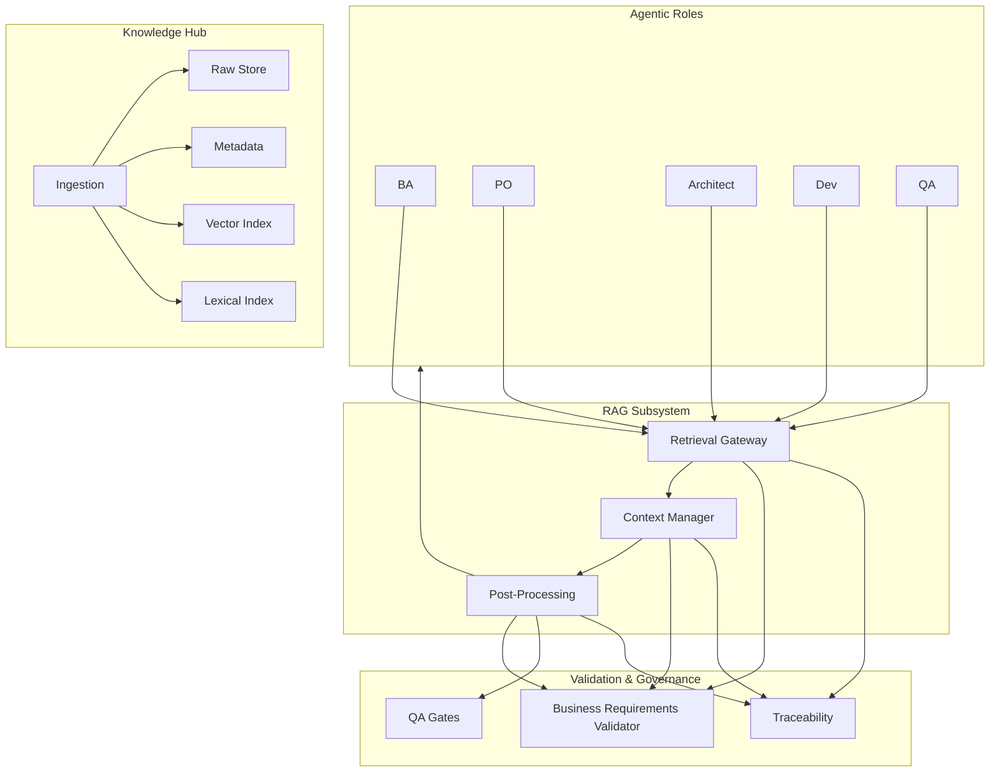

---

## 2. Business requirements validation (stage gates)

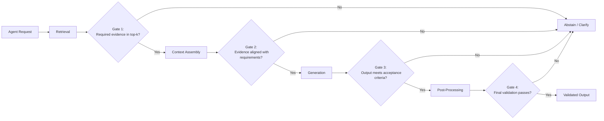

---

## 3. Evidence traceability (minimum schema)

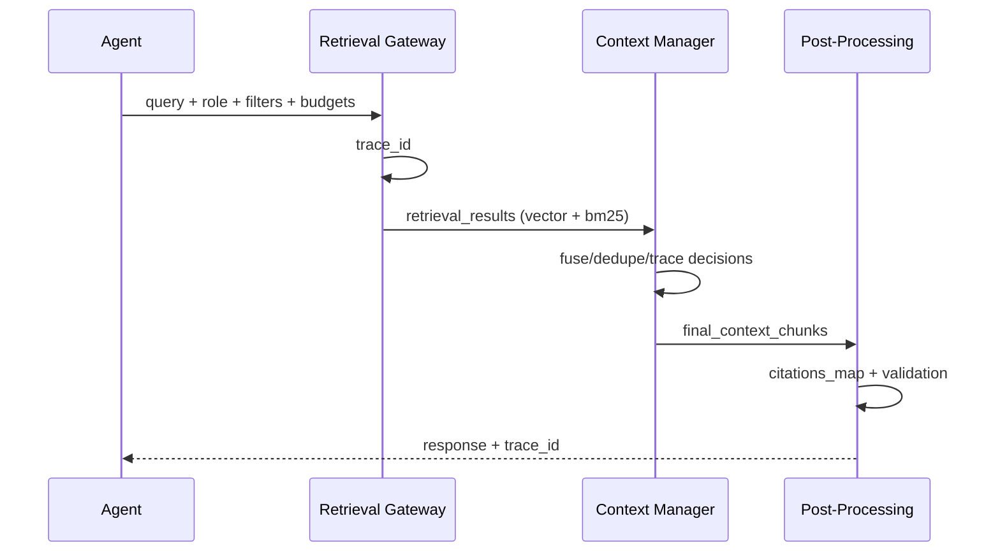

---

## 4. Phase 0 execution (gate-critical flow)

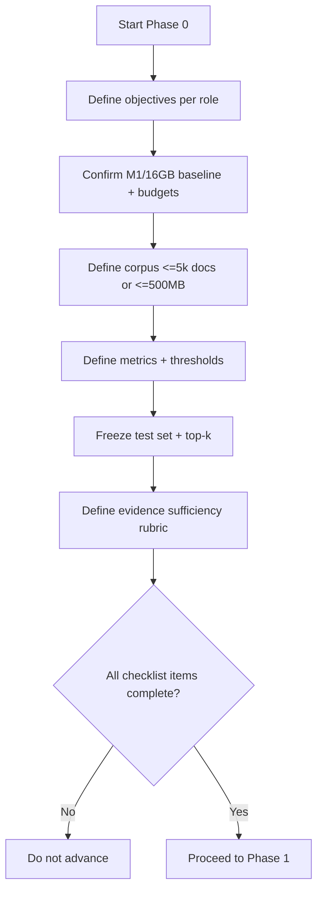

---

## 5. QA gates (backend Python development)

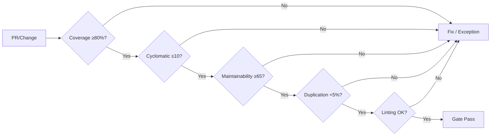

---

## 6. RAG + Governance integration (big picture)

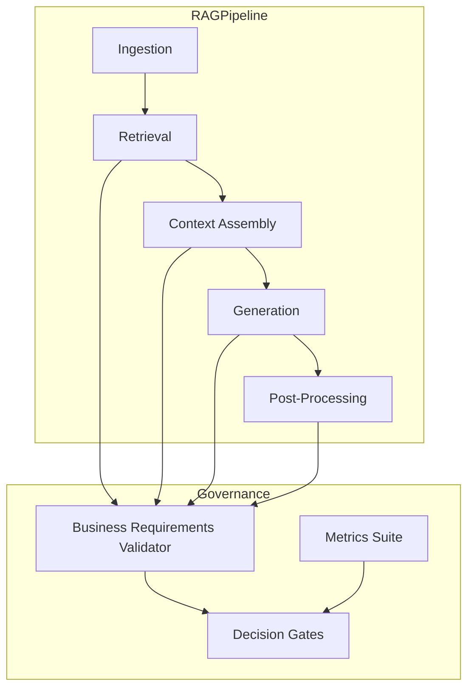

---

## 7. Phase gates audit flow (end‑to‑end)

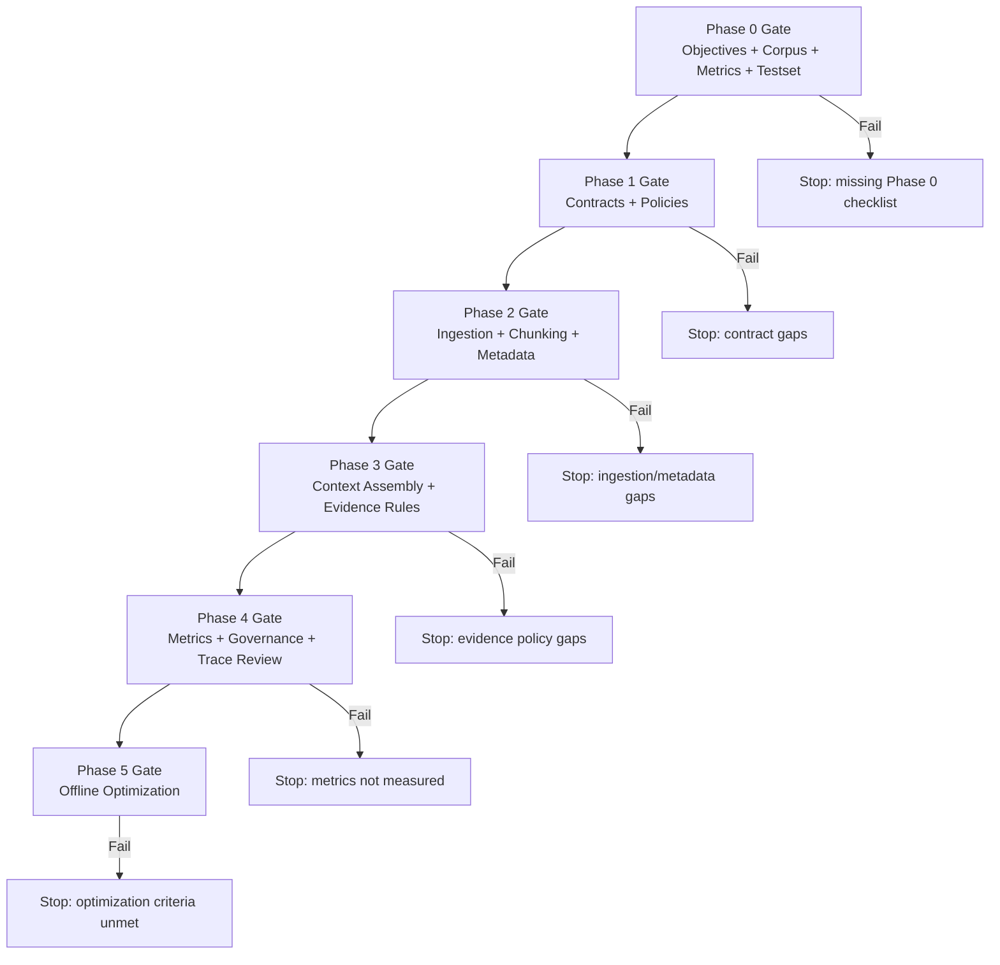

---

## 8. Audit metrics coverage map

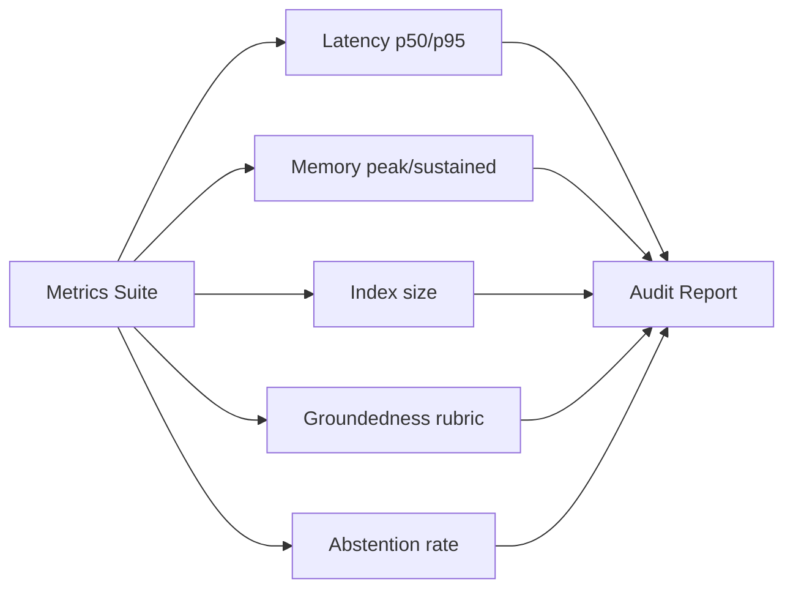

---

## 9. Data lineage and versioning (audit trail)

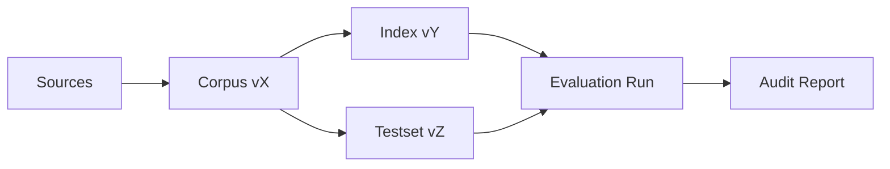

---

## 10. Weaviate vs FAISS decision audit

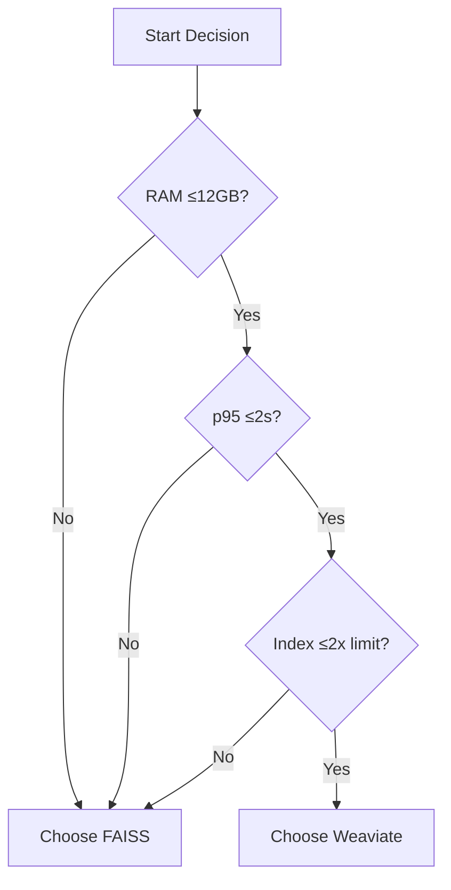

---

## 11. Compliance and security audit flow

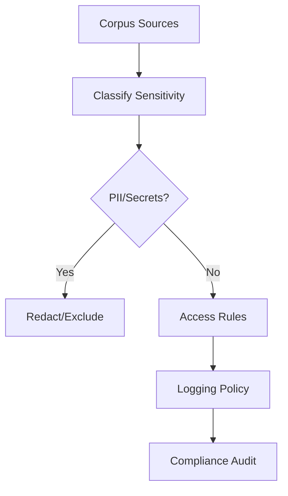

---

## 12. RACI audit mapping

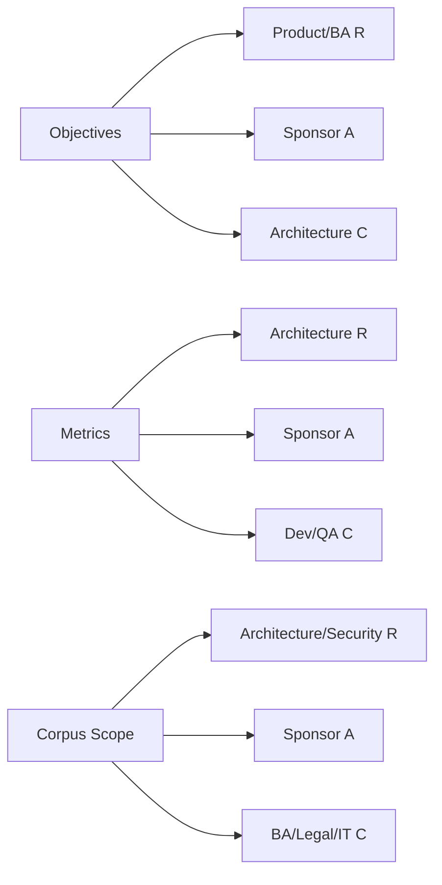

---

**Status**: Ready for review.