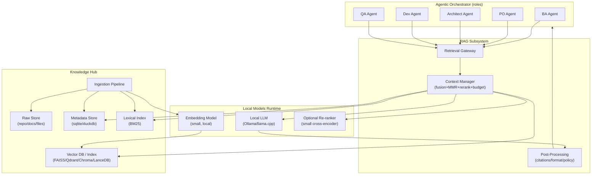
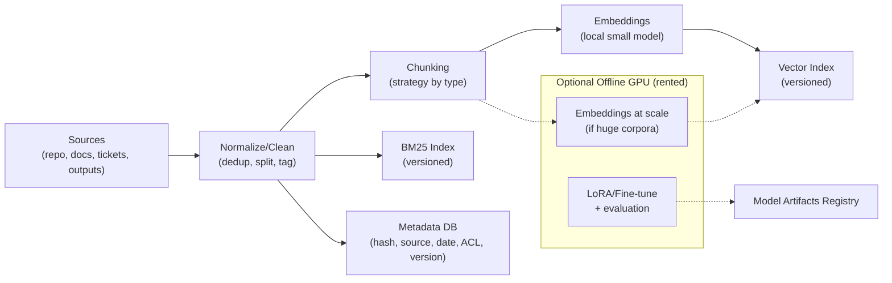
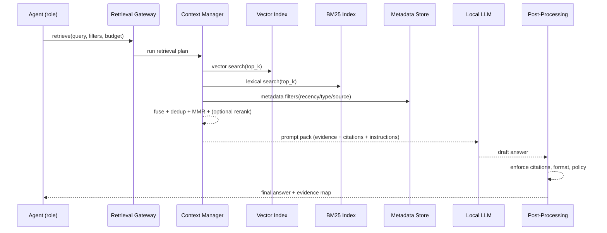
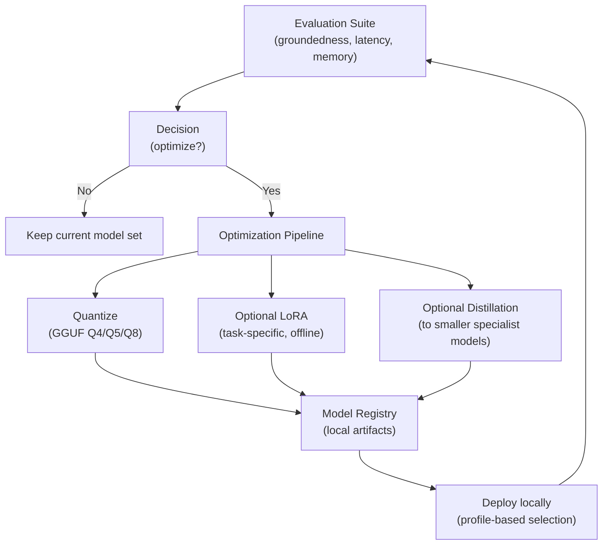
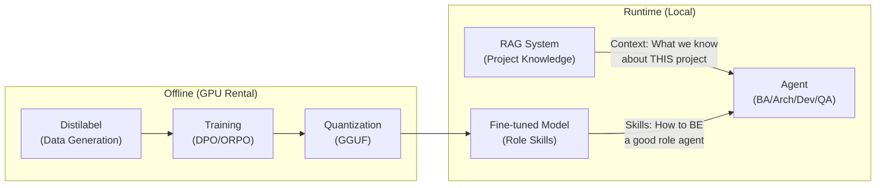

# RAG (Vector DB + Post-Processing) — Conceptual Architecture for `agnostic-ai-pipeline` (Local-First)

**Purpose**: Evolve the concepts in the repository into a **RAG-enabled, local-first agentic pipeline** that remains performant on **normal hardware** (CPU / limited RAM, consumer laptops), while allowing **optional offline GPU (rented)** for tasks that are otherwise impractical.

**Scope**: This document is **conceptual** (architecture, components, contracts, and flows). It is **not** an implementation guide.

---

## 1. Design goals

1. **Local-first runtime**
   - Inference on local LLMs (e.g., Ollama / llama.cpp) using quantized models.
   - Embeddings generated locally with small models when feasible.
2. **Separation of concerns**
   - **Offline**: ingestion, indexing, evaluation, fine-tuning, heavy batch jobs.
   - **Online**: interactive RAG retrieval + context assembly + generation with strict budgets.
3. **Budgeted context**
   - Explicit **token and evidence budgets** (per agent role and per task type).
4. **Hybrid retrieval**
   - Vector + lexical (BM25) + metadata filters to improve robustness.
5. **Traceability and evaluation**
   - Every answer can map back to evidence and retrieval decisions.
   - Continuous measurement of quality/latency/memory.
6. **Open models only** (NEW)
   - No commercial API dependencies (OpenAI, Claude, Gemini).
   - Use Teacher-Student distillation: large teacher (72B) → small specialists (7B-14B).
   - Fine-tune for role-specific skills; RAG provides project-specific knowledge.

---

## 2. High-level components

### 2.1 Knowledge Hub (RAG backbone)
Responsible for:
- Ingestion from sources (repo, docs, tickets, agent artifacts).
- Normalization & cleaning (dedup, metadata tagging).
- Chunking (content-type specific).
- Embeddings generation.
- Indexing: **Vector DB** + **Lexical index (BM25)**.
- Versioning of indexes (reproducibility).

**Stores**
- **Raw Store**: original files (repo/docs).
- **Metadata Store**: sqlite/duckdb (hash, source, timestamps, tags, ACL).
- **Vector Index**: FAISS / Qdrant / Chroma / LanceDB (choose based on footprint).
- **Lexical Index**: BM25 (lightweight fallback / complement).

### 2.2 Retrieval Gateway (internal API for agents)
A stable interface used by all role-agents (BA/PO/Architect/Dev/QA) for:
- `retrieve(query, filters, top_k, budget)`
- `store_memory(artifact, metadata)`
- `explain_retrieval(trace_id)` for debugging and evaluation

### 2.3 Context Manager
Responsible for:
- Hybrid fusion (vector + BM25).
- Deduplication, diversity (MMR), and optional reranking.
- Evidence compression (summaries that remain citeable).
- Prompt-pack assembly (instructions + citations + delimiters).

### 2.4 Post-processing
Two distinct categories:

**A) Output post-processing (response-level)**
- Enforce citations (claims → evidence).
- Policy: if evidence missing → abstain/ask.
- Normalize to expected formats (MD/JSON/templates).
- Structural validation for generated artifacts.

**B) Model post-processing (model-level)**
- Quantization (GGUF Q4/Q5/Q8).
- Optional LoRA / fine-tuning **offline**.
- Distillation into smaller specialist models (routing, extraction, triage).
- Regression evaluation (avoid degradation).

> **See Section 10** for the complete Fine-tuning & Distillation strategy that complements RAG.

---

## 3. How this fits the existing agentic pipeline (role-based)

All role-agents call the same **Retrieval Gateway**:
- **BA / PO**: requirements, historical decisions, domain docs.
- **Architect**: ADRs, constraints, patterns, prior architecture decisions.
- **Dev**: codebase, contracts, examples, conventions.
- **QA**: acceptance criteria, historical bugs, test patterns, coverage hot-spots.

Additionally, the artifacts produced by agents (PRDs, ADRs, QA reports, postmortems) become **recoverable memory** (indexed, versioned, traceable).

---

## 4. Architecture diagrams (Mermaid)

> Note: Mermaid diagrams render in GitHub and many Markdown viewers. If your renderer does not support Mermaid, you’ll need a compatible viewer or conversion step.

### 4.1 Macro architecture



### 4.2 Offline ingestion (local + optional GPU)



### 4.3 Online RAG (request/response)



### 4.4 Model post-processing lifecycle (offline-first)



---

## 5. Strategies for constrained hardware

### 5.1 Minimal but effective RAG
- Keep **top_k small** and use **MMR** to avoid redundancy.
- Chunk by content type (code vs docs vs tickets) to reduce noise.
- Hybrid retrieval: vector + BM25.
- Prefer **disk-backed indexes** and versioned snapshots.

### 5.2 Hierarchical memory
- **Short-term memory**: current iteration context.
- **Long-term memory**: vector DB indexed artifacts.
- **Compressed memory**: citeable summaries of long artifacts.

### 5.3 Budget Manager (policy)
Per role/task, define:
- Token budget for instructions, evidence, and response.
- Max evidence chunks and max lines of code per chunk.
- Recency/priority rules.

---

## 6. Proposed repository conceptual modules (no implementation)

Suggested top-level modules (names are indicative):

- `knowledge_hub/`
  - ingestion, normalization, chunking, index versioning
- `retrieval_gateway/`
  - stable contract for agents + traceability
- `context_manager/`
  - fusion, MMR, optional rerank, compression, budgeting
- `post_processing/`
  - citation enforcement, artifact shaping, output validation
- `model_ops/`
  - model selection profiles, quantization artifacts, offline tuning workflows
- `eval/`
  - RAG + model regression tests (quality/latency/memory)

---

## 7. Offline GPU (rented) without breaking local-first

**Rule**: GPU is used to **produce transferable artifacts**, not as a runtime dependency.

Offline GPU tasks:
- Large-scale embeddings if the corpus is huge.
- LoRA/fine-tuning on specialized tasks.
- Heavy evaluation or re-ranking model training.

Outputs to bring back locally:
- `vector_index_vX` (snapshotted)
- `model_artifacts_vY` (quantized)
- evaluation reports (regression dashboards)

Runtime local consumes:
- the snapshot indexes
- the quantized models
- the retrieval policies (budgets + filters)

---

## 8. Open decisions to parameterize (for later refinement)

### RAG Decisions
1. **~~Vector DB~~**: **DECIDED** → LightRAG (Graph RAG) replaces pure vector stores.
   - LightRAG provides both Knowledge Graph (NetworkX) + Vector Store (NanoVectorDB) in one framework.
   - 6000x fewer tokens than Microsoft GraphRAG. ~80ms latency.
   - MIT license. Ollama native support. EMNLP 2025 paper.
   - See `PLAN_implementation_distilabel_finetuning_rag.md` Decision D3 for full comparison.
2. **Hybrid retrieval policy**: LightRAG "mix" mode (graph + vector combined) as default.
3. **Reranking**: off by default; LightRAG's graph traversal provides implicit reranking via entity relationships.
4. **Citation strictness**: strict for architecture/QA; flexible for brainstorming.
5. **Index scope**: full repo vs curated (APIs/ADRs/docs/tests).
6. **Embedding model**: **DECIDED** → `bge-m3` via Ollama (1024 dims, multilingual).

### Fine-tuning Decisions
6. **Teacher model**: Qwen2.5-72B vs Llama-3.1-70B vs DeepSeek-V2.
7. **Training method**: DPO vs ORPO vs SFT-then-DPO.
8. **GPU provider**: RunPod vs Vast.ai vs Lambda Labs.
9. **Iteration cadence**: Weekly vs per-milestone vs on-demand.
10. **Quality gate strictness**: Conservative (+5% pass@1) vs Aggressive (+3% pass@1).

---

## 9. Next iteration checklist (recommended)

### RAG Setup
1. Define the **exact corpus** to index (repo + docs + agent artifacts + what else).
2. Agree on **chunking policies** per content type.
3. Define the **Retrieval Gateway contract** (inputs/outputs + traceability).
4. Establish minimal **metrics**:
   - retrieval hit-rate
   - groundedness (claims with evidence)
   - latency (p50/p95)
   - memory footprint (RAM)
   - index rebuild time and size

### Fine-tuning Setup
5. **Inventory existing data** in `dspy_baseline/data/production/` and `post_training/`.
6. **Complete PO remediation** - fix the failing PO student (see `docs/po_distillation_report.md`).
7. **Decision**: Continue with custom scripts OR migrate to Distilabel.
   - Custom scripts: Faster, but uses commercial teacher (Gemini)
   - Distilabel: Requires implementation, but enables open teacher (Qwen2.5-72B)
8. **Choose GPU rental** provider and budget allocation.
9. **Define held-out concepts** for evaluation (never used in training).

---

## 10. Fine-tuning & Distillation Strategy (RAG Complement)

### 10.1 RAG + Fine-tuning: Complementary Capabilities

RAG and Fine-tuning serve **different purposes** and work together:

| Capability | RAG Provides | Fine-tuning Provides |
|------------|--------------|---------------------|
| **Scope** | Project-specific KNOWLEDGE | Role-specific SKILLS |
| **What it teaches** | Facts, context, decisions | Patterns, reasoning, style |
| **Update frequency** | Real-time (index refresh) | Periodic (training cycles) |
| **Example** | "What does endpoint X return?" | "How to write a good user story" |

**Mental Model**:
- **RAG** = The project's memory (what we know about THIS project)
- **Fine-tuning** = The agent's expertise (how to BE a good BA/Architect/Dev)

### 10.2 Teacher-Student Architecture (Open Models Only)

All models must be **open-source** (no commercial APIs). The strategy uses a **Teacher-Student** approach:

```
┌─────────────────────────────────────────────────────────────────┐
│                    TEACHER-STUDENT DISTILLATION                  │
├─────────────────────────────────────────────────────────────────┤
│                                                                  │
│  TEACHER (72B - GPU rental)                                     │
│  ┌─────────────────────────────┐                                │
│  │  Qwen2.5-72B-Instruct       │  ← Generates synthetic data    │
│  │  (via Distilabel pipeline)  │  ← Scores/ranks responses      │
│  └─────────────────────────────┘  ← Creates preference pairs    │
│              │                                                   │
│              ▼                                                   │
│  STUDENTS (7B-14B - Local inference)                            │
│  ┌─────────────────────────────┐                                │
│  │  BA:   qwen2.5:7b-instruct  │  ← Fine-tuned for BA role     │
│  │  Arch: qwen2.5:14b-instruct │  ← Fine-tuned for Architect   │
│  │  Dev:  deepseek-coder:7b    │  ← Fine-tuned for Developer   │
│  │  QA:   qwen2.5:7b-instruct  │  ← Fine-tuned for QA role     │
│  └─────────────────────────────┘                                │
│                                                                  │
└─────────────────────────────────────────────────────────────────┘
```

### 10.3 Synthetic Data Generation

#### Current Implementation (Custom Scripts)

The project currently uses **custom scripts** for distillation, NOT Distilabel:

| Component | Current State | Location |
|-----------|---------------|----------|
| Teacher dataset generation | ✅ Implemented | `scripts/generate_po_teacher_dataset.py` |
| LoRA training | ✅ Implemented | `scripts/train_po_lora.py` |
| Student evaluation | ✅ Implemented | `scripts/eval_po_student.py` |
| Teacher model | Gemini 2.5 Pro (commercial) | Via `vertex_sdk` |

**PO Distillation Results** (as of 2025-11-14):
- Dataset: 319 records, mean score 0.896
- Student: Qwen2.5-7B with LoRA (rank 32, alpha 64)
- Result: **NOT PASSING** - Student 0.772 vs Baseline 0.841 (-8.2%)
- Status: Pending remediation (see `docs/po_distillation_report.md`)

#### Proposed: Migrate to Distilabel + Open Models

> **⚠️ NOT IMPLEMENTED** - The following is the proposed future state.

To achieve 100% open-source, migrate from custom scripts to [Distilabel](https://github.com/argilla-io/distilabel):

```python
# PROPOSED - Not yet implemented
from distilabel.llms import vLLM
from distilabel.pipeline import Pipeline
from distilabel.steps.tasks import TextGeneration

with Pipeline("ba-synthetic-data") as pipe:
    load = LoadDataFromDicts(data=seed_concepts)
    generate = TextGeneration(
        llm=vLLM(model="Qwen/Qwen2.5-72B-Instruct"),  # Open model
        system_prompt="You are a senior Business Analyst...",
        num_generations=3
    )
    score = UltraFeedback(...)
    load >> generate >> score

dataset = pipe.run()
dataset.save_to_disk("artifacts/synthetic/ba_v1")
```

**Migration benefits**:
- Replace Gemini (commercial) → Qwen2.5-72B (open)
- Minimal custom code (~50 lines vs 300+ manual)
- Built-in quality filters (UltraFeedback)
- Reproducible, declarative pipelines

### 10.4 Fine-tuning Methods (DPO/ORPO)

After generating synthetic data, train using preference-based methods:

| Method | Use Case | Data Requirement |
|--------|----------|------------------|
| **SFT** (Supervised) | Initial skill transfer | prompt→response pairs |
| **DPO** (Direct Preference) | Align to quality standards | chosen/rejected pairs |
| **ORPO** | Combine SFT+DPO in one pass | chosen/rejected pairs |

**Existing infrastructure**:
- `post_training/` - DPO/ORPO scripts (not yet tested E2E)
- `scripts/train_po_lora.py` - SFT LoRA training (tested, used for PO)
- `docs/po_distillation_report.md` - PO distillation results and remediation plan

### 10.5 Per-Role Specialization Strategy

| Role | Base Model | Training Focus | Min Examples |
|------|------------|----------------|--------------|
| **BA** | qwen2.5:7b-instruct | Requirements extraction, structured YAML | 500+ |
| **Architect** | qwen2.5:14b-instruct | Reasoning chains (CoT), decomposition | 600+ with CoT |
| **Developer** | deepseek-coder:7b | Code generation, test-first patterns | 400+ |
| **QA** | qwen2.5:7b-instruct | Test design, edge case identification | 300+ |

### 10.6 Cost Optimization (GPU Rental)

| Phase | GPU Needed | Estimated Cost | Frequency |
|-------|------------|----------------|-----------|
| Synthetic data generation | A100 80GB | $2-4/hr × 4-8hr = $16-32 | Per role |
| Fine-tuning (LoRA) | A100 40GB | $1.50/hr × 2-4hr = $6-12 | Per iteration |
| Evaluation | A100 40GB | $1.50/hr × 1hr = $1.50 | Per iteration |

**Total per role**: ~$25-50 per training cycle
**Recommended providers**: RunPod, Vast.ai, Lambda Labs

### 10.7 Integration with RAG Pipeline

The fine-tuned models integrate seamlessly:



### 10.8 Model Artifacts Flow

```
Offline (GPU):
  1. Distilabel pipeline → synthetic_data_v1.jsonl
  2. DPO training → adapter_lora_v1/
  3. Merge + Quantize → model_gguf_v1.gguf

Local (Runtime):
  4. Ollama import → ollama create agnostic-pipeline/ba-v1
  5. config.yaml → roles.ba.model: "agnostic-pipeline/ba-v1"
  6. RAG + Fine-tuned model → Enhanced agent performance
```

### 10.9 Quality Gates

Before promoting a fine-tuned model:

| Metric | Threshold | Measurement |
|--------|-----------|-------------|
| pass@1 improvement | ≥ +5% | Held-out concept set |
| pass@8 regression | ≤ -3% | Same held-out set |
| Latency regression | ≤ +20% | p95 response time |
| Memory footprint | ≤ 8GB VRAM | Runtime profiling |

---

## Appendix A — Conceptual contracts (example)

### A.1 Retrieval request (conceptual)
- `query`: user intent (string)
- `filters`: {source, content_type, recency_window, tags}
- `budget`: {max_chunks, max_tokens_evidence, max_tokens_total}
- `mode`: {hybrid|vector_only|lexical_only}
- `trace`: boolean

### A.2 Retrieval response (conceptual)
- `trace_id`
- `items[]`: {doc_id, chunk_id, score_vector, score_bm25, metadata, snippet}
- `fused_ranking_notes`: MMR/rerank decisions
- `evidence_pack`: citeable chunks with stable IDs

---

**Owner**: Architecture (concept)
**Status**: Draft v2 (integrated RAG + Fine-tuning strategy)
**Related Documents**:
- `PLAN_open_models_finetuning.md` - Detailed fine-tuning implementation plan
- `PLAN_open_models_ADDENDUM_lessons_learned.md` - Lessons from previous fine-tuning attempts
- `PLAN_synthetic_data_frameworks.md` - Framework comparison (Distilabel recommended but NOT implemented)
- `post_training/PROJECT_PLAN.md` - Existing DPO/ORPO infrastructure
- `docs/phase9_distillation_plan.md` - PO distillation plan (IMPLEMENTED with custom scripts)
- `docs/po_distillation_report.md` - PO distillation results (NOT PASSING, pending remediation)  
